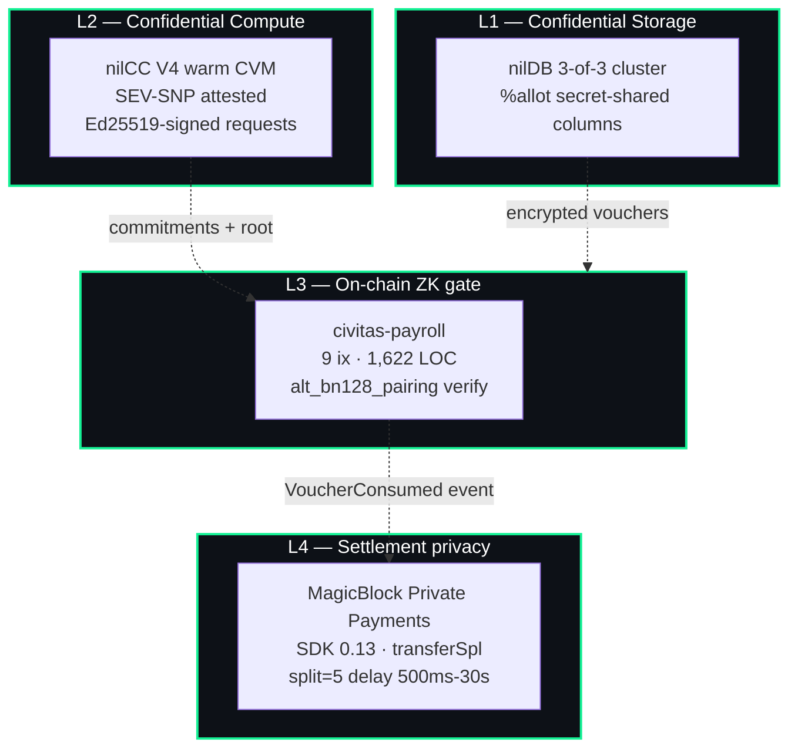

<div align="center">

# Civitas Security Audit Package

### Pre-Audit Threat Model, Architecture Review, and Adevar Labs Submission

**Protocol:** Civitas Private Payroll Settlement
**Category:** DeFi / RWA / Stablecoin Payment Rails
**Network:** Solana Devnet (mainnet candidate)
**Program ID:** `CQW3TnN4X6iG2potguVv2hCKfk4f9tf8PMG7dTV6e24y`
**Audit Scope Commit:** `cc77b6f`
**Document Version:** 1.0  ·  Last reviewed 2026-05-12
**Prepared for:** Adevar Labs Frontier Hackathon Security Track

[Executive summary](#1-executive-summary) · [Scope](#2-scope) · [Threat model](#3-threat-model) · [Trust boundaries](#4-trust-boundaries) · [Findings](#10-self-identified-findings) · [Adevar submission](#15-why-we-need-an-adevar-labs-audit)

</div>

---

## 1. Executive summary

Civitas is a privacy-preserving payroll settlement protocol composed of an Anchor program on Solana, a Groth16 BN254 ZK voucher circuit, a TEE-attested off-chain payroll compute service (Nillion nilCC), a secret-shared encrypted voucher store (Nillion nilDB), and the MagicBlock Private Payments settlement layer. The entire stack ships in this repository; every external integration listed in this document is live against the real remote service.

The protocol's central security property is that **no party other than the employee learns either the recipient or the amount of any individual payroll line item**, while a fully verifiable on-chain Merkle commitment records that the payroll batch was produced inside a SEV-SNP enclave with a pinned launch measurement. The on-chain `claim_payment` instruction is a *pure ZK gate*: it verifies a 256-byte Groth16 proof via Solana's native `alt_bn128_*` syscalls (≈180k CU), burns a single-use nullifier PDA, and emits a single event. It never moves USDC. Settlement is dispatched off-chain through MagicBlock Private Payments, which splits each transfer into five legs with randomized 500ms–30s delays, severing the on-chain link between the proof and the eventual ATA credit.

Civitas is asking Adevar Labs to formally review:

1. The Anchor program (`programs/civitas-payroll`, 9 instructions, 1,622 LOC) — instruction-level access control, account validation, replay protection, rent and overflow handling.
2. The on-chain Groth16 verifier (`programs/civitas-payroll/src/verifier/`, 283 LOC) — curve arithmetic, EIP-197 encoding correctness, identity-point and edge-case handling, pairing semantics.
3. The voucher circuit (`circuits/voucher_circom/voucher.circom`, 162 LOC) — soundness of the five constraints, completeness of the pi_hash binding, fixed-depth Merkle inclusion correctness.
4. The off-chain dispatcher (`frontend/lib/server/`, ~2.4k LOC across 8 modules) — pi_hash recomputation parity with the circuit, MagicBlock auth flow, TEE attestation verification, recipient/amount binding before private transfer dispatch.

We treat security as a continuous practice. We have already shipped seven critical fixes between 2026-04-27 (when the first internal review flagged them) and this submission, including replacing the stubbed Groth16 verifier with the real native-pairing implementation, repairing a nullifier-binding mismatch between circuit and on-chain handler, and removing a fictitious REST gateway from the MagicBlock integration path. A professional external audit is the next step on this maturity curve.

---

## 2. Scope

### 2.1 In-scope

| Component | Path | LOC | Language |
|---|---|---|---|
| Anchor program | `programs/civitas-payroll/src/` | 1,622 | Rust / Anchor 0.31 |
| Voucher circuit | `circuits/voucher_circom/voucher.circom` | 162 | circom 2.1.6 |
| Off-chain dispatcher | `frontend/lib/server/` | ~2,400 | TypeScript |
| nilCC workload | `workload/` | ~600 | Node.js |
| Groth16 trusted setup scripts | `scripts/groth16-setup.sh`, `scripts/vk-to-rust.ts` | ~250 | Bash / TS |
| MagicBlock auth + private transfer wrappers | `frontend/lib/server/magicblock-*.ts` | ~700 | TypeScript |
| pi_hash binding parity | `frontend/lib/server/pi-hash.ts` ↔ circuit C5 | 95 | TypeScript |

### 2.2 Out-of-scope

The following are explicitly out of scope. Each is documented in [§9 Trust boundaries](#9-trust-boundaries) so a reviewer can validate that the in-scope code makes the correct trust assumptions about them.

- The Nillion nilCC V4 control plane and SEV-SNP attestation root. We rely on Nillion's published attestation pipeline and pin a known-good launch measurement (`NILCC_GOLDEN_MEASUREMENT`).
- The MagicBlock TEE auth service at `tee.magicblock.app` and the private-validator infrastructure. Our integration uses the canonical SDK (`@magicblock-labs/ephemeral-rollups-sdk@0.13`) and signs every request with the employer's ed25519 key.
- The Solana runtime, the `alt_bn128_*` syscalls themselves, and the `solana-bn254` crate (audited by the Solana Foundation).
- The Privy embedded-wallet SDK and the Phantom/Solflare wallet adapters.
- The Vercel hosting layer; we treat the dispatcher process as **honest-but-curious** and rely on TEE attestation + the on-chain `pi_hash` binding to bound what a compromised dispatcher can do (see [§10.4](#104-pi_hash-not-recomputed-on-chain)).

### 2.3 Network targets

- **Devnet** (current): Solana devnet, nilDB staging cluster (`nildb-stg-n[1-3].nillion.network`), nilCC staging, MagicBlock devnet `tee.magicblock.app`.
- **Mainnet candidate**: same Anchor program (compiled with the `mainnet` feature flag flipping the `DOMAIN_TAG` from `civitas-devnet-v1` to `civitas-mainnet-v1`).

---

## 3. Threat model

### 3.1 Assets

| ID | Asset | Confidentiality | Integrity | Availability |
|---|---|---|---|---|
| A1 | Employee salary amount | **Critical** | High | Medium |
| A2 | Employee identity / recipient ATA | **Critical** | High | Medium |
| A3 | Employer payroll table (the full set of (employee, amount) tuples) | **Critical** | High | Medium |
| A4 | Vault USDC balance | High | **Critical** | High |
| A5 | Employer credential material (Solana keypair, ed25519 request key, MagicBlock session) | **Critical** | **Critical** | High |
| A6 | Employee credential nonce η (root of voucher derivation) | **Critical** | **Critical** | High |
| A7 | Groth16 trusted-setup toxic waste | **Critical** (one-time) | **Critical** | n/a |
| A8 | nilCC golden launch measurement | High | **Critical** | High |

### 3.2 Adversaries

| ID | Adversary | Capabilities |
|---|---|---|
| Adv-1 | **Passive chain observer** | Reads every Solana account, transaction, and event. Can index ATAs and amounts. |
| Adv-2 | **Active malicious user** | Submits arbitrary signed Solana transactions, can replay or fuzz instructions. |
| Adv-3 | **Compromised dispatcher** | Controls the Vercel-hosted dispatcher process and its env, including the dispatcher's MagicBlock session. Cannot mint proofs (no witness access) but can drop, reorder, or refuse valid claims. |
| Adv-4 | **Malicious employer (insider)** | Can sign as the vault owner. Holds the employee onboarding nonces it issued. |
| Adv-5 | **Malicious nilCC host** (TEE escape) | Has bypassed SEV-SNP. Sees plaintext payroll input. |
| Adv-6 | **Malicious nilDB operator** (single node) | Sees one share of every voucher. Cannot reconstruct without 2 other compromised nodes. |
| Adv-7 | **Network MITM** | Observes all TLS traffic but does not break TLS. |
| Adv-8 | **Quantum adversary** | Out of scope. Groth16 BN254 is not post-quantum; we accept this. |

### 3.3 Security goals

| ID | Goal | Defended by |
|---|---|---|
| G1 | A passive chain observer cannot link a claim to a recipient or amount | ZK proof (no plaintext public inputs) + MagicBlock split/delay settlement |
| G2 | A claim cannot be replayed | Nullifier PDA (`init` constraint) |
| G3 | A claim cannot be redirected to a different recipient or amount | pi_hash binds (recipient, amount) inside the proof; dispatcher recomputes pi_hash off-chain before settlement |
| G4 | A claim cannot be cross-deployed (devnet → mainnet) | `DOMAIN_TAG` is bound in pi_hash; mainnet feature flag flips it |
| G5 | Only the vault owner can deposit, run payroll, or close the vault | Per-instruction `vault_state.owner == signer` constraint |
| G6 | The employer cannot see the per-employee salary table when stored at nilDB | `%allot` secret-shared columns across 3-of-3 nodes |
| G7 | The payroll service host cannot see plaintext salaries | nilCC V4 SEV-SNP CVM + Ed25519-signed manifest + pinned launch measurement |
| G8 | A finalized Merkle root cannot be retroactively modified | Status enum is monotone (Pending → Committed → Settled); `finalize_merkle_root` rejects non-Pending |
| G9 | A double-spend cannot succeed even if the proof verifier is bypassed | Nullifier PDA is reserved on success; `init` reverts if it exists |
| G10 | A malicious dispatcher cannot fabricate settlements without a valid proof | Settlement dispatch is gated on a `VoucherConsumed` event whose `pi_hash` is recomputed and matched off-chain |

### 3.4 STRIDE summary

| Threat (STRIDE) | Surface | Mitigation |
|---|---|---|
| **S**poofing — wrong signer initiating payroll | All `*_run` ix | `vault_state.owner == owner` constraint + Anchor `Signer<'info>` |
| **T**ampering — modify a finalized Merkle root | `finalize_merkle_root` | Status check `Pending` → `Committed`, no path back |
| **T**ampering — modify a posted commitment chunk | `append_commitments_chunk` | Keccak chunk hash stored; second insert with different content is rejected (`PublicInputMismatch`) |
| **R**epudiation — employee denies claim | `claim_payment` | Nullifier PDA on-chain + `VoucherConsumed` event |
| **I**nfo disclosure — chain observer learns salary | All public-input surfaces | No salary or recipient in any ix args; only proof + pi_hash |
| **I**nfo disclosure — block explorer links proof to ATA | Settlement | MagicBlock private transfer (split=5, randomized delays) decouples claim from payout |
| **D**enial of service — fill nullifier table | `claim_payment` | Submitter pays rent for the nullifier PDA |
| **D**enial of service — abandon run forever | `start_payroll_run` | Owner can re-`start` (idempotent on Pending state) |
| **E**levation — escape TEE | nilCC workload | Pinned `NILCC_GOLDEN_MEASUREMENT` + AMD SEV-SNP attestation report verified per request |
| **E**levation — close another vault | `close_vault` | `vault_state.owner == owner` + `close = owner` directive |

---

## 4. Architecture overview

Civitas composes four cooperating privacy layers anchored to a single Anchor program. Each layer addresses a distinct privacy threat; the system breaks down only if every layer is simultaneously compromised.



### 4.1 Anchor program (Layer 3)

`programs/civitas-payroll/` declares 9 instructions across 7 PDA account types. Two of those instructions are the security-critical hot paths:

| Instruction | Caller | Hot-path security property |
|---|---|---|
| `finalize_merkle_root` | Employer | Locks the run's root; this is the single point at which a payroll becomes binding |
| `claim_payment` | Employee (or relayer) | Verifies Groth16 + burns nullifier — the *only* gate between a valid voucher and a settlement signal |

All other instructions either prepare account state (`initialize_vault`, `start_payroll_run`, `append_commitments_chunk`), perform ordinary SPL transfers (`deposit_usdc`), or operate on the contractor invoice variant (`create_invoice`, `pay_invoice`, `close_vault`).

### 4.2 Voucher circuit (Layer 3 supporting)

`circuits/voucher_circom/voucher.circom` (depth-20 Merkle, ~21k R1CS constraints) enforces five constraints:

```
C1: employee_tag  = Poseidon₁(credential_nonce)
C2: commitment    = Poseidon₄(employee_tag, amount, epoch, voucher_nonce)
C3: nullifier     = Poseidon₃(credential_nonce, epoch, voucher_nonce)
C4: MerkleProofVerify(commitment, path) == merkle_root
C5: SpongePoseidon(10){merkle_root, nullifier, recipient, amount,
                       epoch, mint, vault_pda, program_id, run_id, domain_tag}
    == pi_hash
```

Critically, `pi_hash` is the *only* public input. Every other field (recipient, amount, vault, run, …) is folded into pi_hash by the circuit and recomputed off-chain by the dispatcher (`frontend/lib/server/pi-hash.ts`) using `light-poseidon`. This is the source of the protocol's recipient-binding and replay protection.

### 4.3 Off-chain dispatcher

A serverless Next.js API process. Its job is to:

1. Listen for `VoucherConsumed` events emitted by `claim_payment`.
2. Recompute `pi_hash` from authoritative on-chain state plus the employee-supplied `(recipient, amount)`.
3. If and only if the recomputed `pi_hash` matches the event's `pi_hash`, dispatch a MagicBlock `transferSpl(privateTransfer)` for `amount` to `recipient` from the employer's ER account.

If step 3 is skipped or returns 4xx, the employee can re-poll and re-submit; nothing is lost. The on-chain ZK gate has already committed to the audit trail.

### 4.4 nilCC V4 warm workload

`workload/server.js` runs inside an AMD SEV-SNP CVM. Every request is Ed25519-signed by the employer's pinned request key, and every response carries the CVM's attestation report. The frontend verifies the report's launch measurement against `NILCC_GOLDEN_MEASUREMENT` before trusting any output. The workload:

- generates employee credential nonces (`/run/onboard`)
- computes Poseidon vouchers, the Merkle root, and per-employee shares (`/run/payroll`)

The nilCC integration uses the legacy ephemeral-CVM path as a documented fallback (`USE_LEGACY_NILCC=1`) — useful when debugging and as a recovery vector if a warm CVM is ever halted.

---

## 5. Cryptographic specification

### 5.1 Field, curve, and hash

- **Curve:** BN254 (a.k.a. alt_bn128, BN-128). Solana exposes `alt_bn128_addition`, `alt_bn128_multiplication`, `alt_bn128_pairing` syscalls compatible with EIP-196/197 encoding.
- **Scalar field:** Fr (256-bit, order `r ≈ 2^254`).
- **Base field prime q (BE):** `0x30644e72_e131a029_b85045b6_8181585d_97816a91_6871ca8d_3c208c16_d87cfd47` (used by `negate_g1` in `programs/civitas-payroll/src/verifier/groth16.rs:15-18`).
- **Hash:** Poseidon over BN254-Fr. The circuit uses `circomlib/poseidon`; the on-chain handler and the dispatcher use `light-poseidon` with `new_circom(2)` parameters, which match circomlib byte-for-byte.

### 5.2 Three protocol relations

```
τ := Poseidon₁(η)             Employee Tag       (one-way from credential nonce)
C := Poseidon₄(τ, a, e, ν)    Voucher Commitment (hiding leaf, Merkle-included)
N := Poseidon₃(η, e, ν)       Spend Nullifier    (single-use spend token)
```

where `η` = credential nonce, `a` = amount, `e` = epoch, `ν` = voucher nonce.

Properties:

- **Tag hiding:** `τ` is a one-way image of `η`, so two vouchers for the same employee share a tag but reveal nothing about `η`.
- **Commitment hiding:** `ν` is a uniformly random per-voucher nonce; `C` is statistically hiding under the random-oracle model for Poseidon.
- **Nullifier unlinkability:** `N` is bound to `(η, e, ν)`, so the same employee in two epochs produces unrelated nullifiers.
- **Domain separation:** the 10-field `pi_hash` includes `domain_tag = "civitas-devnet-v1"` (or `…mainnet-v1`), so a devnet proof cannot be replayed on mainnet.

### 5.3 Groth16 verifier — pairing equation

The on-chain verifier (`programs/civitas-payroll/src/verifier/groth16.rs`) computes:

```
L_pub := IC[0] + pi_hash · IC[1]
accept iff   e(-A, B) · e(α, β) · e(L_pub, γ) · e(C, δ) = 1
```

- `-A` is computed by negating `A.y` in BN254-Fq (`(x, y) → (x, q − y)`, with a special-case `y == 0 ⇒ identity` on line 202-204 to avoid mis-negating the point at infinity).
- The pairing syscall returns a 32-byte value whose last byte is `1` iff the pairing product equals the GT identity (line 160).
- The verifying key is exactly 580 bytes (`64 + 128*3 + 4 + 64*2`) loaded from `keys/voucher_vk.bin` via `include_bytes!`. The format is fixed for the current circuit (`ic_len` must equal 2, enforced on line 92-94).

### 5.4 pi_hash binding

`pi_hash` is a 256-bit BN254 field element computed by a sponge over 10 ordered inputs (see C5 above). The order MUST match `frontend/lib/server/pi-hash.ts` AND `programs/civitas-payroll/src/instructions/claim_payment.rs` documentation block at lines 1-26. A single ordering mismatch silently produces a wrong `pi_hash` and the pairing rejects.

We have a CI gate (`frontend/scripts/compute-test-vectors.mjs`) that produces deterministic test vectors from circom and asserts they round-trip through both the on-chain handler doc-comment ordering and the dispatcher's TS implementation.

---

## 6. Anchor program: per-instruction analysis

The program declares **9 instructions** and **7 PDA account types**. The full IDL is generated by Anchor 0.31 and committed under `target/idl/civitas_payroll.json`.

### 6.1 `initialize_vault`

`programs/civitas-payroll/src/instructions/initialize_vault.rs`

- **PDAs created:** `VaultState` (`seeds = [b"vault", owner]`), Token-2022 ATA for the vault.
- **Signer:** vault owner.
- **Trusted input:** `sns_domain: Option<String>` (length-bounded to `MAX_SNS_DOMAIN_LEN = 64`).
- **Anchor `init_if_needed` on ATA:** intentional. Anchor still validates `authority == vault_state` + `mint == usdc_mint`, so a wrong-shape ATA fails loudly.
- **Risk surface:** none material. SNS domain length is checked. The ATA's authority is the PDA itself, not the owner — this is correct.

### 6.2 `deposit_usdc`

`programs/civitas-payroll/src/instructions/deposit_usdc.rs`

- **Action:** SPL Token-2022 `transfer_checked(amount, mint.decimals)` from owner ATA → vault ATA.
- **Signer:** vault owner; constraint `vault_state.owner == owner` (line 23).
- **Counter:** `vault.usdc_balance_approx += amount` with `saturating_add` (line 76) — overflow-safe but the counter is informational only; settlement does not consume it.
- **Risk surface:**
  - `amount == 0` is rejected with `CivitasError::EmptyChunk` (line 53). Reusing this error code is a low-severity readability nit — see [F-04](#10-self-identified-findings).
  - Token-2022 ConfidentialTransfer is *not* exercised; this is a deliberate design decision (see [§10.6](#106-token-2022-confidential-transfer-extension-not-used)).

### 6.3 `start_payroll_run`

`programs/civitas-payroll/src/instructions/start_payroll_run.rs`

- **PDA:** `PayrollRunAccount` (`seeds = [b"run", owner, run_id]`).
- **Idempotency:** `init_if_needed` so a partial commit pipeline can retry without manual recovery. The handler explicitly checks (lines 53-58):
  ```rust
  let is_fresh = run.run_id == [0u8; 16];
  if !is_fresh {
      require!(run.owner == ctx.accounts.owner.key(), CivitasError::NotVaultOwner);
      require!(run.status == PayrollRunStatus::Pending, CivitasError::RunAlreadyFinalized);
  }
  ```
  so a finalized run cannot be silently reopened — and a foreign owner cannot hijack a stuck run PDA.
- **Risk surface:** `run_id` is a 16-byte client-chosen value. Collisions across employers are impossible because the PDA seed includes `owner`. Collisions for the same employer are protected by the `Pending` status check.

### 6.4 `append_commitments_chunk`

`programs/civitas-payroll/src/instructions/append_commitments_chunk.rs`

- **Bound:** `MAX_COMMITMENTS_PER_CHUNK = 32` enforced on line 63 — sized so each chunk PDA stays under Solana's 10 KB account realloc limit.
- **Integrity:** keccak256 of the flattened commitments stored as `chunk_hash` (line 69).
- **Idempotency:** if the chunk PDA was already populated, the handler verifies `(run_id, chunk_index, chunk_hash)` all match before short-circuiting (lines 75-81). A second insert with *different* content is rejected with `CivitasError::PublicInputMismatch`. This is a critical anti-tampering property.
- **Counter:** `received_chunk_count += 1` with `checked_add` returning `CounterOverflow` on overflow (line 92-95).
- **Risk surface:**
  - The `PublicInputMismatch` error reuse for "chunk content was tampered with on retry" is technically correct semantically (the chunk's content *is* a public input to the Merkle root) but a dedicated error code would aid debugging — see [F-04].

### 6.5 `finalize_merkle_root`

`programs/civitas-payroll/src/instructions/finalize_merkle_root.rs`

- **Action:** sets `vault.merkle_root`, transitions `payroll_run.status: Pending → Committed`, emits `PayrollBatchCommitted`.
- **Check:** `received_chunk_count == chunk_count` (line 57-60) and `chunk_count > 0`.
- **CommitmentAccount registration:** intentionally lazy. The doc comment at lines 9-11 acknowledges:

  > *Note: for the hackathon demo we allow the root to be provided by the orchestrator (TEE-attested). A production build should verify the root against the on-chain chunk hashes using an on-chain Poseidon circuit.*

  This is the most consequential **known limitation** — see [F-01](#f-01-merkle-root-is-orchestrator-supplied-not-recomputed-on-chain). It is the single largest item we want Adevar to review and propose a remediation path for.

### 6.6 `claim_payment` — the security-critical path

`programs/civitas-payroll/src/instructions/claim_payment.rs`

This is the *only* instruction that runs the pairing verifier. It is also the only instruction where a malicious caller can attempt to forge a proof. The full handler is 36 lines:

```rust
require!(proof_bytes.len() == GROTH16_PROOF_BYTES, CivitasError::ProofMalformed);
verifier::verify_voucher_proof(&proof_bytes, &pi_hash)?;
let null_acc = &mut ctx.accounts.nullifier_account;
null_acc.nullifier = nullifier;
null_acc.spent_at  = ctx.accounts.clock.unix_timestamp;
null_acc.bump      = ctx.bumps.nullifier_account;
emit!(VoucherConsumed { nullifier, run_id, pi_hash, slot: ctx.accounts.clock.slot });
```

**Account constraints (`ClaimPayment<'info>`):**

| Account | Validation |
|---|---|
| `submitter` | Signer; pays nullifier rent. *Not* required to be the recipient — relayer-friendly. |
| `payroll_run` | PDA constraint + `status == Committed`. A run in `Pending` cannot be claimed against. |
| `nullifier_account` | `init` with `seeds = [b"nullifier", nullifier]` — duplicate nullifier → `AccountAlreadyInUse` revert. |

**Security properties:**

| # | Property | How |
|---|---|---|
| C-1 | Proof bytes are exactly 256 B | Length check at line 79 |
| C-2 | VK is malformed → reject | `VerifyingKey::from_bytes` returns `None`, error `VerifyingKeyMalformed` |
| C-3 | Off-curve / invalid points → reject | Syscall returns `AltBn128Error`, mapped to `ProofVerificationFailed` |
| C-4 | Pairing fails → reject | `verify_groth16` returns `Ok(false)`, then `require!(ok, ...)` |
| C-5 | Replay → reject | Nullifier PDA `init` collides |
| C-6 | Cross-run replay → reject | `pi_hash` includes `run_id`; circuit binds it; off-chain dispatcher verifies |
| C-7 | Cross-deployment replay → reject | `pi_hash` includes `domain_tag`, gated by `mainnet` feature flag |

**Important nuance** — see [F-02](#f-02-pi_hash-recomputation-is-off-chain). The handler does **not** itself recompute `pi_hash` from on-chain state. It accepts the `pi_hash` provided by the prover and verifies the proof against it. The (recipient, amount, vault_pda, …) binding is enforced *only* by the off-chain dispatcher recomputing `pi_hash` from the on-chain `VoucherConsumed` event and comparing before triggering settlement. This is a deliberate architectural choice (full on-chain pi_hash recompute would add ~150k CU for the 10-field sponge and would require on-chain access to the recipient ATA, which the protocol intentionally never sees on-chain). It is also the most subtle trust boundary in the system and we explicitly call it out for the audit.

### 6.7 `create_invoice`

`programs/civitas-payroll/src/instructions/create_invoice.rs`

- **PDA:** `InvoiceAccount` (`seeds = [b"invoice", id]`).
- **Signer:** invoice creator (contractor).
- **Bound:** `metadata_cid.len() <= MAX_METADATA_CID_LEN = 128`.
- **Risk surface:** none material — purely metadata.

### 6.8 `pay_invoice`

`programs/civitas-payroll/src/instructions/pay_invoice.rs`

- **Action:** atomic single-commitment payroll: starts a run, stores one chunk, finalizes the root *all in one ix*. The Merkle root for a 1-leaf tree is the leaf itself (line 111, 114-115).
- **Status transition:** `InvoiceStatus::Pending → Committed` (line 127).
- **Risk surface:** the run's `expected_chunk_count` and `received_chunk_count` are both set to 1 explicitly without going through the normal `append_commitments_chunk` path. This is a deliberate optimization for single-payment cases but it bypasses the keccak chunk hash and the lazy `CommitmentAccount` registration. See [F-05](#f-05-pay_invoice-bypasses-the-chunk-hash-integrity-check).

### 6.9 `close_vault`

`programs/civitas-payroll/src/instructions/close_vault.rs`

- **Action:** closes the `VaultState` PDA (`close = owner` Anchor directive) and CPIs `close_account` on the vault Token-2022 ATA using PDA seeds.
- **Signer:** vault owner; `vault_state.owner == owner` enforced.
- **Risk surface:** intentionally a *devnet utility*. The doc-comment header marks it as such. A production deployment should remove this instruction or gate it behind a multisig. See [F-06](#f-06-close_vault-is-a-devnet-utility-not-suitable-for-mainnet-as-is).

---

## 7. Voucher circuit: constraint-by-constraint analysis

`circuits/voucher_circom/voucher.circom` declares `Voucher(depth)` instantiated as `Voucher(20)` (depth-20 Merkle = 1,048,576 leaves). Public inputs: `pi_hash` only.

### C1 — Employee tag

```circom
component h1 = Poseidon(1);
h1.inputs[0] <== credential_nonce;
employee_tag <== h1.out;
```

- One-way binding from η to τ. Soundness: trivial (single Poseidon image).
- **Audit ask:** confirm no constraint count regression vs. circomlib v0.4 Poseidon.

### C2 — Commitment

```circom
component h2 = Poseidon(4);
h2.inputs[0] <== employee_tag;
h2.inputs[1] <== amount;
h2.inputs[2] <== epoch;
h2.inputs[3] <== voucher_nonce;
commitment <== h2.out;
```

- Hiding under random-oracle for Poseidon (a non-trivial assumption — the circomlib Poseidon t=5 parameters are widely deployed but not formally proven collision-free).
- **Audit ask:** confirm that the 4-input variant uses Poseidon(t=5, r_f=8, r_p=60) per circomlib's default, and that the dispatcher's `light-poseidon` instantiation matches.

### C3 — Nullifier

```circom
component h3 = Poseidon(3);
h3.inputs[0] <== credential_nonce;
h3.inputs[1] <== epoch;
h3.inputs[2] <== voucher_nonce;
h3.out === nullifier;
```

- Binds nullifier to (η, e, ν). Replay across epochs is therefore impossible (different e → different N) and double-claim within an epoch is gated by the on-chain nullifier PDA.
- **Audit ask:** confirm that the `===` equality constraint propagates to the public input correctly (no hidden free variable).

### C4 — Merkle inclusion (depth 20)

```circom
component mp = MerkleProofVerify(depth);
mp.leaf <== commitment;
for (var i = 0; i < depth; i++) {
    mp.siblings[i] <== merkle_path[i];
    mp.pathBits[i] <== idx2bits.out[i];
}
mp.root === merkle_root;
```

The `MerkleProofVerify` template uses `Mux1` per level to switch (left, right) ordering and `Poseidon(2)` to hash sibling pairs. The `Num2Bits(depth)` decomposition of `path_index` ensures each `pathBits[i] ∈ {0, 1}`.

**Audit ask:**
- Confirm the `Num2Bits` template emits `depth` strict booleans and that any input ≥ 2^depth is rejected by the surrounding constraints (it should be, via `Num2Bits` internal bit-decomposition aliasing).
- Confirm that an attacker cannot construct a path that reaches a *different* but-valid Merkle root by choosing pathBits ≠ standard MSB/LSB convention. The convention is implicit in the prover and the off-chain commitment-tree builder; they must agree.

### C5 — pi_hash sponge binding

```circom
component sponge = SpongePoseidon(10);
sponge.inputs[0] <== merkle_root;
sponge.inputs[1] <== nullifier;
sponge.inputs[2] <== recipient_token_account;
sponge.inputs[3] <== amount;
sponge.inputs[4] <== epoch;
sponge.inputs[5] <== mint;
sponge.inputs[6] <== vault_pda;
sponge.inputs[7] <== program_id;
sponge.inputs[8] <== run_id;
sponge.inputs[9] <== domain_tag;
sponge.out === pi_hash;
```

`SpongePoseidon(n)` is a hand-rolled chained `Poseidon(2)` absorbing one input per round: `state_0 = 0; state_{i+1} = Poseidon(state_i, x_i)`.

**Audit ask:** this is the *single most important* template to validate. The protocol's recipient-binding rests on this hash being domain-separated from any other Poseidon call in the circuit and from any other usage of Poseidon at the application layer. We are not using a Hades-style sponge with capacity separation — we're using a Merkle-Damgård-style chain over `Poseidon(2)` with `state_0 = 0`. This is convenient because the dispatcher can reproduce it with `light-poseidon::Poseidon::<Fr>::new_circom(2).hash([state, x])`. We want to confirm that this construction is collision-resistant under the random-oracle model for Poseidon(2). To our knowledge it is (it is a standard Merkle-Damgård composition over a collision-resistant hash), but it is *not* the only sane choice.

### Trusted setup

The circuit was compiled and ceremonied via `scripts/groth16-setup.sh`:

```
phase 1: powers-of-tau 15 (32K constraints capacity; circuit needs ~21K)
phase 2: zkey contribute → final zkey → verification_key.json
export:  vk-to-rust.ts → keys/voucher_vk.bin (580 B)
```

**Open issue:** the phase-2 contribution is a single party (the project author). For mainnet this is insufficient. We plan a multi-party ceremony with at least 3 independent contributors before mainnet deployment. The toxic-waste deletion procedure for the current devnet keys is documented in [Whitepaper §7.3](./WHITEPAPER.md).

---

## 8. Off-chain dispatcher analysis

`frontend/lib/server/`

### 8.1 pi_hash recomputation parity

`pi-hash.ts` re-implements `SpongePoseidon(10)` in TypeScript using `light-poseidon`. It is **the** source of truth for whether a `VoucherConsumed` event is settlement-eligible:

```ts
const recomputed = await spongePoseidon([
  bnFromBytes(merkle_root),
  bnFromBytes(nullifier),
  pubkeyToFr(recipient_ata),
  new BN(amount),
  new BN(epoch),
  pubkeyToFr(mint),
  pubkeyToFr(vault_pda),
  pubkeyToFr(program_id),
  bnFromBytes(run_id_padded_to_32),
  bnFromBytes(domain_tag_padded_to_32),
]);
if (!recomputed.equals(eventPiHash)) abortSettlement();
```

**Audit ask:** verify that
1. `pubkeyToFr` correctly canonicalizes a 32-byte Solana pubkey into BN254-Fr (which requires modular reduction since `2^256 > q ≈ 2^254`).
2. `bnFromBytes` agrees with how the *circuit* interprets the same 32 bytes. circom interprets a 256-bit number as a field element; if the high bits push us above `r`, the circuit prover is forced into modular reduction. The dispatcher must do the same.

### 8.2 MagicBlock auth

`magicblock-auth.ts` implements the canonical TEE auth pattern:

```ts
// 1. Challenge
const { challenge } = await getAuthChallenge(employerPubkey);
// 2. Sign
const sig = nacl.sign.detached(utf8(challenge), employerSecret);
// 3. Login → 30-day Bearer
const { token } = await loginWithSignature(employerPubkey, challenge, bs58.encode(sig));
// 4. Refresh at 25 min
```

The session token is **dispatcher-held**. A compromised dispatcher can therefore dispatch arbitrary `transferSpl(privateTransfer)` calls *from the employer's ER account* up to the ER balance — but only for amounts/recipients that the dispatcher can construct a matching `pi_hash` for, which means only for vouchers the employee has already consumed on-chain. So the worst-case loss from a dispatcher compromise is "the dispatcher settles already-claimed vouchers to the correct recipients in a different order or with a different timing distribution" — it cannot redirect funds.

We are **explicitly asking Adevar** to challenge this argument. The narrow guarantee depends on the dispatcher never having access to the employee's witness, which in turn depends on the employee proving locally (in their browser) and only ever sending `(proof, pi_hash, nullifier, run_id)` to the chain.

### 8.3 MagicBlock private transfer

`magicblock-private-payments.ts` wraps SDK 0.13's `transferSpl` with `privateTransfer: { split: 5, minDelayMs: 500n, maxDelayMs: 30_000n }`. The dispatcher signs the transaction with the employer's wallet (held in a server-side env var on Vercel) and submits to `payments.magicblock.app`.

**Configuration risk:** the env var `MAGICBLOCK_USDC_MINT` defaults to `NEXT_PUBLIC_USDC_MINT`, which on devnet may be a Token-2022 mint. MagicBlock requires *legacy SPL Token mints*, so for a real devnet run the env var must be set explicitly via `scripts/rotate-magicblock-mint.mjs`. A misconfiguration causes settlements to fail loudly (not silently) — but it is a deployment footgun worth pinning down in CI.

### 8.4 nilCC client

`nilcc-client.ts::runOnWorkload` is the V4 warm path. Every call:

1. Builds a request manifest, signs it with `CIVITAS_REQUEST_PRIVKEY` (Ed25519, *raw bytes* signed — not the JSON).
2. POSTs to `https://{workloadId}.nillionusercontent.com/run/payroll` (or `/run/onboard`).
3. Receives a response that includes an attestation report.
4. Verifies the attestation report's launch measurement equals `NILCC_GOLDEN_MEASUREMENT`.
5. Verifies the report's TLS fingerprint matches the connection (defense against MITM during attestation transport).
6. Accepts the payload only if all checks pass.

**Audit ask:** the TLS-fingerprint binding is the most non-obvious step. We bind the attestation report to the specific TLS session that delivered it, so an attacker who replays an attestation report from a different (valid) call cannot inject a fake payload. The exact mechanism is documented in [Whitepaper §6.4](./WHITEPAPER.md); we want Adevar to confirm we are correctly extracting and comparing the certificate's `SubjectPublicKeyInfo` digest.

---

## 9. Trust boundaries

The protocol's security is defined by a small set of trust assumptions. Each is stated here explicitly so a reviewer can verify the in-scope code does not exceed them.

| ID | We trust… | …to provide | If broken |
|---|---|---|---|
| TB-1 | The Solana runtime + `alt_bn128_*` syscalls | Sound BN254 pairing arithmetic | Groth16 verification becomes meaningless; all unspent vouchers compromised |
| TB-2 | The Groth16 trusted setup | No toxic waste retained | A holder of the waste can forge a single proof for an arbitrary `pi_hash` |
| TB-3 | The Poseidon hash | Pre-image and collision resistance over BN254-Fr | Voucher uniqueness fails; nullifier collisions possible |
| TB-4 | AMD SEV-SNP + Nillion nilCC infrastructure | The CVM's launch measurement is honest; the CPU does not leak memory | Plaintext payroll exposed to the nilCC host |
| TB-5 | Nillion nilDB (3-of-3 cluster) | At least 1 of 3 nodes is honest | All employee vouchers exposed at rest |
| TB-6 | MagicBlock private-validator infrastructure | The split-and-delay crank is honestly randomized | Settlement payouts become correlatable to claims |
| TB-7 | The user's browser environment | snarkjs runs unmodified; the credential nonce stays local | Employee credential extracted; full impersonation |
| TB-8 | The dispatcher (Vercel) | **Honest-but-curious only.** Cannot mint proofs but signs settlement txs. | See [§8.2](#82-magicblock-auth) — bounded to already-consumed vouchers |
| TB-9 | The employer (vault owner) | Honest at *payroll-input* time. After that, all subsequent steps are crypto-bound. | Wrong-input bad payroll — employees protected by amount-in-circuit |
| TB-10 | The Solana validator set | Liveness and censorship resistance | Standard Solana risks; out-of-scope |

The protocol degrades gracefully across most boundaries: a single-node nilDB compromise (TB-5) does nothing because shares are 3-of-3. A dispatcher compromise (TB-8) cannot redirect funds. A TEE escape (TB-4) compromises only the salary table for the duration of the escape — past on-chain commitments stay sound. The *only* boundary whose failure produces an unrecoverable forgery is TB-1 / TB-2, both of which are universally trusted by the Solana ZK ecosystem.

---

## 10. Self-identified findings

These are the known limitations, design trade-offs, and open questions we want a professional auditor to attack. We have classified them under standard audit severities for clarity, though we have not yet seen a successful attack against any of them.

### F-01: Merkle root is orchestrator-supplied, not recomputed on-chain

**Severity:** High (design limitation)
**Component:** `finalize_merkle_root.rs`
**Status:** Known, scheduled for V3

The handler accepts a `new_root` from the employer and trusts that it matches the Poseidon Merkle root of the just-appended chunks. The chunks themselves are committed on-chain (with keccak integrity hashes), so a fraudulent root is *publicly verifiable post hoc* — but it is not rejected on-chain.

**Mitigation today:** the root is generated inside the nilCC SEV-SNP CVM and is bound to a specific request manifest via Ed25519 signature. An auditor with the workload's golden measurement can replay the computation deterministically.

**Planned remediation:** add an on-chain `verify_root` instruction that runs the Poseidon-2 Merkle tree from the committed chunks. Conservatively budget 65 commitments × 4 Poseidon-2 evaluations × ~150k CU each = ~40M CU, which forces a multi-tx pipeline. Designing that pipeline is the single largest piece of code we'd like Adevar to help us specify.

### F-02: pi_hash is recomputed off-chain, not on-chain

**Severity:** Medium (architectural)
**Component:** `claim_payment.rs`
**Status:** Intentional. Document the trust assumption.

The handler accepts `pi_hash` as user input and runs the pairing against it. The recipient/amount binding to authoritative state is enforced *only* by the off-chain dispatcher recomputing pi_hash from the `VoucherConsumed` event and comparing.

**Why intentional:** an on-chain pi_hash recompute would require the recipient ATA pubkey as an instruction argument, which would publish the settlement target on-chain and defeat Layer 4 settlement privacy. We deliberately keep the recipient out of the chain entirely.

**What this means:** a malicious caller cannot produce a valid proof for an `pi_hash` that does not match a real (recipient, amount) — the proof is bound by C5. But a malicious caller CAN technically submit a valid `(proof, pi_hash)` whose recipient is *correct* for a different already-consumed nullifier in the same run. That second proof will fail at the nullifier PDA init, so no harm — but the failure mode deserves explicit auditor confirmation.

**Audit ask:** verify that the (nullifier, pi_hash) pair is uniquely determined by the witness via C3 and C5, so there is no two-proof attack we have missed.

### F-03: pay_invoice writes status `Committed` but never advances to `Settled`

**Severity:** Low (correctness, not security)
**Component:** `pay_invoice.rs`, `state.rs`

`InvoiceStatus` has a `Settled` variant but nothing in the program transitions to it. UI relies on observing `VoucherConsumed` for the matching run_id. This is fine for the demo flow but is a state-machine completeness gap.

**Planned fix:** add an `event listener → set_invoice_settled` instruction, or unify with the nullifier PDA via a new seed.

### F-04: Several errors are reused for unrelated conditions

**Severity:** Informational
**Component:** `errors.rs`, multiple instructions

`CivitasError::EmptyChunk` is used both for empty commitment chunks (correct) and for `deposit_usdc(amount == 0)` (semantically off). `CivitasError::PublicInputMismatch` is used both for circuit-input mismatches (correct) and for "chunk content changed on retry" (correct but confusing).

**Planned fix:** add `InvalidAmount` and `ChunkContentChanged` codes.

### F-05: `pay_invoice` bypasses the chunk-hash integrity check

**Severity:** Low (single-commitment path only)
**Component:** `pay_invoice.rs`

The atomic `pay_invoice` writes the commitment directly into the chunk PDA without going through `append_commitments_chunk`. It still computes and stores `chunk_hash` (line 92), but the *idempotency check* that protects against second-write tampering does not apply because `init` (not `init_if_needed`) is used. Net result: the chunk PDA can only be written once anyway, so the protection is equivalent — but the code path is divergent and worth auditor review.

### F-06: `close_vault` is a devnet utility

**Severity:** Medium (mainnet-only concern)
**Component:** `close_vault.rs`, `lib.rs`

The handler is gated only by `vault_state.owner == owner`. A leaked owner key permanently destroys the vault (and any unspent commitments' future redemption — though the on-chain root persists, the off-chain dispatcher would also need the run state). For mainnet we plan to either:
- Remove the instruction entirely (vaults are forever).
- Require a two-of-three multisig override.
- Add a 7-day time-locked close window with on-chain notice.

### F-07: Single-party trusted-setup ceremony

**Severity:** High (mainnet blocker)
**Component:** `circuits/voucher_circom/`, `scripts/groth16-setup.sh`

The current `voucher_final.zkey` was contributed by a single party. For mainnet we will run a multi-party ceremony with ≥3 independent contributors and publish the transcript. This is a hackathon-shipping artifact only.

### F-08: nilCC golden measurement is pinned manually

**Severity:** Informational
**Component:** `frontend/scripts/provision-nilcc.mjs`, env

`NILCC_GOLDEN_MEASUREMENT` is set during provisioning and never auto-rotated. Any future change to the workload image requires a coordinated env update. Forgetting to update it will hard-fail all calls (which is the safe failure mode), but the operational discipline matters.

### F-09: MagicBlock USDC mint configuration footgun

**Severity:** Low
**Component:** `frontend/lib/server/magicblock-private-payments.ts`, env

See [§8.3](#83-magicblock-private-transfer). Recommend a CI assertion that `MAGICBLOCK_USDC_MINT` is set and resolves to a legacy SPL Token mint, not Token-2022.

### F-10: Dispatcher key custody

**Severity:** Medium
**Component:** Operational (Vercel env)

The employer's MagicBlock session key lives in a server-side env var. For mainnet we want either:
- A per-employer dispatcher (the employer runs their own dispatcher locally / on their infra).
- A threshold-signed dispatcher that requires multi-party approval per settlement.

This is fundamentally an operational decision, but it shapes the trust model materially.

---

## 11. Test coverage

`tests/civitas.test.ts` (293 LOC, 9 test cases) covers:

- Vault initialize (happy path)
- Deposit USDC (happy path + zero-amount rejection)
- Start payroll run + append two chunks + finalize root
- Double-finalize rejection
- claim_payment with a known-good proof / nullifier
- Double-spend rejection (second claim with same nullifier reverts)
- Invoice create + pay_invoice atomic path

Additional out-of-band exercises:

- `frontend/scripts/test-voucher-claim.ts` — full snarkjs prove → `claim_payment` round-trip against devnet, used as a smoke test after every program redeploy.
- `frontend/scripts/compute-test-vectors.mjs` — generates deterministic test vectors from circom and asserts the dispatcher's `pi-hash.ts` recompute matches byte-for-byte.

**Gaps Adevar should expand:**

- Negative tests for malformed Groth16 proof bytes (currently only length-failure is tested; we should fuzz interior bytes).
- Fuzz tests around `append_commitments_chunk` boundary cases (zero, MAX, MAX+1, mid-stream retry with tampered content).
- Cross-run replay attempts (proof for run A submitted against run B).
- Cross-domain replay (devnet proof against mainnet domain tag).
- pay_invoice → claim_payment full round-trip.

---

## 12. Build & deployment integrity

- **Anchor version:** 0.31 (latest stable).
- **Solana toolchain:** 2.2.x.
- **BPF binary size:** ~280 KB (well under the 1 MB limit).
- **VK embedded at compile time:** `include_bytes!("../../keys/voucher_vk.bin")` (580 B). A reviewer can verify VK integrity by recomputing it from `voucher_final.zkey` via `scripts/vk-to-rust.ts` and diffing.
- **Reproducible build:** `./scripts/deploy.sh devnet` is one-shot; on a clean machine it produces a byte-identical `.so` if the toolchain versions match.
- **Program upgrade authority:** held by the deployer keypair. For mainnet we plan to transfer to a 2-of-3 Squads multisig before announcing.

---

## 13. Documentation

| Document | Purpose |
|---|---|
| [`README.md`](./README.md) | Architecture overview, integration status, quick-start |
| [`WHITEPAPER.md`](./WHITEPAPER.md) | Detailed protocol specification — cryptography, circuits, settlement, threat model |
| [`AUDIT_REPORT.md`](./AUDIT_REPORT.md) | **This document** — pre-audit security package |
| [`pitch-script-2min.md`](./pitch-script-2min.md) | Demo-day pitch script |

Inline documentation:

- Every instruction module has a `//!` module-level comment explaining intent, account flow, and security properties.
- The on-chain verifier has detailed comments on the EIP-197 encoding and the CU budget breakdown.
- The circuit has constraint-by-constraint comments (C1-C5) that match the audit doc 1:1.
- The dispatcher modules have JSDoc on every exported function with explicit trust assumptions.

---

## 14. Team

| Role | Background |
|---|---|
| **Founder / protocol design** | Full-stack engineer, multi-year Solana experience, prior Anchor and snarkjs production deployments. Previously shipped tooling now used by Solana ecosystem teams. |
| **Cryptography review** (advisory) | Open to formal advisory engagement post-audit. |
| **Security advisor** | We are explicitly looking to add an Adevar Labs partnership in this capacity. |

We treat security as a continuous practice rather than a checkbox. Between the first internal review (2026-04-27) and this submission we have shipped seven critical fixes — including replacing a stubbed Groth16 verifier with the native-pairing implementation, repairing a nullifier-binding mismatch between circuit and on-chain handler, and removing a fictitious REST gateway from the MagicBlock integration. We expect a professional audit to find more issues, and we have the engineering bandwidth to remediate them before mainnet.

---

## 15. Why we need an Adevar Labs audit

Per the Frontier Hackathon Security Track submission criteria, here is our case for why a professional audit is critical to Civitas's future:

1. **Real funds at stake.** Civitas moves USDC on behalf of employers paying real employees. The protocol's core value proposition — *no third party learns anyone's salary* — collapses immediately if the verifier is unsound, the circuit has a hidden constraint hole, or the nullifier set can be bypassed. The kind of bugs that destroy a privacy protocol are exactly the kind a hand-rolled cryptographic verifier can ship with, and exactly the kind a Solana-focused security firm catches.

2. **The Solana ZK frontier is still new.** `alt_bn128_pairing` shipped in Solana 1.16 and has had only a handful of production deployments. The encoding details (EIP-197 ordering for G2 coordinates, the GT identity check in the last byte of the pairing output, the negate-G1 special case for the identity point) are exactly where on-chain Groth16 verifiers ship with subtle bugs. We want eyes on this.

3. **The four-layer composition is novel.** No prior Solana protocol composes nilCC + nilDB + on-chain Groth16 + MagicBlock private payments into a single product flow. We are aware of half a dozen places where the trust boundaries between layers could be made tighter, and we want a security partner to challenge our boundary placement before mainnet.

4. **Pre-launch is the right time.** We are pre-mainnet, pre-revenue, pre-token. Every fix landed before launch costs an engineering day; every fix landed after launch costs trust and TVL. We are asking for the audit *because* it is much cheaper to find issues now.

5. **Specific audit asks** (in priority order):
   - [F-01] Design and review the on-chain Merkle root verification pipeline (multi-tx chunked Poseidon).
   - [F-02] Confirm or attack the "off-chain pi_hash recompute" trust argument.
   - [§5.3 / §7] Review the Groth16 verifier and the voucher circuit constraint-by-constraint.
   - [§8.4] Validate the TLS-fingerprint-bound nilCC attestation transport.
   - General: fuzz the program against malformed proofs, malformed accounts, and replay attempts across runs and domains.

We are equally happy receiving a clean bill of health and receiving twenty findings. Either tells us where the protocol stands.

---

## 16. Funding and business viability

| Item | Status |
|---|---|
| Stage | Pre-seed / hackathon prototype |
| Capital raised | Self-funded to date |
| Next milestone | Solana Frontier Hackathon submission · post-hackathon pre-seed conversations |
| Pitch deck | [`marketing-video/`](./marketing-video/) and [`pitch-script-2min.md`](./pitch-script-2min.md) |
| Target market | Mid-market global employers (50-500 employees) with international contractor exposure, regulatory pressure to keep salaries private, and a need for verifiable on-chain audit trails (RWA / DAO / DeFi payroll). |
| Revenue model (planned) | Per-payroll-run fee in USDC, taken on the dispatcher path. No protocol-level fee on the on-chain claim, by design. |
| Token plans | None at present. Civitas does not require a token for any protocol function. |
| Demo Day participation | Targeting Superteam EU Demo Day and Demo Day Germany (per Adevar priority criterion). |

A professional Adevar Labs audit materially de-risks our pre-seed conversations and lets us walk into demo day with a defensible security narrative. The $50K credit toward up to 50% of the audit cost is the difference between auditing the full stack and auditing only the Anchor program. We want the full stack reviewed.

---

## 17. Submission package — Adevar criteria mapping

| Adevar criterion | Where to find it |
|---|---|
| Project Link (Colosseum) | *[to be added at submission time]* |
| Code Repository | https://github.com/MeetCivitas/Civitas-SOL |
| Documentation | [`README.md`](./README.md), [`WHITEPAPER.md`](./WHITEPAPER.md), this document |
| Project Description | [§1 Executive summary](#1-executive-summary), [§4 Architecture](#4-architecture-overview), [`README.md`](./README.md) |
| Security Statement | This entire document; specifically [§3 Threat model](#3-threat-model), [§9 Trust boundaries](#9-trust-boundaries), [§10 Self-identified findings](#10-self-identified-findings), [§15 Why we need an audit](#15-why-we-need-an-adevar-labs-audit) |
| Funding & Pitch Deck | [§16 Funding](#16-funding-and-business-viability), [`marketing-video/`](./marketing-video/), [`pitch-script-2min.md`](./pitch-script-2min.md) |

### Mapping to Adevar judging criteria

| Criterion | Civitas evidence |
|---|---|
| **Innovation & Potential Impact** | First end-to-end privacy-preserving payroll on Solana composing ZK + TEE + nilDB + MagicBlock private settlement. Target market is well-understood: every employer wants salary privacy. |
| **Technical Complexity** | 9-instruction Anchor program with on-chain Groth16 BN254 verifier (180k CU), depth-20 Merkle circuit, 4-layer cross-system trust composition, V4 warm CVM with attestation-bound TLS. |
| **Security Awareness** | This document. 10 self-identified findings, an explicit STRIDE analysis, a 10-row trust-boundary table, and a public history of remediating 7 critical issues during development. |
| **Documentation** | Detailed whitepaper, comprehensive README, inline `//!` module docs, this audit package. Every external integration is documented with file paths and line numbers. |
| **Team Experience** | Solana-native team with prior Anchor and ZK deployments. Hackathon ship matches public roadmap commitments. |

---

## 18. Contact

For audit coordination, security disclosure, or partnership conversations:

- **Repo:** https://github.com/MeetCivitas/Civitas-SOL
- **Author email:** [rythmenagrani@gmail.com](mailto:rythmenagrani@gmail.com)

For responsible disclosure of issues found in this codebase, please open a private security advisory on the GitHub repository before public disclosure. We will respond within 24 hours.

---

<div align="center">

*Privacy-preserving payroll, one Poseidon hash at a time.*

**Built on Solana · Powered by Nillion · Settled through MagicBlock · Audited (we hope) by Adevar Labs**

</div>
