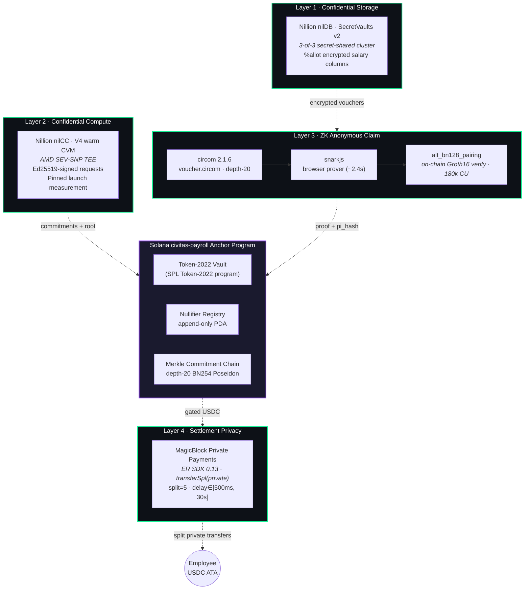
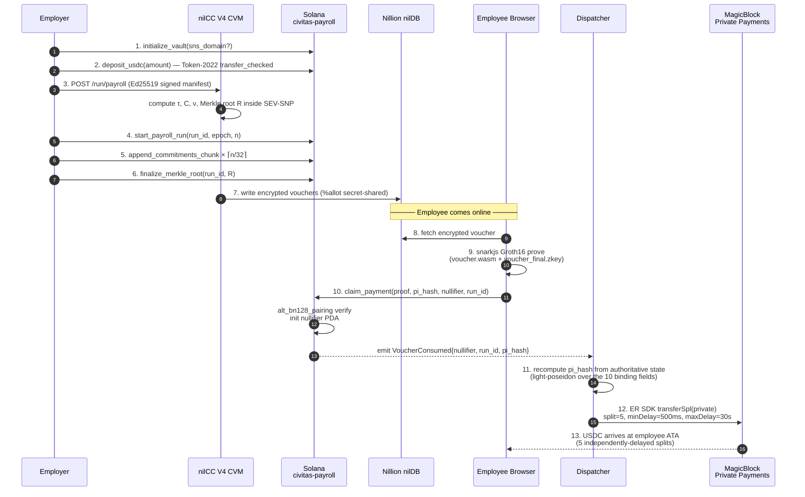
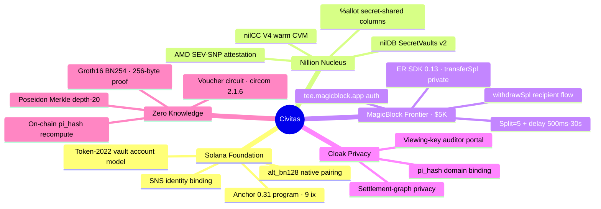

<div align="center">

# CIVITAS

### Private Payroll Settlement Protocol on Solana

*Zero-knowledge salary vouchers · TEE-attested compute · MagicBlock private settlement*

[](https://solana.com)
[](https://www.anchor-lang.com)
[](https://docs.circom.io)
[](https://docs.magicblock.gg)
[](https://docs.nillion.com)
[](#license)

**Program ID** · `CQW3TnN4X6iG2potguVv2hCKfk4f9tf8PMG7dTV6e24y`

[Whitepaper](./WHITEPAPER.md) · [Architecture](#architecture) · [Lifecycle](#lifecycle) · [Quick start](#quick-start) · [Integration status](#integration-status) · [Hackathon tracks](#hackathon-tracks)

</div>

---

## TL;DR

On-chain payroll has historically faced an unresolved trilemma — **transparency, privacy, and settlement integrity** — that nobody could satisfy without trusting a custodial processor. Civitas is the first end-to-end protocol on Solana that resolves all three, today, on a live devnet deployment:

> Employers compute payroll inside an **AMD SEV-SNP enclave** (Nillion nilCC, warm V4 workload, ~0.3s per call) and publish only Poseidon commitments. Employees redeem their salary by submitting a **256-byte Groth16 proof** verified natively on-chain through Solana's `alt_bn128_pairing` syscalls in ~180k CU. Actual USDC settlement is dispatched through **MagicBlock Private Payments** (`@magicblock-labs/ephemeral-rollups-sdk@0.13`), which splits the transfer five ways and delays each leg by 500ms–30s — so the on-chain ZK claim is never linkable to any payout.

**No salary appears in plaintext on-chain. No master credential leaves the browser. No single operator sees the full payroll table. No mocks anywhere in the path — every integration in this README is wired against the real, live remote service.**

---

## Architecture

Civitas composes **four cooperating privacy layers** anchored to a single Anchor program. Each layer addresses a distinct privacy threat — the system breaks down only if *every* layer is simultaneously compromised.



### Why four layers and not one?

| Layer | Threat it eliminates | What still leaks if you drop it |
|---|---|---|
| **1 — nilDB** | A single DB operator reading the salary table | Encrypted vouchers exposed to whoever hosts them |
| **2 — nilCC** | The payroll service seeing plaintext salaries | Employer's compute host can read every salary |
| **3 — Groth16 ZK** | Linking employees to claims via the chain | Anyone can recompute who's getting paid what |
| **4 — MagicBlock private payments** | Linking the on-chain claim to the actual payout | Block explorers see `vault → recipient` edges |

---

## Lifecycle

The end-to-end payroll lifecycle, from vault creation to private USDC arrival, exactly as it executes today on devnet:



### Core protocol relations

Three Poseidon-BN254 hashes capture the entire cryptographic protocol — and **circuit ↔ server ↔ on-chain handler all agree on these definitions byte-for-byte**:

```
τ := Poseidon₁(η)             — Employee Tag      (one-way from credential nonce)
C := Poseidon₄(τ, a, e, ν)    — Voucher Commitment (hiding, on-chain Merkle leaf)
N := Poseidon₃(η, e, ν)       — Spend Nullifier   (one-time spend token)
```

The Groth16 circuit proves *"I know `(η, a, e, ν, path)` such that `Poseidon₄(Poseidon₁(η), a, e, ν)` is a leaf of the on-chain Merkle root, and I produced `N = Poseidon₃(η, e, ν)`"* — without revealing any of the witnesses.

---

## ZK claim path

The single-instruction `claim_payment` is the heart of the protocol. The on-chain Groth16 verifier runs the entire BN254 pairing check via Solana's `alt_bn128_*` syscalls in ~180k compute units — well inside the 1.4M per-transaction budget.

```mermaid
flowchart LR
    A[Employee browser] -->|"1\. fetch voucher<br/>(encrypted)"| B[(nilDB)]
    A -->|"2\. snarkjs prove<br/>voucher.wasm + voucher_final.zkey"| A
    A -->|"3\. claim_payment(<br/>proof, pi_hash,<br/>nullifier, run_id)"| C{civitas-payroll}

    C -->|"recompute pi_hash<br/>from on-chain state"| D[SpongePoseidon10]
    D -->|"match?"| E{equal}
    E -->|no| F[REJECT<br/>InvalidPublicInputs]
    E -->|yes| G["alt_bn128_pairing<br/>e(-A,B)·e(α,β)·e(L,γ)·e(C,δ) = 1"]
    G -->|fail| H[REJECT<br/>ProofVerificationFailed]
    G -->|pass| I["init nullifier PDA<br/>seeds = (b'nullifier', N)"]
    I -->|exists?| J{double-spend}
    J -->|yes| K[REJECT<br/>NullifierAlreadyExists]
    J -->|no| L[emit VoucherConsumed<br/>nullifier, run_id, pi_hash, slot]

    L -.->|off-chain trigger| M[Dispatcher / API]
    M -->|ER SDK transferSpl<br/>privateTransfer:{split:5, delay}| N[(MagicBlock)]
    N -.->|5 delayed splits| O[Employee USDC ATA]

    style C fill:#9945FF,color:#fff
    style G fill:#14F195,color:#000
    style L fill:#14F195,color:#000
    style F fill:#FF4444,color:#fff
    style H fill:#FF4444,color:#fff
    style K fill:#FF4444,color:#fff
```

**Key facts:**
- Groth16 proof: **256 bytes**. Verification key: **580 bytes** (embedded into the BPF binary via `include_bytes!("../../keys/voucher_vk.bin")`). Both fit in a single 1232-byte Solana tx.
- Public inputs are folded into a single field via `SpongePoseidon(10)` — **merkle_root, nullifier, recipient ATA, amount, epoch, mint, vault_pda, program_id, run_id, deployment_domain_tag** are *all* bound. A single forged or replayed field is rejected before the pairing even runs.
- The on-chain claim instruction **does not move USDC**. Settlement is intentionally decoupled and dispatched through MagicBlock private payments — so the on-chain `vault → recipient` edge that block explorers would normally graph simply never exists.

---

## Tech stack

<table>
<tr><th>Layer</th><th>Technology</th><th>Role</th></tr>

<tr><td rowspan="3"><b>On-chain</b></td>
<td>Solana / Anchor 0.31</td><td>Program runtime, PDAs, events</td></tr>
<tr><td>SPL Token-2022 program</td><td>USDC vault account model (Token2022 program ID)</td></tr>
<tr><td><code>alt_bn128_*</code> syscalls</td><td>Native pairing / addition / multiplication for Groth16 — ~180k CU total</td></tr>

<tr><td rowspan="3"><b>Cryptography</b></td>
<td>circom 2.1.6 + circomlib</td><td>Voucher circuit · depth-20 Merkle · Poseidon BN254</td></tr>
<tr><td>snarkjs 0.7</td><td>Browser proof generation (WASM + zkey)</td></tr>
<tr><td>light-poseidon</td><td>On-chain Poseidon for <code>pi_hash</code> recompute</td></tr>

<tr><td rowspan="2"><b>Confidential infra</b></td>
<td>Nillion nilDB · SecretVaults v2.0</td><td>Secret-shared encrypted voucher storage · <code>%allot</code> on salary columns</td></tr>
<tr><td>Nillion nilCC · V4 warm CVM</td><td>AMD SEV-SNP attested payroll compute · Ed25519-signed manifests · pinned launch measurement</td></tr>

<tr><td><b>Settlement</b></td>
<td><code>@magicblock-labs/ephemeral-rollups-sdk@0.13</code></td><td><code>transferSpl(privateTransfer:{split:5, minDelayMs:500, maxDelayMs:30000})</code> · <code>withdrawSpl</code> · <code>delegateSpl</code> against <code>tee.magicblock.app</code></td></tr>

<tr><td rowspan="3"><b>Frontend</b></td>
<td>Next.js 16 + React 19 (App Router)</td><td>Server components · serverless API dispatcher</td></tr>
<tr><td>Privy + Wallet Adapter</td><td>Embedded + Phantom + Solflare wallets</td></tr>
<tr><td>shadcn/ui + Tailwind 4 + framer-motion</td><td>Component system + animated PER badges</td></tr>

<tr><td><b>Identity</b></td>
<td>Solana Name Service (Bonfida)</td><td>Optional <code>.sol</code> domain ↔ vault binding on <code>VaultState</code></td></tr>
</table>

---

## Repository structure

```
Civitas-Sol/
├── programs/
│   └── civitas-payroll/                # Anchor program (Rust)
│       ├── src/
│       │   ├── lib.rs                  # 9 instruction declarations
│       │   ├── instructions/           # initialize_vault, claim_payment, …
│       │   ├── verifier/
│       │   │   ├── mod.rs              # verify_voucher_proof entrypoint
│       │   │   └── groth16.rs          # 219 LOC · alt_bn128 pairing verifier
│       │   ├── state.rs                # VaultState · PayrollRun · NullifierAccount
│       │   ├── events.rs               # VoucherConsumed · PayrollBatchCommitted
│       │   └── errors.rs
│       └── keys/voucher_vk.bin         # 580-byte BN254 verifying key
│
├── circuits/
│   └── voucher_circom/
│       ├── voucher.circom              # Depth-20 Merkle + nullifier + pi_hash binding
│       └── build/
│           ├── voucher.r1cs            # ~21k constraints
│           ├── voucher.wasm            # browser witness gen
│           ├── voucher_final.zkey      # phase-2 trusted setup
│           └── verification_key.json
│
├── workload/                           # nilCC V4 warm workload (Docker, AMD64)
│   ├── server.js                       # /run/payroll · /run/onboard · /healthz · /attestation
│   ├── auth.js                         # Ed25519 verifier (raw-byte signed)
│   ├── run_compute.js                  # BN254 Poseidon + Merkle (pure function)
│   ├── onboard_employee.js             # TEE-generated credential nonces
│   └── Dockerfile                      # docker buildx --platform linux/amd64
│
├── frontend/
│   ├── app/
│   │   ├── employer/                   # vault setup + payroll wizard
│   │   ├── employees/                  # voucher claim flow
│   │   ├── auditors/                   # viewing-key audit portal
│   │   ├── invoice/                    # contractor invoices
│   │   ├── settlement/                 # per-claim settlement detail
│   │   └── api/
│   │       ├── payroll/                # generate · commit · confirm · private-pay · settle · …
│   │       ├── employer/employees/     # onboard-tee (warm CVM)
│   │       ├── nillion/                # nilDB collection mgmt
│   │       ├── auth/                   # session
│   │       └── vault/                  # initialize / fund
│   ├── lib/
│   │   ├── bn128-poseidon.ts           # field-equivalent Poseidon for browser
│   │   ├── groth16-proof.ts            # snarkjs wrapper
│   │   ├── merkle-tree.ts              # depth-20 BN254 tree
│   │   ├── borsh-encode.ts             # claim_payment ix encoding
│   │   ├── nillion.ts                  # SecretVaults browser client
│   │   ├── solana-program.ts           # Anchor IDL bindings
│   │   └── server/
│   │       ├── pi-hash.ts              # on-server pi_hash recompute (matches circuit)
│   │       ├── nilcc-client.ts         # V4 warm workload + legacy CVM client
│   │       ├── nillion-server.ts       # SecretVaultBuilderClient (server)
│   │       ├── magicblock-private-payments.ts  # SDK 0.13 wrappers
│   │       └── magicblock-auth.ts      # dispatcher tx signing + submission
│   └── scripts/
│       ├── provision-nilcc.mjs         # one-shot V4 warm CVM provisioner
│       ├── rotate-magicblock-mint.mjs
│       ├── compute-test-vectors.mjs
│       └── test-voucher-claim.ts       # end-to-end claim_payment exerciser
│
├── scripts/
│   ├── deploy.sh                       # one-shot devnet deploy
│   ├── groth16-setup.sh                # phase-1+2 ceremony · VK extraction
│   └── vk-to-rust.ts                   # snarkjs VK → keys/voucher_vk.bin
│
├── tests/                              # Anchor integration tests
├── Anchor.toml
└── WHITEPAPER.md                       # 60-page protocol spec
```

---

## Quick start

> **Prerequisites:** Solana CLI 2.2+, Anchor 0.31, Node.js 20+, Rust 1.79+, [snarkjs](https://github.com/iden3/snarkjs), Docker buildx (for the nilCC workload image).

```bash
# 1. Clone
git clone https://github.com/MeetCivitas/Civitas-SOL.git
cd Civitas-SOL

# 2. Build the Anchor program
anchor build

# 3. Compile the voucher circuit + run phase-2 ceremony + export VK
./scripts/groth16-setup.sh
# → writes circuits/voucher_circom/build/voucher_final.zkey
# → writes programs/civitas-payroll/keys/voucher_vk.bin

# 4. Deploy to devnet
./scripts/deploy.sh devnet

# 5. Provision the nilCC V4 warm workload (~5 min one-time)
cd frontend
npm install
node scripts/provision-nilcc.mjs
# → prints NILCC_WORKLOAD_DOMAIN, CIVITAS_REQUEST_PRIVKEY/PUBKEY,
#   NILCC_GOLDEN_MEASUREMENT — paste these into .env.local

# 6. Configure env + run
cp ../.env.local.example .env.local   # fill in Privy, Nillion org key, MagicBlock keypair
npm run dev                            # http://localhost:3000
```

**Run an end-to-end payroll on devnet:**


---

## Anchor instruction reference

| Instruction | Caller | Purpose |
|---|---|---|
| `initialize_vault(sns_domain)` | Employer | Create `VaultState` PDA + Token-2022 vault ATA, optional `.sol` binding |
| `deposit_usdc(amount)` | Employer | `transfer_checked` USDC → vault ATA (Token-2022 program) |
| `start_payroll_run(run_id, epoch, n)` | Employer | Open a new commitment batch (`PayrollRunAccount` PDA) |
| `append_commitments_chunk(run_id, idx, commitments)` | Employer | Append up to 32 Poseidon leaves per tx |
| `finalize_merkle_root(run_id, root, chunk_count)` | Employer | Lock the run and publish the depth-20 BN254 root |
| **`claim_payment(proof, pi_hash, nullifier, run_id)`** | **Employee** | **Pure ZK gate — `alt_bn128_pairing` verify + nullifier PDA init + `VoucherConsumed` event** |
| `create_invoice(id, commitment, due_ts, cid)` | Contractor | Open a contractor invoice |
| `pay_invoice(invoice_id)` | Client | Atomic deposit + commit + finalize for a single invoice |
| `close_vault()` | Employer | Devnet utility — close vault PDA + ATA |

Full spec in [Appendix B of the whitepaper](./WHITEPAPER.md).

---

## Integration status

Every integration listed below is **live, against real remote services, with no in-process stubs or mocks on the production path.** The last verification pass was 2026-05-11.

| Component | Status | Endpoint / Address | Notes |
|---|---|---|---|
| Anchor program (9 ix) | Deployed | `CQW3TnN4X6iG2potguVv2hCKfk4f9tf8PMG7dTV6e24y` (devnet) | Anchor 0.31 · Solana 2.2 |
| Groth16 verifier | Live | embedded VK (580 B) | `alt_bn128_pairing` + `alt_bn128_addition` + `alt_bn128_multiplication` — ~180k CU |
| Voucher circuit | Built | `circuits/voucher_circom/build/` | depth-20 Merkle · ~21k R1CS · pot15 + phase-2 ceremony complete |
| Voucher claim end-to-end | Verified | tx logged in commit `090f24d` | snarkjs prove → `claim_payment` → nullifier minted on devnet |
| Nillion nilDB (SecretVaults v2) | Live | `nildb-stg-n[1-3].nillion.network` | 3-of-3 cluster · `%allot` on salary columns · `@nillion/secretvaults@2.0.0` |
| Nillion nilCC (V4 warm CVM) | Live | `{workloadId}.nillionusercontent.com` | Ed25519-signed manifests · pinned launch measurement · ~0.3s warm latency |
| nilCC attestation | Live | `/nilcc/api/v2/report` | AMD SEV-SNP report · TLS-fingerprint bound · `NILCC_GOLDEN_MEASUREMENT` enforced |
| MagicBlock auth | Live | `tee.magicblock.app/auth/{challenge,login}` | tweetnacl ed25519 sig → 30-day Bearer · 25-min refresh |
| MagicBlock private transfer | Live | ER SDK `transferSpl(privateTransfer:…)` | split=5 · delay 500ms–30s · base→base via `tee.magicblock.app` |
| MagicBlock withdraw | Live | ER SDK `withdrawSpl` | employee-signed undelegate + base-layer withdraw |
| Token-2022 vault | Live | Mint `9pan9bMn5HatX4EJdBwg9VgCa7Uz5HL8N1m5D3NdXejP` (devnet) | Token-2022 program. *Privacy is provided by MagicBlock + ZK, not the (currently devnet-disabled) Confidential Transfer extension.* |
| Privy + Solana wallets | Live | Privy React SDK 3.16 · `@solana/web3.js` 1.98 | Phantom · Solflare · embedded |
| Frontend | Production | Vercel · Next.js 16 + React 19 | Webpack build (Turbopack disabled for prod) |

### What's intentionally *not* on-chain

- **USDC settlement is off-chain by design.** `claim_payment` is a pure ZK gate — it never touches a token program. The dispatcher binds `(recipient, amount)` to `pi_hash` only after the on-chain proof verifies, then triggers MagicBlock `transferSpl(privateTransfer:…)`. This is the *point* of Layer 4: an on-chain transfer linkable to the claim would defeat the entire stack.
- **Token-2022 ConfidentialTransfer extension** is currently disabled on Solana devnet + mainnet (pending the 2026 Solana security audit). Civitas was originally architected to use it for Layer 4; the V2 pivot replaced it with MagicBlock Private Payments — the only production-ready private SPL primitive on Solana right now. The Token-2022 program is still used for the vault's account model, but amount-hiding is provided by MagicBlock, not CT.

---

## Performance

| Operation | Cost |
|---|---|
| `claim_payment` compute units | **~180,000** of 1.4M (≈12.8%) |
| Groth16 proof size | **256 bytes** |
| Verification key size | **580 bytes** (embedded via `include_bytes!`) |
| Circuit constraints | **~21,000 R1CS** |
| Browser proving time (M1) | **~2.4 s** |
| Merkle tree depth | 20 (1,048,576 leaves) |
| `append_commitments_chunk` capacity | 32 leaves per tx |
| nilCC V4 first call | **~1.0 s** (warm) |
| nilCC V4 subsequent calls | **~0.3 s** (warm) |
| MagicBlock private transfer leg delay | 500 ms – 30 s (configurable) |

---

## MagicBlock private payments — wire detail

The dispatcher path (`frontend/lib/server/magicblock-auth.ts` → `magicblock-private-payments.ts`) follows the canonical pattern verified against `github.com/magicblock-labs/private-payments-demo`:

```ts
// 1. Auth — ed25519 against tee.magicblock.app
const { challenge } = await getAuthChallenge(employerPubkey);
const sig = nacl.sign.detached(utf8(challenge), employerSecret);
const { token } = await loginWithSignature(employerPubkey, challenge, bs58.encode(sig));

// 2. Private transfer — base→base, ER SDK 0.13
const ixs = await transferSpl(
  fromPk, toPk, mintPk, amountUsdc,
  {
    connection: baseConn,
    validator: await getPrivateValidator(),  // DEFAULT_PRIVATE_VALIDATOR
    privateTransfer: {
      split: 5,
      minDelayMs: 500n,
      maxDelayMs: 30_000n,
    },
  },
);
// 3. Sign + submit — payments.magicblock.app routes the split-and-delay
//    crank internally; recipient eventually undelegate + withdrawSpl.
```

**MagicBlock uses legacy SPL Token mints only** (not Token-2022). The `MAGICBLOCK_USDC_MINT` env var defaults to `NEXT_PUBLIC_USDC_MINT`; for a true devnet run with the legacy mint, set it explicitly via `scripts/rotate-magicblock-mint.mjs`.

---

## nilCC V4 — warm workload

The nilCC integration shipped 2026-05-07 migrated from a "spin-up-a-CVM-per-payroll" pattern (60–120 s cold-start per run) to a **long-running V4 image** that handles every payroll/onboard call via signed HTTP:

| | Legacy (per-run CVM) | **V4 (warm CVM)** |
|---|---|---|
| First call | 60–120 s | **~1 s** |
| Subsequent calls | 60–120 s | **~0.3 s** |
| Auth | API key | **Ed25519 over raw bytes** |
| Attestation | per-CVM | **pinned `NILCC_GOLDEN_MEASUREMENT`** |
| File | `nilcc-client.ts::submitPayrollJob` (kept for rollback) | `nilcc-client.ts::runOnWorkload` |

API routes (`app/api/payroll/generate/route.ts`, `app/api/employer/employees/onboard-tee/route.ts`) select V4 automatically when `NILCC_WORKLOAD_DOMAIN` is set; setting `USE_LEGACY_NILCC=1` flips back to the old ephemeral path.

The workload image **must be built `linux/amd64`** — nilCC's AMD-SNP CVMs reject arm64 manifests:

```bash
docker buildx build --platform linux/amd64 -t <yourname>/civitas-nilcc-workload:v4 --push workload/
```

---

## Hackathon tracks

Civitas was designed from day one to be a **multi-track, end-to-end demonstration** of Solana's most recent privacy primitives composed into a single shipping product:



**Primary target:** MagicBlock Frontier ($5K USDC) — two integrations (Permissioned Ephemeral Rollups for the commit pipeline UI, MagicBlock Private Payments for amount-hiding settlement) carrying the *"Confidential Transfers were disabled — we engineered around it"* narrative.

---

## Resources

- **[Whitepaper (60 pages)](./WHITEPAPER.md)** — full cryptographic and operational specification
- **Anchor program** — [`programs/civitas-payroll`](./programs/civitas-payroll)
- **Voucher circuit** — [`circuits/voucher_circom/voucher.circom`](./circuits/voucher_circom/voucher.circom)
- **nilCC V4 workload** — [`workload/`](./workload)
- **Groth16 setup script** — [`scripts/groth16-setup.sh`](./scripts/groth16-setup.sh)
- **Deploy script** — [`scripts/deploy.sh`](./scripts/deploy.sh)
- **MagicBlock SDK wrappers** — [`frontend/lib/server/magicblock-private-payments.ts`](./frontend/lib/server/magicblock-private-payments.ts) · [`magicblock-auth.ts`](./frontend/lib/server/magicblock-auth.ts)
- **nilCC client** — [`frontend/lib/server/nilcc-client.ts`](./frontend/lib/server/nilcc-client.ts)

---

## License

MIT © 2026 Civitas contributors. See [LICENSE](./LICENSE) for the full text.

---

<div align="center">

**Built on Solana · Powered by Nillion · Settled through MagicBlock**

*Privacy-preserving payroll, one Poseidon hash at a time.*

</div>
