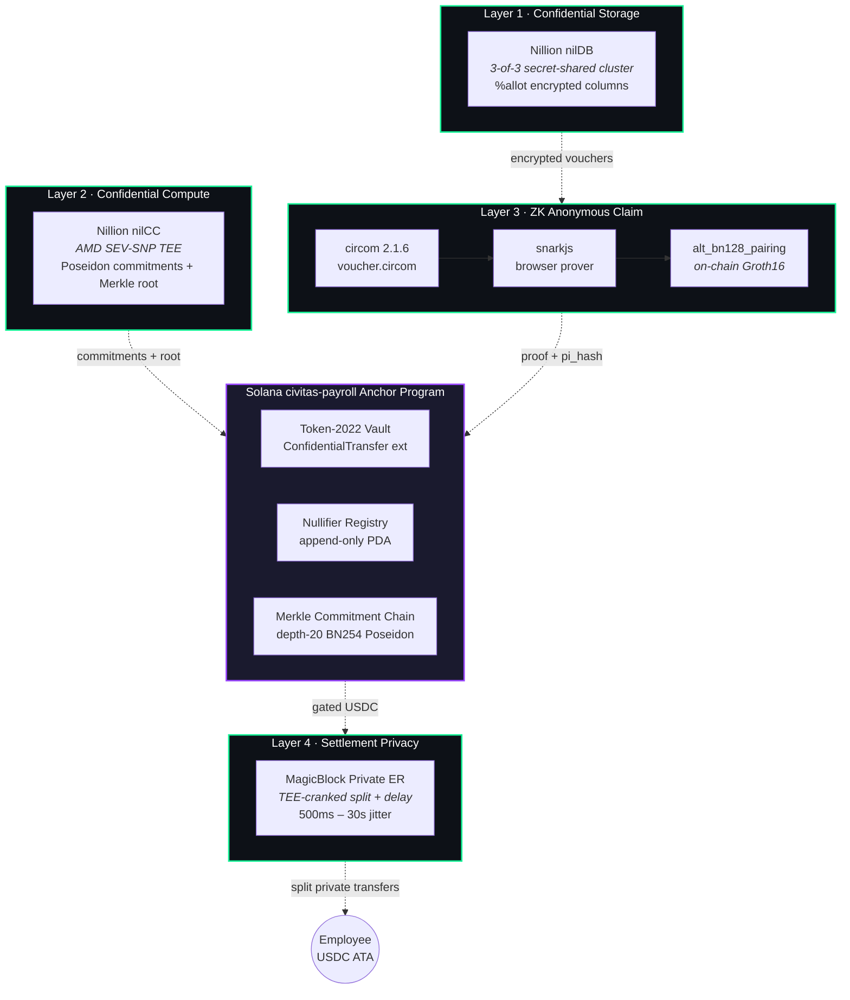
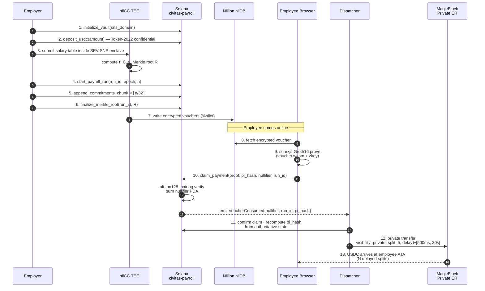
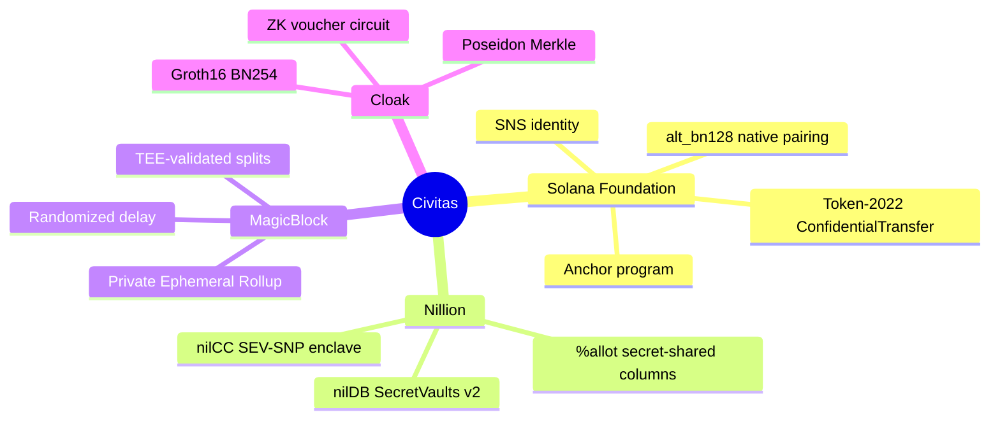

<div align="center">

# CIVITAS

### Private Payroll Settlement Protocol on Solana

*Zero-knowledge salary vouchers · TEE-attested compute · TEE-validated settlement*

[](https://solana.com)
[](https://www.anchor-lang.com)
[](https://docs.circom.io)
[](https://spl.solana.com/token-2022)
[](#license)

**Program ID** · `CQW3TnN4X6iG2potguVv2hCKfk4f9tf8PMG7dTV6e24y`

[Whitepaper](./WHITEPAPER.md) · [Architecture](#architecture) · [Lifecycle](#lifecycle) · [Quick start](#quick-start) · [Tracks](#hackathon-tracks)

</div>

---

## TL;DR

On-chain payroll has historically faced an unresolved trilemma — **transparency, privacy, and settlement integrity** — that nobody could satisfy without trusting a custodial processor. Civitas is the first end-to-end protocol on Solana that resolves all three:

> Employers compute payroll inside an **AMD SEV-SNP enclave** (Nillion nilCC) and publish only Poseidon commitments. Employees redeem their salary by submitting a **256-byte Groth16 proof** verified natively on-chain through Solana's `alt_bn128_pairing` syscalls. Actual USDC settlement is dispatched through **MagicBlock's Private Ephemeral Rollup**, which splits and randomly delays the transfer so the on-chain ZK gate is never linkable to the payout.

**No salary ever appears in plaintext on-chain. No master credential ever leaves the browser. No single operator ever sees the full payroll table.**

---

## Architecture

Civitas composes **four cooperating privacy layers** anchored to a single Anchor program. Each layer addresses a distinct privacy threat — the system breaks down only if *every* layer is simultaneously compromised.



### Why four layers and not one?

| Layer | Threat it eliminates | What still leaks if you drop it |
|---|---|---|
| **1 — nilDB** | A single DB operator reading the salary table | Encrypted vouchers exposed to whoever hosts them |
| **2 — nilCC** | The payroll service seeing plaintext salaries | Employer's compute host can read every salary |
| **3 — Groth16 ZK** | Linking employees to claims via the chain | Anyone can recompute who's getting paid what |
| **4 — MagicBlock ER** | Linking the on-chain claim to the actual payout | Block explorers see `vault → recipient` edges |

---

## Lifecycle

The end-to-end payroll lifecycle, from vault creation to private USDC arrival:



### Core protocol relations

Three Poseidon-BN254 hashes capture the entire cryptographic protocol:

```
τ := Poseidon₁(η)             — Employee Tag      (one-way from secret nonce)
C := Poseidon₄(τ, a, e, ν)    — Voucher Commitment (hiding, on-chain leaf)
N := Poseidon₃(η, e, ν)       — Spend Nullifier   (one-time spend token)
```

The Groth16 circuit proves *"I know `(η, a, e, ν, path)` such that `Poseidon₄(Poseidon₁(η), a, e, ν)` is a leaf of the on-chain Merkle root, and I produced `N = Poseidon₃(η, e, ν)`"* — without revealing any of the witnesses.

---

## ZK claim path

The single-instruction `claim_payment` is the heart of the protocol. It runs the entire Groth16 verifier in ~180k compute units — well inside Solana's 1.4M per-transaction budget.

```mermaid
flowchart LR
    A[Employee browser] -->|"1\. fetch voucher<br/>(encrypted)"| B[(nilDB)]
    A -->|"2\. snarkjs prove<br/>voucher.wasm + zkey"| A
    A -->|"3\. claim_payment(<br/>proof, pi_hash,<br/>nullifier, run_id)"| C{civitas-payroll}

    C -->|"recompute pi_hash<br/>from on-chain state"| D[SpongePoseidon10]
    D -->|"match?"| E{equal}
    E -->|no| F[REJECT<br/>InvalidPublicInputs]
    E -->|yes| G["alt_bn128_pairing<br/>e(-A,B)·e(α,β)·e(L,γ)·e(C,δ) = 1"]
    G -->|fail| H[REJECT<br/>InvalidProof]
    G -->|pass| I[init nullifier PDA<br/>seeds=[b'null', N]]
    I -->|exists?| J{double-spend}
    J -->|yes| K[REJECT<br/>NullifierAlreadyExists]
    J -->|no| L[emit VoucherConsumed<br/>n, run_id, pi_hash, slot]

    L -.->|off-chain trigger| M[Dispatcher API]
    M -->|signed MagicBlock tx<br/>visibility=private| N[(MagicBlock ER)]
    N -.->|N delayed splits| O[Employee USDC ATA]

    style C fill:#9945FF,color:#fff
    style G fill:#14F195,color:#000
    style L fill:#14F195,color:#000
    style F fill:#FF4444,color:#fff
    style H fill:#FF4444,color:#fff
    style K fill:#FF4444,color:#fff
```

**Key facts:**
- Proof: **256 bytes**. Verification key: **580 bytes**. Both fit in a 1232-byte Solana tx.
- Public inputs are folded into a single field via `SpongePoseidon(10)` — recipient ATA, amount, epoch, mint, vault PDA, program ID, run ID, deployment domain tag are *all* bound. A single forged or replayed field is rejected.
- The on-chain claim instruction does **not** move USDC. Settlement is decoupled and dispatched through the MagicBlock private rollup.

---

## Tech stack

<table>
<tr><th>Layer</th><th>Technology</th><th>Role</th></tr>

<tr><td rowspan="3"><b>On-chain</b></td>
<td>Solana / Anchor 0.30</td><td>Program runtime, PDAs, events</td></tr>
<tr><td>Token-2022</td><td>ConfidentialTransfer-extension USDC vault</td></tr>
<tr><td><code>alt_bn128_*</code> syscalls</td><td>Native pairing, addition, multiplication for Groth16</td></tr>

<tr><td rowspan="3"><b>Cryptography</b></td>
<td>circom 2.1.6 + circomlib</td><td>Voucher circuit, depth-20 Merkle, Poseidon BN254</td></tr>
<tr><td>snarkjs</td><td>Browser proof generation (WASM + zkey)</td></tr>
<tr><td>light-poseidon</td><td>On-chain Poseidon for <code>pi_hash</code> recompute</td></tr>

<tr><td rowspan="2"><b>Confidential infra</b></td>
<td>Nillion nilDB / SecretVaults v2</td><td>Secret-shared encrypted voucher storage</td></tr>
<tr><td>Nillion nilCC</td><td>AMD SEV-SNP attested payroll compute</td></tr>

<tr><td><b>Settlement</b></td>
<td>MagicBlock <code>ephemeral-rollups-sdk</code> v0.12</td><td>TEE-validated private split-and-delay transfers</td></tr>

<tr><td rowspan="3"><b>Frontend</b></td>
<td>Next.js 16 + React 19</td><td>App router, server components</td></tr>
<tr><td>Privy + Wallet Adapter</td><td>Embedded + Phantom + Solflare wallets</td></tr>
<tr><td>shadcn/ui + Tailwind 4</td><td>Component system</td></tr>

<tr><td><b>Identity</b></td>
<td>Solana Name Service (Bonfida)</td><td><code>.sol</code> domain ↔ vault binding</td></tr>
</table>

---

## Repository structure

```
Civitas-Sol/
├── programs/
│   └── civitas-payroll/          # Anchor program (Rust)
│       └── src/
│           ├── lib.rs            # 9 instructions
│           ├── instructions/     # initialize_vault, claim_payment, ...
│           ├── verifier/         # Groth16 BN254 verifier
│           ├── state.rs          # VaultState, PayrollRun, Nullifier PDAs
│           └── events.rs         # VoucherConsumed, PayrollBatchCommitted
│
├── circuits/
│   ├── voucher_circom/           # ZK circuit + trusted setup
│   │   ├── voucher.circom        # depth-20 Merkle + nullifier
│   │   ├── voucher.wasm          # 3.1 MB
│   │   └── voucher_final.zkey    # 8.4 MB
│   └── voucher_noir/             # parallel Noir/Aztec implementation
│
├── frontend/
│   ├── app/                      # Next.js routes
│   │   ├── employer/             # vault setup + payroll runs
│   │   ├── employees/            # voucher claim flow
│   │   ├── invoice/              # contractor invoices
│   │   ├── settlement/           # MagicBlock dispatcher UI
│   │   └── api/                  # serverless dispatcher endpoints
│   ├── lib/
│   │   ├── bn128-poseidon.ts     # field-equivalent Poseidon
│   │   ├── groth16-proof.ts      # snarkjs wrapper
│   │   ├── merkle-tree.ts        # depth-20 BN254 tree
│   │   ├── nillion.ts            # SecretVaults client
│   │   ├── solana-program.ts     # Anchor IDL bindings
│   │   └── server/               # pi-hash, magicblock-auth
│   └── orchestrator/             # nilCC TEE compute dispatcher
│
├── workload/                     # nilCC docker workload
├── tests/                        # Anchor integration tests
└── WHITEPAPER.md                 # 60-page protocol spec
```

---

## Quick start

> **Prerequisites:** Solana CLI 1.18+, Anchor 0.30, Node.js 20+, Rust 1.79+, [snarkjs](https://github.com/iden3/snarkjs).

```bash
# 1. Clone
git clone https://github.com/MeetCivitas/Civitas-SOL.git
cd Civitas-SOL

# 2. Build the Anchor program
anchor build

# 3. Compile the voucher circuit + run trusted setup
cd circuits/voucher_circom && ./build.sh && cd -

# 4. Deploy to devnet
anchor deploy --provider.cluster devnet

# 5. Frontend
cd frontend
cp .env.local.example .env.local   # fill in Privy, Nillion, MagicBlock keys
npm install
npm run dev                        # http://localhost:3000
```

**Run an end-to-end payroll on devnet:**


---

## Anchor instruction reference

| Instruction | Caller | Purpose |
|---|---|---|
| `initialize_vault(sns_domain)` | Employer | Create `VaultState` + Token-2022 ATA, optional `.sol` binding |
| `deposit_usdc(amount)` | Employer | Confidential deposit via Token-2022 `apply_pending_balance` |
| `start_payroll_run(run_id, epoch, n)` | Employer | Open a new commitment batch |
| `append_commitments_chunk(run_id, idx, commitments)` | Employer | Append up to 32 Poseidon leaves per tx |
| `finalize_merkle_root(run_id, root, chunk_count)` | Employer | Lock the run and publish the depth-20 root |
| **`claim_payment(proof, pi_hash, nullifier, run_id)`** | **Employee** | **Pure ZK gate — pairing + nullifier + event** |
| `create_invoice(id, commitment, due_ts, cid)` | Contractor | Open an invoice |
| `pay_invoice(invoice_id)` | Client | Atomic deposit + commit + finalize |
| `close_vault()` | Employer | Devnet utility — close vault PDA + ATA |

Full spec in [Appendix B of the whitepaper](./WHITEPAPER.md#appendix-b--anchor-instruction-reference).

---

## Performance

| Operation | Cost |
|---|---|
| `claim_payment` compute units | **~180,000** of 1.4M (≈12.8%) |
| Groth16 proof size | **256 bytes** |
| Verification key size | **580 bytes** |
| Circuit constraints | ~21,000 R1CS |
| Browser proving time (M1) | **~2.4s** |
| Merkle tree depth | 20 (1,048,576 leaves) |
| `append_commitments_chunk` capacity | 32 leaves per tx |

---

## Hackathon tracks

Civitas was designed from day one to be a **multi-track, end-to-end demonstration** of Solana's most recent privacy primitives composed into a single product:



---

## Status

**Devnet live.** The protocol is fully functional end-to-end on Solana devnet. Mainnet-Beta target is post-hackathon following an external audit of the verifier and trusted-setup ceremony.

| Component | State |
|---|---|
| Anchor program (9 instructions) | Deployed on devnet |
| Groth16 verifier (`alt_bn128_pairing`) | Verified on-chain |
| Voucher circuit + trusted setup | Phase 2 ceremony complete |
| Nillion nilDB integration | SecretVaults v2 live |
| Nillion nilCC enclave workload | SEV-SNP attested |
| MagicBlock private dispatcher | Functional |
| Frontend (Next.js) | Production build on Vercel |

---

## Resources

- **[Whitepaper (60 pages)](./WHITEPAPER.md)** — full cryptographic and operational specification
- **Anchor program** — [`programs/civitas-payroll`](./programs/civitas-payroll)
- **Voucher circuit** — [`circuits/voucher_circom/voucher.circom`](./circuits/voucher_circom)
- **nilCC workload** — [`workload/`](./workload)

---

## License

MIT © 2026 Civitas contributors. See [LICENSE](./LICENSE) for the full text.

---

<div align="center">

**Built on Solana · Powered by Nillion · Settled through MagicBlock**

*Privacy-preserving payroll, one Poseidon hash at a time.*

</div>
