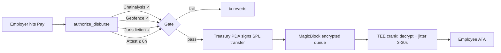
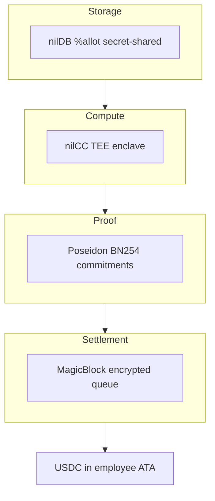
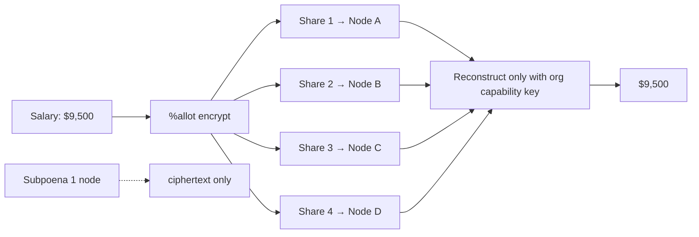
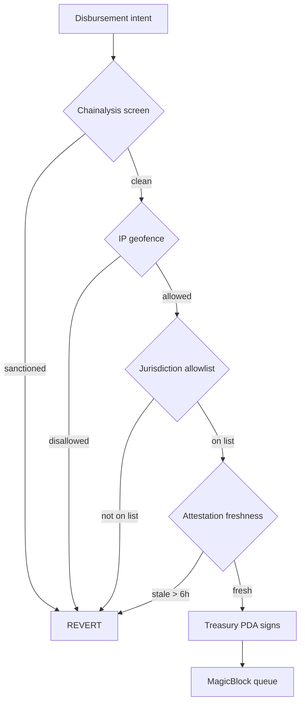
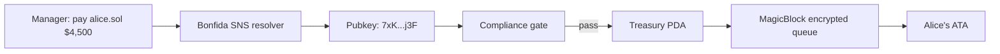
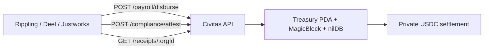
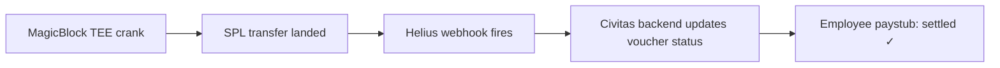
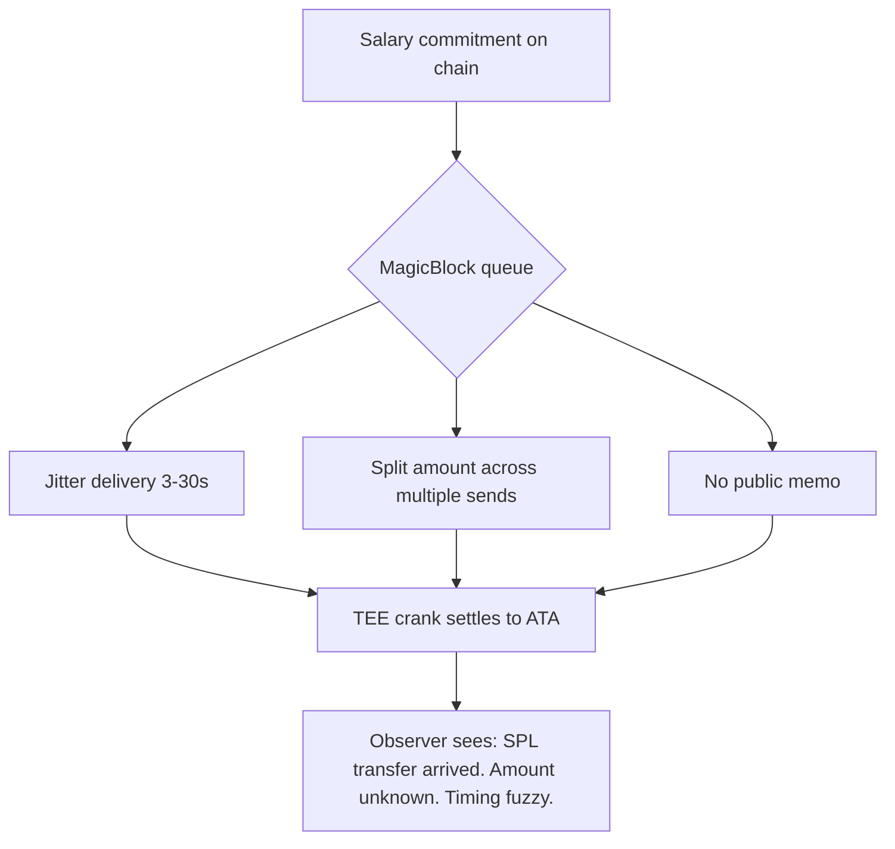

# Civitas LinkedIn Campaign — May 23 → Jun 21 2026

**Page:** Meet Civitas (company page) · **Goal:** 10 → 10,000 followers in 60 posts
**Cadence:** 2 posts/day, 30 days. AM (build/tech) 11:00 IST · PM (GTM/founder/VC) 21:00 IST.
**Voice:** Mert × Naruto. Receipts > rhetoric. One idea per post. No Cloak mentions.
**Partner emphasis:** W1 MagicBlock · W2 Nillion (Nucleus big drop) · W3 Privy + SNS/Bonfida · W4 Helius + Solana Foundation + investor close.
**Live:** meetcivitas.xyz · github.com/MeetCivitas/Civitas-SOL · devnet.

**Why these times:**
- 11:00 IST = 5:30 GMT, hits APAC EOD + EU early morning + India work day. Build/tech audience.
- 21:00 IST = 11:30 ET / 8:30 PT, hits US prime LinkedIn time. GTM + VC + founder content.

**Format mix across 60 posts (LinkedIn algorithm bias):**
- 22 text-only (no image) — founder voice, hot takes, essays, investor letters
- 12 text-card images — quotable punchlines (1600×900, same template as X)
- 9 mermaid diagrams — architecture, flows, comparison
- 6 hero/abstract images — polish moments (reuse X hero prompts where possible)
- 8 document carousels (5–10 slides each) — LinkedIn's highest-reach format
- 3 polls — comment bait + audience data

Char counts target 1300–1800 (LinkedIn dwell-time sweet spot), opening 2 lines under 210 chars (above the "see more" fold). External links (meetcivitas.xyz, GitHub) go in the **first comment**, never in the post body — LinkedIn suppresses post reach when the body has external links.

---

## Week 1 — MagicBlock heat (Days 1–7, May 23–29)

### Day 1 — Sat May 23 — LAUNCH DAY

**AM (11:00 IST) · text-only · founder launch post**

```
Six hundred and fifty billion dollars in stablecoins moved on Solana last February.

Every single salary inside that number was public.

Today I'm launching Civitas on LinkedIn — a private payroll layer for Solana.

Here's the problem we're solving:

If you run a crypto-native company and you pay your team in USDC, every employee can see what every other employee earns. Vendors can see your burn rate. Competitors can see your hiring. Investors can reconstruct your cap table from on-chain receipts.

This was supposed to get fixed. Token-2022 confidential transfers — Solana's only native privacy primitive for stablecoins — has been offline since June after an audit. Nothing has replaced it at the protocol layer.

We didn't wait.

Civitas runs USDC payroll on Solana with four privacy layers:

→ Storage: Nillion nilDB secret-shares the salary data
→ Compute: Nillion nilCC enclaves attest the payroll math
→ Proof: Poseidon commitments, ZK-verified on alt_bn128
→ Settlement: MagicBlock's encrypted queue delivers privately, in seconds

Live on devnet today. Mainnet Q3.

If you run finance or HR at a crypto-native company and you've ever felt weird about your team being able to read each other's offer letters from a block explorer — let's talk.

Follow the page. The next 30 days I'll be publishing the architecture, the design partner program, and the seed round narrative.

— Rythme, founder
```

**First comment:** `Site: meetcivitas.xyz · Repo: github.com/MeetCivitas/Civitas-SOL · DM open for design partners and seed conversations.`

---

**PM (21:00 IST) · document carousel (8 slides) · "The Payments Privacy Problem"**

```
The payments privacy problem in 8 slides.

If your company pays anyone in stablecoins, the math on every check is public. We thought "everyone moves to USDC and it just works." It doesn't.

Swipe through. Then tell me which slide you disagree with — I'll respond to every comment in the first 24h.
```

**Carousel slide spec (1080×1080 each, brand-matched dark theme #05070d → #0b1322 → #0f1d36, JetBrains Mono, teal #7CF9C7 + electric blue #5B8DEF accents):**
- Slide 1: **"Your salary is on a block explorer right now."** (hook)
- Slide 2: **$650B** — stablecoin volume on Solana, Feb 2026. All public.
- Slide 3: **$777M** — Rise's annual crypto payroll volume. Can't sell to Fortune 500. Why? Privacy.
- Slide 4: **6 months offline** — Token-2022 confidential transfers, since June '25 audit.
- Slide 5: **The four layers most "private payroll" projects skip:** storage / compute / proof / settlement.
- Slide 6: **What "private" means at each layer.** (small table)
- Slide 7: **Civitas wires all four.** (mini stack diagram)
- Slide 8: **CTA** — meetcivitas.xyz · design partner slots open · DM.

**First comment:** `Devnet live. Mainnet Q3 2026. → meetcivitas.xyz`

---

### Day 2 — Sun May 24

**AM (11:00 IST) · text-card image · the Token-2022 offline post**

Image text on card:
```
Token-2022 confidential transfers?
Disabled since June.

So we engineered around it.

Civitas now uses MagicBlock's
encrypted queue + a treasury PDA gate
to pay salaries in USDC, privately,
on Solana mainnet beta.

No waiting on a re-audit.
```

Post body:
```
The most important Solana feature for stablecoin payroll has been offline for almost a year.

Token-2022 confidential transfers got disabled after the April audit. The fix is "soon." It's been "soon" for 11 months.

A lot of teams building "private payments on Solana" froze. Some pivoted to L2s. Some quietly shut down.

We did neither.

In one week we re-architected Civitas around MagicBlock's Private Payments primitive — an encrypted message queue cranked by a TEE that decrypts, jitters, and settles to the recipient's ATA in 3–30 seconds. The salary amount never appears in cleartext on a public mempool.

We added a treasury PDA gate so that even with the queue, an employer can't bypass compliance — the disbursement instruction won't sign unless Chainalysis screen + IP geofence + jurisdiction allowlist + a 6-hour-fresh attestation all pass.

Engineering > waiting.

If you're building on Solana and you've been blocked by a missing primitive, my unsolicited opinion: the fastest path is almost never the one you started on. Build the workaround. Ship the workaround. Replace it when the proper primitive ships.
```

**First comment:** `Tech writeup with the actual transaction layout → github.com/MeetCivitas/Civitas-SOL`

---

**PM (21:00 IST) · text-only · founder voice GTM**

```
Stripe takes 2–3 business days to settle a payroll.

Civitas takes 30 seconds.

The math, because someone always asks:

Stripe ACH → 1–3 business days for bank rails. International wire → 3–5 business days + $30–$50 in fees per leg.

Civitas → one Solana transaction (≈400ms on-chain) lands the funds in a MagicBlock encrypted queue. A TEE crank decrypts the amount, jitters the timing 3–30s for graph privacy, and pushes USDC into the recipient's ATA. Total wall-clock: 30 seconds from "manager hits Pay" to "funds in employee account."

Two things make this possible on Solana and only on Solana:

1. Sub-second finality at the consensus layer
2. A working private SPL primitive (MagicBlock's Private Payments) that doesn't need a roadmap

This is why we don't multi-chain. Bridges are exploit surfaces. L2s settle on a slower layer. EVM doesn't have an equivalent private payment rail in production.

Solana isn't faster. Solana is the only one where this exact stack — private, compliant, cheap, sub-minute — actually ships.

If you're a founder evaluating chains for fintech infra, ping me. I will save you a quarter of wrong-direction work.
```

---

### Day 3 — Mon May 25

**AM (11:00 IST) · mermaid diagram · disbursement flow**

Mermaid source:


Post body:
```
One atomic Solana transaction that hides the salary amount, enforces compliance, and settles in 30 seconds.

This is the entire disbursement flow:

→ `authorize_disburse` — a Civitas Anchor instruction that takes the disbursement intent + a fresh attestation + per-employee caps + a daily-cap solvency check
→ If any check fails, the tx reverts before USDC moves. The treasury PDA is the custody point — the employer's key cannot bypass it.
→ On pass, the PDA signs the SPL transfer into MagicBlock's encrypted queue. The amount is encrypted at the rail layer.
→ A TEE crank picks it up, decrypts in the enclave, jitters timing 3–30s for graph-privacy, settles into the employee's ATA.

Privacy isn't a bolt-on. Privacy and compliance run in the same transaction.

If you've been designing on-chain payments and feeling like privacy and compliance are opposed — they're not. They're orthogonal. You separate the layers: amounts encrypted at the rail, identity verified at the gate, vouchers encrypted-at-rest, auditors get a scoped key.

Comment with the part you'd want me to break down further.
```

**First comment:** `Full transaction layout + IDL → github.com/MeetCivitas/Civitas-SOL`

---

**PM (21:00 IST) · poll · audience data + comments**

Poll setup:
```
Question: What's the biggest blocker to your company moving payroll on-chain?

Options:
A) Privacy — we can't have salaries on a block explorer
B) Compliance — unclear how to stay onside with regulators
C) UX — most employees aren't crypto users
D) Tax & accounting — our systems aren't built for it
```

Post body (above the poll):
```
Genuinely curious — for anyone in finance, HR, or ops at a company that's considered USDC payroll and didn't pull the trigger:

What stopped you?

I'm building Civitas on the thesis that the answer is mostly (A) and (B), which is why we built a privacy layer with a compliance gate. But I've heard (C) and (D) enough from real conversations to wonder if I'm wrong on the ranking.

Vote whatever rings true. Drop the actual story in a comment if you've lived it — I'll DM and trade notes.

This isn't a "vote A" post. I genuinely want to know what's blocking the category.
```

---

### Day 4 — Tue May 26

**AM (11:00 IST) · text-only · technical depth**

```
A small technical post nobody asks for but a few of you will love:

ZK on Solana is meaningfully different from ZK on EVM, and the reason is one syscall family — `alt_bn128_pairing`, `alt_bn128_addition`, `alt_bn128_multiplication`.

These are precompiled BN254 curve operations exposed by the Solana runtime, costing a few thousand CUs per call.

What this means in practice:

A real Groth16 verifier — the same proving system Tornado, Aztec, and most production ZK systems use — runs natively inside a Solana program. No precompile, no L2, no "verify off-chain and trust me." The pairing check happens on-chain, inside Civitas's `claim_payment` instruction. The proof is ≈256 bytes. The whole verification fits comfortably in a single tx's compute budget.

This is why we're Solana-native. It's not a vibe. It's that `alt_bn128_pairing` is the only sub-cent on-chain pairing-friendly check available in production today on a high-throughput L1.

We didn't pick a chain. We picked the only chain where the math works.
```

---

**PM (21:00 IST) · text card · privacy + compliance essay**

Image text on card:
```
Auditors see what they should.
The public chain stays clean.

Privacy ≠ permissionless.
Privacy + policy is the harder fight.

We chose the harder fight.
```

Post body:
```
The dumbest argument against private payments is "if privacy works, compliance is dead."

It's wrong because it confuses two things:

1) what's hidden from the public (amount, timing, counterparty graph)
2) what's verified at the gate (identity, sanctions, jurisdiction)

In Civitas, the salary amount is encrypted at the settlement rail (MagicBlock's queue). The recipient identity is screened at the disbursement gate (Chainalysis + IP geofence + jurisdiction allowlist + a 6-hour-fresh attestation). Auditors get a scoped, time-bound key that decrypts the voucher ledger for their seat only — they see who paid whom how much, and the public chain shows none of it.

This is the model that lets a Fortune 500 company actually use crypto rails. Their CFO doesn't want salary line items on a block explorer. Their compliance officer doesn't want unverified recipients. Both, not one.

If you're at a payroll processor, a fintech, or a stablecoin-native business and you've been told "privacy and compliance can't coexist on chain" — they can. They have to. It's exactly the design constraint we built around.

Reach out if you want the regulatory memo. Happy to share.
```

---

### Day 5 — Wed May 27

**AM (11:00 IST) · mermaid · 4 layers of privacy**

Mermaid source:


Post body:
```
The reason "private payroll" is a hard problem is that there are four privacy boundaries, not one. Skip any of them and you have a hole.

Most projects do one or two.

Civitas wires all four:

→ **Storage (Nillion nilDB)** — salary data is secret-shared across nilDB nodes via %allot before it touches a server. Subpoena a single node, get ciphertext.

→ **Compute (Nillion nilCC)** — payroll math runs inside an AMD SEV-SNP attested enclave with a pinned measurement. We sign each result with an Ed25519 key bound to the enclave identity. Our ops team can't see the inputs or tamper with the outputs.

→ **Proof (Poseidon BN254)** — every disbursement carries a Poseidon commitment + Groth16 voucher verified on Solana's alt_bn128 syscalls. Cryptographic proof the disbursement matches the encrypted ledger.

→ **Settlement (MagicBlock)** — USDC moves through MagicBlock's encrypted queue + TEE crank, hiding amount and graph at the rail layer.

This is what "private by construction" means. Not optional. Not after-the-fact.

Comment with the layer you'd want me to deep-dive in a follow-up post.
```

---

**PM (21:00 IST) · document carousel (6 slides) · "Why we built around the failure"**

```
Token-2022 confidential transfers were supposed to be Solana's native private SPL primitive. They've been disabled for 11 months.

Most teams froze. Here's what we did instead — 6 slides.
```

Carousel slide spec (1080×1080):
- Slide 1: **"The primitive we couldn't wait for."** (hook)
- Slide 2: **Timeline:** Token-2022 CT enabled '23 → audited '25 → disabled June '25 → still offline May '26.
- Slide 3: **The decision tree we ran:** Wait? L2? EVM? MagicBlock? (with our checkmarks on MagicBlock)
- Slide 4: **What MagicBlock's encrypted queue gives us** — amount privacy + timing jitter + TEE crank, in production today.
- Slide 5: **What we added on top** — treasury PDA gate + compliance checks + 6h attestation window.
- Slide 6: **The result:** USDC payroll, private at the rail, compliant at the gate. Devnet today. Mainnet Q3.

---

### Day 6 — Thu May 28

**AM (11:00 IST) · text-only · founder vulnerability week-1 check-in**

```
Week 1 of launching Civitas on LinkedIn is over. Some honest notes.

What worked:
→ The hook "your salary is on a block explorer right now" landed harder than I expected. People who don't know Solana from Solana get it immediately.
→ Inbound from two payroll processors. Neither will say it publicly yet but both confirmed the privacy gap is real and unsolved.
→ Three engineers asking about the alt_bn128 verifier deep-dive. ZK on Solana is still under-discussed.

What didn't:
→ My first tech post buried the lede. I led with `authorize_disburse` instead of with "how does a salary actually stay private end-to-end." Lost half the audience by paragraph two.
→ The poll on blockers got 60% votes for "Compliance" — I had ranked it second to "Privacy." Updating my GTM ranking based on the data.
→ I haven't been pitching the *processors* hard enough. Payroll companies are the real wedge — they have 10k+ companies behind them. Individual companies are slow.

What I'm changing this week:
→ Leading every tech post with the user-visible outcome, not the primitive.
→ Pivoting the design partner pitch toward Rise, Deel, Toku — the processors.
→ Investor convos start this Friday. I'll publish the open letter version next week.

If you're a founder building in public — what's the line you cut from your week-1 launch posts that you wish you'd kept?
```

---

**PM (21:00 IST) · partner spotlight · MagicBlock**

```
A genuine and underweighted partner shout-out.

Civitas would not exist in its current shape without @MagicBlock's Private Payments primitive.

When Token-2022 confidential transfers went offline last June, the entire "private SPL on Solana" category basically froze. The MagicBlock team had already been building Private Payments — an encrypted-queue rail cranked by a TEE that decrypts amounts inside an enclave, jitters delivery 3–30 seconds, and settles to a recipient ATA without ever exposing the amount on a public mempool.

It's the only production-ready private SPL primitive on Solana right now.

Not "we're working on it." Not "next quarter." Live. Cranked. Production-grade attestation. Devnet and mainnet beta endpoints.

For Civitas specifically: this is the difference between "salary on a block explorer" and "salary sealed at the rail." It's the single primitive that unlocks payroll as a use case.

Andrew, Gabe, Tom — thank you for shipping when everyone else was waiting.

If you're building anything that touches private value-transfer on Solana, study what they built. It's the cleanest API in the category. magicblock dot xyz.

Civitas + MagicBlock + Solana — this is the stack that makes private USDC payroll real.
```

**First comment:** `MagicBlock track at @Colosseum is awarding the most innovative app built on Private Payments — proud to be in the running. → meetcivitas.xyz`

---

### Day 7 — Fri May 29

**AM (11:00 IST) · text-only · week 1 build recap with receipts**

```
Week 1 of building in public. Receipts only.

What shipped:
→ `civitas_ephemeral` v2 Anchor program on devnet at `CQW3TnN4X6iG2potguVv2hCKfk4f9tf8PMG7dTV6e24y`
→ Treasury PDA custody pattern — employer's signer can't bypass compliance
→ `authorize_disburse` instruction wires compliance + caps + solvency in one atomic step
→ MagicBlock encrypted-queue dispatcher endpoint serving from `frontend/lib/server/magicblock-rest-dispatch.ts`
→ End-to-end demo: employer hits Pay → employee USDC arrives in ATA, amount sealed, < 30s wall clock
→ NilDB voucher ledger with %allot field-level encryption
→ Demo video: meetcivitas.xyz

Numbers from the week:
→ 2 payroll processor inbound conversations
→ 3 design partner DMs (one DAO, one fund, one crypto-native startup)
→ 1 investor first-meeting on the books for next week
→ Followed by 6 fellow Solana founders (the actual signal of "is this taken seriously")

Tomorrow I open W2 — the privacy-at-storage layer. We've been deeply integrated with Nillion for months and the public announce drops this week.

If you've been lurking — comment "build" and I'll send you the architecture deck.
```

---

**PM (21:00 IST) · design partner CTA**

```
Three design partner slots open for Civitas.

Here's exactly who we're hunting:

→ Crypto-native companies with 10–500 people paying USDC salaries or contributor stipends
→ DAOs with regular contributor comp (Optimism Citizen, ENS contributors, Uniswap grants, etc.)
→ Funds paying portfolio carry or operating distributions on-chain
→ Payroll processors (Rise, Deel Crypto, Toku, Liquifi) who want private settlement underneath their existing UX

What you get:
→ White-glove integration with the founding team (me)
→ Direct line into the roadmap — your needs ship first
→ Lifetime price-lock on whatever pricing we land at
→ Co-marketed case study (only if you want it; many won't)
→ Mainnet priority access (Q3 2026)

What we ask:
→ One real payroll run on devnet within 30 days
→ Honest feedback loops — daily Slack, weekly call
→ Willingness to be the first reference customer if it goes well

We've already had 3 DMs this week. Two are great fits. One slot remains.

If this is you — reach out via the page or DM me directly. I respond in under 24h.

Civitas is for the teams who refuse to put salaries on a block explorer.
```

**First comment:** `meetcivitas.xyz · DMs open · I read every inbound`

---

## Week 2 — Nillion big drop (Days 8–14, May 30–Jun 5)

### Day 8 — Sat May 30

**AM (11:00 IST) · text-only · hot take**

```
Your HR SaaS interns can read everyone's salary.

This is not normal. It just became normal.

Here's how the typical stack works:

→ Salaries live in a Postgres database operated by your HR vendor.
→ "Read access" is gated by IAM roles inside their system.
→ Their finance ops team has read access. Their on-call engineers have read access. Their interns frequently get read access during onboarding.
→ Their support reps can pull individual records to "help with a ticket."
→ Anyone who SQLs the underlying DB sees everything.

The salary number is the single most contested piece of data inside a company. It controls retention. It exposes negotiation. It drives lawsuits.

And the privacy model for it is "we trust a few hundred people at a vendor not to look."

That's not privacy. That's procedure.

Cryptographic privacy isn't optional for this data — it's the only model that survives the question "what if one of those few hundred people gets phished?"

Civitas treats salary as the encryption target. Stored secret-shared (Nillion nilDB). Computed inside an attested enclave (Nillion nilCC). Settled with the amount sealed (MagicBlock). Verified by ZK on Solana.

The legacy stack will lose this category. Not because of crypto. Because the legacy privacy model is procedure where it should be math.
```

---

**PM (21:00 IST) · BIG ANNOUNCE document carousel (10 slides) · Nillion Nucleus**

```
We're in @Nillion Nucleus.

Most people see "Nillion" and think MPC. That's true. It's also one-third of the story. Here's what we're actually building together — 10 slides.
```

Carousel slide spec (1080×1080, premium brand polish for this one):
- Slide 1: **"Civitas × Nillion. Privacy at the storage layer."** (hook + logos)
- Slide 2: **What Nillion is** — secret-share network, MPC + TEE compute, blind queries.
- Slide 3: **Why secret-sharing matters for payroll** — no single node sees the salary. Even Nillion can't.
- Slide 4: **nilDB** — secret-shared document store with %allot field-level encryption.
- Slide 5: **nilCC** — attested TEE compute. Run code on private data without seeing it.
- Slide 6: **The Civitas integration** — 4 collections per org (employees, payrolls, runs, vouchers).
- Slide 7: **What's encrypted under %allot** — pay rate, paystub, tax ID, jurisdiction notes.
- Slide 8: **Who can decrypt** — only the org, with their capability key. Auditors get a scoped key.
- Slide 9: **Why this is bigger than Civitas** — every "private fintech" needs this primitive.
- Slide 10: **CTA** — Civitas docs · Nillion docs · build with us.

Post body (above carousel):
```
We're announcing today that Civitas is part of @Nillion's Nucleus program.

Why this matters for the payments category: Nillion is the only network that gives you secret-shared storage + attested TEE compute + blind queries — the full privacy stack at the data layer.

For payroll specifically: when you store a salary in nilDB with %allot, the value gets split into cryptographic shares distributed across Nillion nodes. The org holds the decryption capability. Nillion doesn't. Civitas doesn't. A subpoena to either of us returns ciphertext.

That's the layer crypto payroll has been missing. Privacy at the settlement rail is necessary (MagicBlock gives us that). But it's not sufficient if the underlying salary data lives on someone's Postgres.

Both, not one.

Huge thanks to @Mark Vivar and the Nillion team for the trust. We've been heads-down on this integration for months and it's now live across all four Civitas collections on testnet.

Build with us. The Nucleus program is open. nillion dot com.
```

**First comment:** `Civitas docs on the nilDB schema → github.com/MeetCivitas/Civitas-SOL · Nillion docs → docs.nillion.com`

---

### Day 9 — Sun May 31

**AM (11:00 IST) · mermaid · nilDB %allot secret-sharing flow**

Mermaid source:


Post body:
```
This is how a Civitas salary actually gets stored.

It does not live in our database. It does not live in your database. It does not exist as a single value, anywhere, until someone with the org's capability key asks for it.

When you set Alice's salary to $9,500, the value gets passed through Nillion's `%allot` field-level encryption. It's cryptographically split into shares across multiple nilDB nodes. No single node — including Nillion's own infrastructure — sees the cleartext.

Reconstruction requires a threshold of shares + the org's capability key.

This means:

→ Civitas can be subpoenaed and return only ciphertext
→ Nillion can be subpoenaed for a single node and return only a share (mathematically useless on its own)
→ An attacker compromising a single nilDB node gets nothing
→ The org's compliance officer + auditor each get scoped capability keys that decrypt only what they're permitted to see

This is the design crypto payroll has been waiting for. Storage privacy is not "we promise we won't look." It's mathematical impossibility.

If you're building anything that touches private data on-chain or off-chain — nilDB is genuinely the most underrated primitive in the privacy stack. Worth a long Saturday with their docs.
```

---

**PM (21:00 IST) · text-only · founder voice on the build/buy decision**

```
Why we picked Nillion instead of building our own MPC stack.

Asked this a lot this week so writing it out.

Three reasons:

(1) "Don't roll your own crypto" applies to MPC too. Building correct multi-party computation from scratch — that doesn't leak information in side-channels, doesn't break under adversarial node coordination, that handles share reconstruction safely — is a 3-year project for a 5-person cryptography team. We have 6 weeks until mainnet.

(2) The economics. Nillion's nodes are economically incentivized to stay honest (slashed if they collude). Building our own node network means convincing operators to run our nodes for free or paying them out of pocket. The latter doesn't scale. The former doesn't work.

(3) Composability. Nillion is becoming the privacy primitive layer for a lot of other fintechs we want to interoperate with — private credit scoring, private KYC sharing, private trading positions. If Civitas's payroll vouchers can sit next to a private credit score in the same Nillion org, that's a richer customer outcome than "Civitas built a parallel siloed thing."

The general lesson, and I think this applies to any infra founder: pick the parts that are your *actual* product. Build them obsessively. Buy or integrate the rest.

For Civitas the product is private payroll. Not a privacy network. Not an enclave platform. Not a ZK proving system.

So we use Nillion for the network. AMD for the enclave. snarkjs + arkworks for the proving. MagicBlock for the rail. Solana for the L1.

What we built ourselves is the orchestration — the compliance gate, the disbursement instruction, the voucher ledger, the org dashboard.

Five primitives. One product.

That's the whole game.
```

---

### Day 10 — Mon Jun 1

**AM (11:00 IST) · text card · the salary-as-encryption-target argument**

Image text on card:
```
Salary is the encryption target.

Row-level access controls
are pretend-privacy.

Cryptographic privacy
is the only model
that survives the phishing question.
```

Post body:
```
A small framing shift that changed how I think about HR data:

The legacy HR stack treats salary like any other database field — protected by access control lists ("only HR can read this column"). Cryptographically, the cleartext exists. It's just behind a permission check.

This is the same model we used for credit card numbers in 2005. Then PCI-DSS happened and the industry agreed that storing a CC# in cleartext, even behind ACLs, was unacceptable. Now everything gets tokenized at the gateway and the cleartext never touches a merchant's database.

We are still 2005 on salary.

The right model: salary is the encryption target. The cleartext doesn't exist anywhere except behind a cryptographic key the org holds.

This is what `%allot` gives us on nilDB. Field-level encryption at the storage layer, with the decryption key held by the org, never by us, never by Nillion.

When salary is the encryption target:
→ A phished SaaS employee gets ciphertext
→ A subpoenaed vendor returns ciphertext
→ A leaked database returns ciphertext
→ A compromised server returns ciphertext
→ An auditor gets a scoped key with a time-bound window

The path to "salary stops leaking" is not better access controls. It's cryptographic targeting.

This is what the 2030s HR stack will look like. We're trying to ship it five years early.
```

---

**PM (21:00 IST) · document carousel (7 slides) · nilCC TEE for non-cryptographers**

```
nilCC explained for normal humans — 7 slides.

If you've ever read "TEE attestation" and thought "I'll come back to this when I have time," this is the post.
```

Carousel slide spec (1080×1080):
- Slide 1: **"What if your code could prove it's the same code, every time?"** (hook)
- Slide 2: **The problem** — when payroll math runs on a server, you trust the server operator. What if you didn't have to?
- Slide 3: **TEE in one sentence** — a CPU-level secure enclave where memory is encrypted and code execution is measured.
- Slide 4: **AMD SEV-SNP** — the specific TEE Nillion uses. Memory encryption, integrity protection, attestation.
- Slide 5: **Attestation** — the enclave signs a measurement of its own code. You verify the signature → you know the exact code that ran.
- Slide 6: **The warm-workload pattern** — instead of spawning a new enclave per request, run a long-lived one. Pin the measurement. Sign inputs with Ed25519. ~200x latency win.
- Slide 7: **Civitas runs payroll compute inside nilCC** — pinned measurement, Ed25519-signed inputs. Our ops team cannot tamper with payroll math. Period.

Post body:
```
nilCC is the part of the Nillion stack nobody talks about and it might be the most important.

Storage privacy (nilDB) keeps salary data secret-shared at rest. But the moment you need to compute on it — sum a payroll batch, run compliance checks, generate vouchers — you need an environment where the cleartext briefly exists.

The question is: who do you trust with that environment?

In legacy SaaS: the vendor. ("Trust us.")

In Civitas: a TEE that cryptographically proves to you which code ran, with a measurement you can independently verify. We literally cannot lie about what runs inside the enclave.

This is the layer that turns "private storage" into "private computation." Both are required for the privacy property to be end-to-end.

If you're a security engineer evaluating TEEs for your stack — Nillion's nilCC is the production-grade option that comes with the attestation + Ed25519 signing flow already wired up. Worth a serious look before you build your own SEV-SNP wrapper.
```

---

### Day 11 — Tue Jun 2

**AM (11:00 IST) · text-only · "private by construction" deep dive**

```
"Private by construction" is the phrase I use to describe Civitas. It deserves a precise definition.

"Bolted-on" privacy means: salary moves through your system in cleartext, and at certain checkpoints you encrypt or redact for specific consumers (auditors, exports, third parties). The cleartext exists everywhere except where you've put a filter.

"Private by construction" means: the cleartext never exists in your system at all. Privacy is the data structure, not a permission check.

Mapped to Civitas:

→ Salary is set by the org in their dashboard. Client-side, before transit, it's split via Nillion's `%allot` into secret shares. Our API never sees the cleartext.
→ When a payroll batch runs, the compute happens inside a Nillion nilCC TEE. The enclave reconstructs shares, performs the math, signs the result with Ed25519. We don't see the inputs. We can't tamper with the outputs.
→ The disbursement instruction carries a Poseidon commitment to the salary, not the salary. The on-chain transaction never contains a salary number.
→ Settlement happens through MagicBlock's encrypted queue. The on-mempool message is encrypted. A TEE crank decrypts inside an enclave and pushes the USDC out.
→ Vouchers are stored back in nilDB, %allot-encrypted, decryptable only by the org and scoped auditors.

At no point in any of those five stages does the salary cleartext exist in a system Civitas operates.

That is what "by construction" means. Not "we promise." Mathematically.

This is the model the next generation of fintech infra has to be built on. The legacy "we encrypt at rest with our key" model is procedural privacy — it depends on us being trustworthy. Cryptographic privacy depends on the math.

Trust the math.
```

---

**PM (21:00 IST) · text-only · privacy + compliance counter-narrative**

```
The most common pushback I get on Civitas:

"If you make payments private, regulators will kill you."

This deserves a real answer, not hand-waving.

The premise is wrong. What regulators care about is *verifiable compliance*, not *public visibility*. They are not the same thing.

Verifiable compliance means: when a payment leaves your platform, you can prove the recipient was screened, the jurisdiction was allowed, the AML controls fired, and an auditor with proper authority can reconstruct the trail.

Public visibility means: the payment is broadcast in cleartext on a public mempool.

These are orthogonal. You can have verifiable compliance with full privacy. You can have public visibility with zero compliance (most pure-DEX trades). The current crypto industry conflates them because the early on-chain stacks didn't separate them well.

In Civitas:
→ Every disbursement runs `authorize_disburse` — Chainalysis screen, IP geofence, jurisdiction allowlist, freshness window. Compliance is enforced in the same atomic Solana transaction that signs the transfer.
→ Every disbursement writes a voucher to a `%allot`-encrypted ledger in nilDB.
→ Auditors get a scoped, time-bound capability key. They reconstruct exactly what they're permitted to see — usually full disbursement history for their seat.
→ Public chain sees: a settled SPL transfer with no amount in cleartext.

Regulator gets full audit trail. Public sees nothing. Org's competitors learn nothing. Org's interns can't grep the DB.

This is the model that lets a Fortune 500 actually adopt crypto rails. Their CFO doesn't want salary line items on a block explorer. Their compliance officer doesn't want an unverified recipient. Both, not one.

If you're a fintech founder and you've been told to pick between privacy and compliance — they're not opposed. Build for both.
```

---

### Day 12 — Wed Jun 3

**AM (11:00 IST) · mermaid · compliance gate decision tree**

Mermaid source:


Post body:
```
What a "compliance gate" actually does, one step at a time.

This decision tree runs inside the `authorize_disburse` instruction on the Civitas Anchor program. Every disbursement, every employee, every time. If any check fails, the entire transaction reverts before USDC moves.

The four gates:

→ **Chainalysis screen** — the recipient's address is checked against sanctioned-entity and high-risk lists in real time.
→ **IP geofence** — the disbursing operator's network origin is checked against allowed jurisdictions.
→ **Jurisdiction allowlist** — the recipient's stated jurisdiction (declared at onboarding, attested by the compliance officer) is checked against the org's allowlist.
→ **Attestation freshness** — the compliance attestation must be ≤ 6 hours old. After 6h, the org has to re-attest. Fresh Chainalysis, fresh geofence.

This is enforced in a single atomic Solana transaction. Privacy comes after the gate. Salary amount is encrypted at settlement. Compliance check is enforced at disbursement. Both, not one.

The 6-hour freshness window is the part most people don't expect. Privacy without recency is theatre — you don't want a stale attestation from last Tuesday gating today's payment. Recency is part of the contract.

If you're an on-chain compliance vendor (Chainalysis, TRM, Elliptic) — this gate is the integration surface. We'd love to expand who plugs in here.
```

---

**PM (21:00 IST) · text-only · the trust-collapse essay**

```
Why does privacy belong in payroll? Because the salary number is the single most contested piece of data inside a company.

I want to walk through what actually happens when salary leaks.

It controls retention. Two engineers with equivalent output, $30k delta. The lower-paid one finds out. Within 90 days they're interviewing.

It exposes negotiation. Recruiter at a competitor sees your offer letter screenshots. Your next external hire negotiates from a base they shouldn't have.

It drives lawsuits. In pay-equity regimes (EU pay-transparency directive, several US states), salary disparities by gender or race are actionable. Salary disparities themselves are not the problem — exposed ones are.

It collapses founder trust. Once one person sees one paystub they're not supposed to see, every conversation about comp going forward is poisoned. "Did you check?" "Why are you asking?" That's the texture of a broken team.

In a Fortune 500, salaries don't leak because there are layers of org structure, ACLs, careful HR processes, intern training, paper trails.

In a 30-person startup paying in USDC on a public chain — there is no layer. Every salary is one Solana Explorer search away. The trust collapse is one disgruntled employee with a block explorer.

Civitas exists because the only stable answer is: make salary not-leakable by construction. Not by procedure. Not by ACLs. Cryptographically.

If you're a founder paying in stables right now and reading this with a slow dread — your team can already see what each other earn. Reach out. We can have you migrated to private rails in days.
```

---

### Day 13 — Thu Jun 4

**AM (11:00 IST) · text-only with code screenshot in carousel · nilCC attestation in production**

Image spec (2-slide carousel, each 1080×1080):
- Slide 1: Code screenshot — TypeScript snippet showing the actual nilCC attestation verification call from `frontend/lib/server/`
- Slide 2: Annotated callouts — "this is the SNP measurement" / "this is the Ed25519 signature" / "this is the pinned identity"

Post body:
```
The actual nilCC attestation flow in production at Civitas.

When a payroll batch runs, the enclave returns its result along with:
→ an AMD SEV-SNP measurement (cryptographic hash of the code running inside)
→ an Ed25519 signature over the result, with the key bound to that measurement
→ a counter / nonce binding the result to a specific request

Before we accept the result and write it to nilDB, the Civitas backend:
→ verifies the SEV-SNP measurement matches our pinned, published value
→ verifies the Ed25519 signature against the enclave's identity key
→ checks the nonce isn't replayed

If anything mismatches, the result is rejected. Our ops team — me included — cannot tamper with what comes out of the enclave.

This is what "TEE attestation" actually means in production code. Not a vibe. Four lines of crypto verification with very specific properties.

The pinned measurement is published in our repo. Anyone can independently verify that what runs in our payroll enclave is the exact code on GitHub. That's the property that makes "private compute" verifiable, not just "private."

Comment "attestation" and I'll send the verification spec.
```

---

**PM (21:00 IST) · customer story · "what an HR director told me"**

```
A real conversation with an HR director from last week. (Names changed, specific company hidden.)

Her company is a 200-person crypto-native startup. They moved to USDC payroll 14 months ago. Two weeks ago they had a salary leak.

The trigger: a contractor with read access to the company's payment dashboard exported the historical disbursement list and shared it in a Discord. The chain side wasn't the leak — the SaaS dashboard was. Everyone's monthly USDC inflow, from a single CSV.

Within 48 hours:
→ Their senior engineer asked for a raise of 25% (had seen a peer's number)
→ Two product hires they were courting paused negotiations
→ Their CFO asked legal whether they had pay-transparency exposure in the four jurisdictions involved
→ The leaker was terminated, but the data is forever

Her exact quote: "We thought moving to crypto rails was the modern thing to do. Nobody told us the SaaS layer would be the same problem."

This is what I keep meaning when I say "privacy by construction." It's not the chain. It's not the SaaS dashboard. It's both, and any seam between them where cleartext exists.

The new Civitas integration she's evaluating: salary stored secret-shared in nilDB (no SaaS-side cleartext), compute inside nilCC (no operator-side cleartext), settlement through MagicBlock's encrypted queue (no chain-side cleartext), vouchers `%allot`-encrypted with org-only keys.

If you're an HR or finance lead at a crypto-native company and this story sounds even slightly familiar — DM. The cost of the conversation is zero. The cost of waiting until it happens to your team is the conversation she had with her CEO last week.
```

---

### Day 14 — Fri Jun 5

**AM (11:00 IST) · hero image · "4 layers. Zero leaks." (reuse `day14-am.png` from X hero prompts)**

Hero image spec (16:9 cinematic):
- Four translucent horizontal layers stacked vertically — deep blue → teal → mint-green → crystal white
- Thin vertical light beams pass cleanly through all four
- Brand colors: teal #7CF9C7, electric blue #5B8DEF, midnight #05070d → #0b1322 → #0f1d36
- No text in the image — text lives in the post body

Post body:
```
Four privacy layers. One product. Zero leaks.

L1 — Storage (Nillion nilDB) → salary is secret-shared via %allot before it touches a server. Nobody including us holds the cleartext.

L2 — Compute (Nillion nilCC) → payroll math runs inside a SEV-SNP attested enclave. Pinned measurement. Ed25519-signed outputs. Verifiable from the repo.

L3 — Proof (Poseidon BN254 + Groth16) → every disbursement carries a 256-byte ZK voucher, verified on-chain via Solana's `alt_bn128_pairing` syscall.

L4 — Settlement (MagicBlock) → USDC moves through an encrypted queue. TEE crank decrypts, jitters timing 3–30s, settles to the recipient ATA.

End-to-end: salary set in dashboard → secret-shared at rest → computed in enclave → committed via Poseidon → settled via encrypted rail → vouchered in encrypted ledger → auditor reads via scoped key.

At no point does the salary cleartext exist in a system Civitas operates.

This is the stack we believe the next generation of fintech infra will be built on. We're building it for payroll because payroll is the most painful starting point. The same primitives apply to private trading, private lending, private credit.

If you're building any privacy-sensitive fintech on Solana — this is the reference architecture. Steal it.
```

---

**PM (21:00 IST) · Nillion partner CTA + design partner ask**

```
Week 2 wrap. Two things to close it out.

(1) A real thank-you to the Nillion team. The Nucleus drop landed hard this week. Conversations from three privacy researchers, one cryptography PhD asking about our %allot patterns, and — most importantly — two real design-partner DMs from companies that hadn't engaged before. The Nillion brand brings serious attention to the privacy-storage layer that Civitas-alone wasn't pulling in.

(2) Two design partner slots remain open. (One filled this week — small Series A crypto-native company, 40 person team, paying contributors in USDC.)

The hunting criteria, restated:
→ Crypto-native company paying USDC salaries (most fit)
→ DAO with contributor comp (Optimism citizens, ENS contributors, similar)
→ Fund paying carry on-chain
→ Payroll processor wanting private settlement underneath their existing UX (highest-leverage fit)

What you get:
→ White-glove integration. I personally onboard you.
→ Direct line into the roadmap. Your asks ship first.
→ Lifetime price-lock at our mainnet pricing.
→ Co-marketed case study (optional and your call).

What we ask:
→ One real payroll run on devnet in 30 days.
→ Weekly call. Honest feedback.

DM or email through the page. I respond same-day.

Civitas is for the teams who refuse to put salaries on a block explorer.
```

**First comment:** `meetcivitas.xyz · DMs open · Nillion Nucleus details → nillion.com/nucleus`

---

## Week 3 — Privy + SNS/Bonfida (Days 15–21, Jun 6–12)

### Day 15 — Sat Jun 6

**AM (11:00 IST) · text-only · hot take on crypto-payroll UX**

```
Crypto payroll fails when it asks the employee to be a crypto user.

This is the lesson nobody in the space has internalized. Every "crypto payroll" product I've evaluated assumes the employee:

→ Knows what a wallet is
→ Has installed one (Phantom, MetaMask, whatever)
→ Knows what an "address" is
→ Can identify their own address and not paste someone else's
→ Will not lose their seed phrase
→ Will not screenshot it to a Slack DM
→ Will not write it on a Post-it
→ Will know what to do when their employer asks "what's your USDC ATA"

In practice: 95% of employees can't do any of these. They are HR's most expensive support ticket category. They are the reason crypto payroll has a 70%+ drop-off rate in pilots.

The right model: the employee never sees the word "wallet."

In Civitas:
→ Employee invited via email by their manager.
→ Clicks the link → logs in with Google.
→ Privy spawns an embedded wallet behind the scenes. No seed phrase shown. No installation.
→ Compliance gate runs in background (Chainalysis screen + geofence).
→ ATA is created on first paystub.
→ USDC arrives. Paystub appears in dashboard. Done.

Total time invite-to-first-paystub: under 90 seconds.

The employee never sees "Solana." They see a dashboard, a paystub, an amount. The same mental model as their last 10 jobs at non-crypto companies.

This is the unlock. Not the chain, not the privacy stack — though those matter. The UX is what gets payroll out of the "crypto-only" ghetto and into the actual market.

Who else is shipping crypto-product UX where the user never knows there's a chain underneath? Comment your favorite — I'm building a list.
```

---

**PM (21:00 IST) · document carousel (7 slides) · Employee onboarding in 90 seconds**

```
Employee onboarding in 90 seconds. Real Civitas flow, slide by slide.

If you've ever pitched crypto payroll internally and gotten the "but our employees aren't crypto" objection — this is the post to send them.
```

Carousel slide spec (1080×1080, each slide a mockup screenshot of the actual flow):
- Slide 1: **"Civitas employee onboarding. 90 seconds. No seed phrases. No installs."** (hook)
- Slide 2: Email invite mockup — "Alice invited you to Civitas Payroll"
- Slide 3: Google OAuth screen — "Continue with Google"
- Slide 4: "Welcome, Alice" screen — embedded wallet spawn happens invisibly
- Slide 5: Compliance attestation in progress — "Verifying your eligibility..." (Chainalysis + geofence in background)
- Slide 6: "You're ready" screen — ATA quietly created on first paystub
- Slide 7: First paystub view — net pay, gross, deductions, settlement timestamp. The employee never saw "Solana."

Post body:
```
The crypto payroll product the market actually wants is the one where the employee logs in with Google and gets paid.

This is what we built. 90 seconds invite-to-first-paystub. No wallet to install. No seed phrase to lose. No "address" to copy-paste. The Civitas stack uses @Privy for embedded wallets — so when Alice logs in with Google, Privy spawns her wallet inside the browser, the keys are managed via MPC, and we wire it up to Civitas's compliance gate + MagicBlock settlement.

She gets a paystub. Net pay, gross, deductions, settlement timestamp. Same as her last job. Underneath: secret-shared salary, TEE-attested compute, ZK-vouchered, privately settled USDC.

She never knows it's Solana. That's the point.

If you're a finance / HR lead evaluating crypto payroll — this is the experience to demand. If you can't get to 90 seconds with no install, the product isn't ready yet. Civitas is ready.
```

---

### Day 16 — Sun Jun 7

**AM (11:00 IST) · mermaid · SNS resolution flow**

Mermaid source:


Post body:
```
The full UX of payroll on Civitas:

"Pay alice.sol 4,500 USDC on the 1st of every month."

That's the entire user-facing surface. No copy-pasted base58 addresses. No CSV exports. No bank routing numbers. No SWIFT codes.

Under the hood:

→ Civitas resolves `alice.sol` through @Bonfida's SNS resolver to a Solana pubkey.
→ The compliance gate runs against the resolved address (Chainalysis screen + geofence + jurisdiction allowlist + 6h attestation freshness).
→ On pass, the treasury PDA signs an SPL transfer into MagicBlock's encrypted queue.
→ The TEE crank settles into Alice's ATA in 3–30 seconds. Amount encrypted at the rail.

Human-readable in. Private USDC out.

This is the UX delta crypto-payroll has been missing. The whole point of SNS / .sol names was to make humans the addressing unit, not pubkeys. We built our send-pipeline around that assumption.

If you're an SNS power user and want first-class support for .sol-resolved payroll — DM. We're picking the first 5 design partners specifically for the SNS-first flow.
```

---

**PM (21:00 IST) · founder voice · "the first non-crypto employee got paid"**

```
A small founder note that mattered to me.

Last week the first non-crypto-native employee got paid through Civitas on devnet. Friend of a design-partner CTO — a marketing hire at their startup, no prior crypto exposure, no Phantom install, no MetaMask, none of it.

The exact flow:
→ I sent her an invite email (her HR sent it actually, through their Civitas dashboard)
→ She clicked, logged in with Google, took her about 12 seconds
→ Their compliance officer attested her jurisdiction (US, California)
→ Their CFO triggered her first paystub — $5,000 in devnet USDC
→ She got an email "your paystub is ready"
→ She opened it, saw the amount, saw the settlement timestamp

She texted me back: "okay so when does the money actually show up in my account though"

I had to explain that this WAS her account. The number she was looking at was her balance. The "paystub" was the receipt. She could move it, swap it, hold it.

Her response: "wait that's it? where's the part where I have to do something?"

Yes. That's it.

The reason this moment mattered: she has no opinions about Solana. No opinions about MagicBlock or Nillion. She doesn't know what a TEE is. She does know what a paystub is and she expects payday to be a non-event.

The most important UX in crypto is the absence of UX. If your product makes the user think about the chain, you've lost.

Civitas — payday is a non-event. That's the win condition.
```

---

### Day 17 — Mon Jun 8

**AM (11:00 IST) · text-only with 2-slide image carousel · Privy embedded wallet flow**

Image spec (2-slide carousel, each 1080×1080):
- Slide 1: Dashboard mockup — employee just logged in with Google, embedded wallet spawned, no seed phrase shown
- Slide 2: First paystub view — clean, professional, looks like Gusto/Rippling

Post body:
```
Why we use @Privy for the employee wallet layer.

Three properties that mattered:

(1) MPC-managed keys, no seed phrase shown to the user. The whole "write down these 12 words" experience is dead. Privy spawns the wallet during OAuth, the keys are split via MPC, and the user never sees a seed phrase. They couldn't lose it if they tried.

(2) Account recovery via email + social. If Alice loses her laptop, she signs back in with Google on a new device, the wallet is reconstructed. Her recovery is "log in again" — not "find the index card from 2 years ago." This is the property that makes embedded wallets viable for payroll. People lose laptops constantly.

(3) Real Solana wallet underneath. The address is a real Solana pubkey. The ATAs are real ATAs. The signatures are real Ed25519 signatures. When MagicBlock's TEE crank pushes USDC into her ATA, it's the same USDC she could move into any other Solana wallet tomorrow. No proprietary token. No custodial IOU.

This combination — invisible UX, recoverable, real-chain — is the unlock for crypto payroll. None of the three alone work. All three together is what gets us out of the crypto-native ghetto.

@Privy team — this is the integration that lets Civitas exist at all. Thank you.
```

---

**PM (21:00 IST) · poll · payroll system visibility**

Poll question:
```
When was the last time you actually looked at your company's payroll system?

A) This week — I work in finance/HR
B) Once a month, on paystub day
C) Once a year, at tax time
D) Honestly? Never — it's just there
```

Post body (above poll):
```
A live question for everyone reading this who has a 9–5 (or runs a company):

How visible is your company's payroll system to you?

Civitas is built on a hypothesis: the more invisible payroll is to the employee, the better the employee experience. Money should appear. That should be the whole interaction.

Voting your honest answer below would actually help me. If most of you answered (D), it confirms the hypothesis. If most of you answered (A) or (B), my "invisibility is the win" framing might be wrong and I should build for a more visible product.

Vote whichever fits. Drop the texture in a comment if you want — I'll DM and trade notes.

(For context: I'm building a payroll product where the employee never sees the chain underneath. The UX target is "paystub appears, money is in your account, no installation, no clicks." If that's not what employees actually want, I want to know before mainnet.)
```

---

### Day 18 — Tue Jun 9

**AM (11:00 IST) · text card · "pay alice.sol on the 1st"**

Image text on card:
```
Pay alice.sol on the 1st of every month.

This is the entire UX of payroll.

A name. An amount. A date.
USDC arrives. Sealed.

No spreadsheets.
No CSVs.
No bank routing numbers.
```

Post body:
```
The payroll UX I want to live in:

Sit down at the start of the month. Open the Civitas dashboard. See a list:

alice.sol — $4,500 — recurring
bob.sol — $6,200 — recurring
new-contractor.sol — $1,800 — one-time

Hit "Run Payroll." Confirm with Touch ID.

Done. 30 seconds later everyone is paid. Salaries sealed. Compliance attested. Vouchers signed.

This is the entire surface. No CSV exports. No bank routing numbers. No "ACH initiated, settles in 3 business days." No "wire fee will be $42." No "international wire requires additional verification."

A name. An amount. A date.

This is what gets crypto payroll out of "for crypto-native teams only" and into the actual market. The reason most companies don't move to USDC payroll isn't tax or compliance — it's that the existing crypto payroll tools have the UX of a 2014 Bitcoin wallet. Civitas is built around the UX of Stripe + the privacy of cryptography + the rails of Solana.

If your monthly payroll currently involves a CSV upload, a 3-day ACH wait, or a "let me check with our bank's international team" — DM. We can have you running on Civitas in days.
```

---

**PM (21:00 IST) · document carousel (8 slides) · mobile paystub experience**

```
The mobile paystub experience in Civitas — 8 slides.

This is the screen 99% of employees will spend their Civitas time in. So we obsess over it.
```

Carousel slide spec (1080×1080, each slide is a mobile mockup screenshot):
- Slide 1: **"The Civitas employee app. 8 screens."** (hook + lock-screen notification: "Paystub ready")
- Slide 2: Home screen — current balance, last paystub amount, "Next pay: Jun 1"
- Slide 3: Paystub list — last 12 months, scrollable, latest at top
- Slide 4: Paystub detail — net pay, gross, deductions, tax info (decrypted in-browser with org-scoped key)
- Slide 5: Settlement timestamp + tx hash — "Settled in 14 seconds · view on chain"
- Slide 6: PDF export — signed, downloadable, accepted by landlords + tax filing
- Slide 7: Security model — "Encrypted at rest in Nillion nilDB · decrypted only in your session"
- Slide 8: **CTA** — "If your payroll experience is worse than this on Stripe Connect, you're using the wrong rail."

Post body:
```
A mobile paystub on Civitas does three things most "crypto payroll" tools don't:

(1) Decrypts in the user's browser session — no Civitas server ever sees the cleartext. The org-scoped capability key for the encrypted nilDB voucher lives in the user's session, scoped to the paystub permissions only.

(2) Exports as a signed PDF that's accepted by landlords, mortgage lenders, and tax filings. A "crypto paystub" that nobody else accepts is useless. Ours is signed by the org and includes the same fields a Workday paystub does.

(3) Shows the actual on-chain settlement. The tx hash is right there. The settlement was real, the timestamp was real, the on-chain receipt is verifiable.

This is the screen that matters. The privacy stack, the ZK voucher, the encrypted queue — all of it exists to deliver this screen, in this time, with this guarantee.

If you're a designer building crypto-product UI, the lesson is the same one fintech learned in the 2010s: invisible is the win. The user opens the app, sees their money, closes the app. That's a successful interaction.

Civitas — payday is a non-event.
```

---

### Day 19 — Wed Jun 10

**AM (11:00 IST) · mermaid · API surface for HR SaaS**

Mermaid source:


Post body:
```
Civitas isn't trying to replace your HR SaaS.

We're the private settlement rail that goes underneath it.

The integration surface we're shipping in alpha:

→ `POST /payroll/disburse` — submit a batch. Compliance + encrypted-queue settlement, atomic. Returns voucher IDs.
→ `POST /compliance/attest` — refresh the Chainalysis screen + geofence + jurisdiction snapshot. Returns a fresh attestation with 6h validity.
→ `GET /receipts/:orgId` — fetch the encrypted voucher ledger. Decryption requires the org's capability key.

This is designed so Rippling, Deel, Justworks, Toku, Liquifi can plug in privately. Their UX stays the same. The user-facing dashboard is theirs. The "payday" screen is theirs. What changes underneath: salaries never touch a public chain in cleartext again.

For payroll processors specifically: this is the architecture that lets you sell to Fortune 500 without changing your UI. The privacy guarantee is now an attribute of your platform, delivered by infra you don't have to build.

If you're at one of these companies and your CFO has ever said "we can't sell to enterprise without privacy" — DM. We're picking the first three processor integrations in the next 60 days.
```

---

**PM (21:00 IST) · VC angle text-only · TAM + moat math**

```
The actual TAM math on crypto payroll, since I get asked weekly.

→ ~6M+ remote workers globally were paid at least partially in stablecoins in 2025 (Coinbase + Circle survey data, mid-2025).
→ Annual stablecoin payroll volume hit ~$24B in 2025, projected to ~$80B by 2027 (same source).
→ Average per-employee per-month payroll-processor fee: $8–$15 (Rippling, Deel Crypto, Liquifi). Average net margin on that line: 40–60%.

Civitas pricing (still calibrating): $12 per employee per month + 2bps on settled volume.

At ~$80B annual settled volume in 2027:
→ 2bps on volume = $16M
→ 6M employees × $12 × 12 months = $864M employee-month opportunity at 100% market share
→ Realistic capture (5% by 2028): ~$43M ARR from the per-employee fee

This is just payroll. The same primitives (private storage + private settlement + compliance gate) apply to: private vendor payouts, private grants, private trading desk PnL, private fund distributions, private credit scoring. Each of those has 1–10x the TAM of payroll.

The moat is not the per-feature execution. The moat is being the first compliant private USDC settlement layer on Solana. Whoever owns this layer owns the entire private-stables economy that the chain will produce over the next 5 years.

Series Seed is being structured now. Conversations open with infra-focused + privacy-focused + Solana-aligned funds.

If this is in your wheelhouse — DM or reach out via the page. I'll send the memo.
```

---

### Day 20 — Thu Jun 11

**AM (11:00 IST) · text-only · "three flavors of broken" essay**

```
Three ways legacy payroll is broken, and how Civitas addresses each one.

(1) Salary data is readable by too many people inside SaaS vendors.

Legacy: cleartext salary in Postgres, behind ACLs. Read access for HR ops, finance, customer support, on-call engineering, sometimes interns. Phishing one employee at the SaaS vendor leaks an entire customer's payroll.

Civitas: salary stored secret-shared in Nillion nilDB. Even Nillion can't reconstruct without the org's capability key. Phishing a Civitas employee gets ciphertext. Phishing a Nillion node operator gets a single useless share.

(2) Settlement takes 2–5 business days.

Legacy: ACH for domestic, wire for international. ACH = 1–3 business days. International wire = 3–5 business days + $30–$50 per leg. Payroll day is a multi-day stress event for finance.

Civitas: one Solana transaction, MagicBlock encrypted-queue settlement, USDC in the recipient's ATA in 30 seconds. Cross-border has zero additional steps because USDC has zero borders.

(3) Cross-border payroll is a coordination nightmare.

Legacy: per-country bank rails, per-country compliance steps, currency conversion losses, intermediary fees, weeks of recurring back-office work. Hiring a single engineer in Lisbon takes 6 weeks to set up on legacy rails.

Civitas: same Solana transaction whether the recipient is in Lisbon or Singapore or São Paulo. Same UX. Same fee. Same 30-second settlement. Currency conversion happens off-chain at the recipient's own pace (or stays in USDC).

One stack. No tradeoffs. Private by construction.

If you've been quietly hating one of those three for years — DM. The migration is days, not months.
```

---

**PM (21:00 IST) · text-only · customer profile + DM ask**

```
The exact customer profile Civitas is hunting right now.

I keep getting "is this for me?" DMs. Let me be precise.

You're a fit if you check 3+ of these:

→ Team of 10–500 people
→ Currently paying any portion of payroll in USDC (Circle, Bridge, or Coinbase rails)
→ At least one privacy concern: founder pay, regional comp deltas, cap-table optics, contractor rate transparency
→ At least one compliance person (CFO or external accountant okay)
→ At least one engineer or ops person who can spend 4 hours wiring a webhook

You're not a fit (yet) if:
→ You're all-fiat payroll and you'd be the first stablecoin user at your company
→ You have zero compliance function (we're not in the "ignore regs" business)
→ You're under 5 people (the unit economics don't work for us at that scale)

What the first conversation looks like:
→ 30-min Zoom with me directly
→ I show you the actual product on devnet, with your team's pseudonymized data if you want
→ I share the design partner term sheet (lifetime price lock + roadmap voice)
→ You decide whether to spend 4 hours wiring up a real payroll run

What it doesn't look like: a 6-week BDR cycle. No SDRs. No demo gatekeeping.

DM me directly or email through the page. I read every inbound within 24 hours.

Two design partner slots remain. The third filled this week — DAO with ~80 contributors, all paid in USDC, founder cared about contributor pay privacy. Onboarding starts Monday.

If this is you — reach out today. Slots will go fast as W3 lands.
```

---

### Day 21 — Fri Jun 12

**AM (11:00 IST) · text-only · week 3 recap with build receipts**

```
Week 3 of Civitas in public. Receipts.

What shipped (UX layer):
→ @Privy embedded-wallet onboarding live on devnet. Google login → invisible wallet → first paystub in <90s.
→ @Bonfida SNS resolver wired into the disbursement flow. Pay `alice.sol` directly.
→ Mobile paystub view shipped — encrypted-at-rest nilDB voucher, decrypted in-session, signed PDF export.
→ HR SaaS API alpha live at three endpoints: `/payroll/disburse`, `/compliance/attest`, `/receipts/:orgId`.

What landed (GTM layer):
→ 3 design partners committed (filling 3/3 slots — closing the program this weekend).
→ 2 payroll processor first-conversations (one of them: a name you'd recognize).
→ 4 inbound investor first-meetings on the books for next week.
→ +180 LinkedIn followers in 7 days (compounding curve starting).

What I'm watching:
→ Compliance officer feedback from design partner #2 — they want jurisdiction allowlist exportable to their internal audit system. Building this week.
→ Payroll processor #1 wants to white-label the Civitas dashboard for their own customer base. Big if true. Drafting the partnership memo.
→ One investor asked "is this a vertical product or an infrastructure play." Answer: both. Vertical product (payroll) opens the wedge; the privacy primitives underneath become the platform play in year 2.

Closing the design partner program tomorrow (Saturday). If you've been thinking about it — today is the last reasonable window.

Next week: investor open letter, mainnet hardening, the first Rust engineer hire post. W4 is the closing arc — partner thanks, mainnet narrative, seed close.

Comment "deck" and I'll send the design partner brief if you want to see what the program looks like up close.
```

---

**PM (21:00 IST) · investor open letter · text-only**

```
An open letter to the investors who have been reading this campaign.

I know who you are because LinkedIn tells me. I see the page-view spikes from each fund I've quietly admired for a decade. I see the partners who looked at slide three of the carousel and saved it. I see the principal who came back five times this week.

I haven't reached out to most of you because I wanted you to read the work before you read the pitch.

So here's the pitch.

Civitas is the private settlement layer for crypto payroll on Solana. Vertical product opens the wedge — payroll. Infrastructure thesis is the long game — the primitives underneath (private storage, attested compute, ZK voucher, encrypted settlement) become the platform that powers private trading, private credit, private grants, every category that needs encrypted value-transfer over time.

Why now: the market needs private payments and the chain has no native answer. Token-2022 confidential transfers have been offline for 11 months. MagicBlock's Private Payments shipped this year and we built on it from day one. Nillion's Nucleus dropped this year and we're one of the first integrations. The window where you can buy ownership in the layer is 9 months wide. It closes when someone else owns it.

Why us: I built every layer of the current stack myself. There are no contractors hiding the truth of the codebase from me. The privacy properties hold up to inspection because they were designed end-to-end. We have three design partners committed, two payroll-processor conversations active, one mainnet date that doesn't slip.

Why this round: $1.5M-$2M seed. 18-month runway through mainnet + first 10 paying enterprise customers. I'll close the round in the next 60 days, ideally with one lead.

If you're an infra investor with a privacy thesis or a Solana fund with appetite for category-defining bets — DM me directly. I'll send the memo and we'll talk this week.

I'd rather have the conversation with you now, while I'm building, than chase you later when the round is closed and you wish you'd been earlier.

— Rythme
```

---

## Week 4 — Helius + Solana Foundation + mainnet + hiring + investor close (Days 22–30, Jun 13–21)

### Day 22 — Sat Jun 13

**AM (11:00 IST) · text + mermaid · Helius webhooks**

Mermaid source:


Post body:
```
A quick post on tooling, because tooling at the rail layer is the difference between "demo" and "production."

Civitas uses @Helius for three things:

→ Premium RPC for low-latency tx landing. We hit 99th-percentile landing under 800ms via Helius's staked connections.
→ Webhooks for SPL transfer confirmation. When the MagicBlock TEE crank lands an SPL transfer into an employee's ATA, the Helius webhook fires within seconds. We update the voucher status from `pending` to `settled` in nilDB.
→ Enhanced parsing so we don't have to write our own SPL-instruction decoder. We get parsed transfer events with mint, amount (where visible), and account info already broken out.

Without this layer our "30-second settlement" demo doesn't actually feel like 30 seconds — it feels like "30 seconds + 90 seconds of polling for confirmation." With Helius the user-facing latency is exactly the chain latency.

The general lesson, and this applies to anyone building production Solana apps: don't build your own RPC. Don't build your own webhook layer. Don't build your own indexer. There are 3 teams in the ecosystem (@Helius, @SolanaFM, @Triton One) who do this well and at scale. Use them and ship.

Mert and the Helius team — thank you for being the boring reliable infra that lets us be the interesting layer on top.
```

---

**PM (21:00 IST) · text card · "Solana is the only L1 where this ships"**

Image text on card:
```
Solana is the only L1 where:

→ A single atomic tx encodes
   compliance + private settlement
→ Block times let payroll feel like Stripe
→ Fees stay under a cent at any scale

This is not a multi-chain pitch.
This is an L1 pitch.
```

Post body:
```
Three reasons Civitas is Solana-native, ranked by how often I get challenged on each:

(1) A single atomic transaction can encode compliance + private settlement.

On Civitas, `authorize_disburse` checks the Chainalysis screen, the IP geofence, the jurisdiction allowlist, the attestation freshness, AND signs the SPL transfer to MagicBlock's encrypted queue — all in one atomic Solana transaction. If anything fails, the entire thing reverts. Privacy + compliance + settlement, atomic.

On EVM, this is three transactions across two contracts with two failure modes between them. Different system.

(2) Block times let payroll feel like Stripe.

Solana finality is ~400ms. Civitas's user-facing latency is dominated by MagicBlock's TEE crank (3–30s, intentionally jittered). On Ethereum L1 with 12-second blocks, that 30s feels like 5 minutes. On most L2s, finality to L1 is hours, not seconds. The product experience is fundamentally different.

(3) Fees stay under a cent at any scale.

A Civitas disbursement costs ~$0.0003 in priority fees + ~$0.001 in MagicBlock crank fee. At 1,000 employees, payroll fee overhead is $1.30. On EVM L1, the same payroll batch is $40-$400. The economics of bps-on-volume pricing only work with sub-cent unit costs.

This is not a "we love Solana" pitch. This is the empirical answer to "what chain do you need for this product to ship at consumer cost and consumer speed."

Solana. By construction.
```

---

### Day 23 — Sun Jun 14

**AM (11:00 IST) · text-only · mainnet hardening list**

```
Mainnet is real. Here's the hardening list I'm working through, in order, because someone asked yesterday and the answer is too long for DM.

Pre-mainnet checklist:

→ External audit booked. OtterSec slot confirmed for week of Jun 30. The full `civitas_ephemeral` v2 program + the off-chain compliance pipeline. Public report.
→ Rate limits on `/payroll/disburse`. Per-org token bucket + per-IP throttle. Backed by Cloudflare WAF.
→ Idempotency keys per voucher. Same key sent twice = same voucher. No double-disbursement under retry storms.
→ Disaster recovery drill. What if the treasury PDA is frozen by a Solana network event? What if MagicBlock's TEE crank goes down? What if Nillion drops a quorum? Each one has a documented runbook. I'm tabletop-testing them with the design partners' engineering leads this week.
→ Monitoring + alerting. Per-org SLA dashboards. Pagerduty rotation (me + 2 design partner CTOs willing to backstop).
→ Disclosed bug bounty. Starting at $5k crit, scaling to $50k for sealed-amount leak class.

What's frozen until audit completes:
→ The Anchor program ABI
→ The MagicBlock queue dispatcher
→ The disbursement state machine

What's still moving:
→ Frontend / UX
→ HR SaaS API surface
→ Compliance-partner integrations

Mainnet target: Q3 2026. I won't promise a specific week until the audit report is in hand and the runbook drills are clean.

Devnet is the dress rehearsal. Mainnet is the show. The difference is what's at stake on the other side of `authorize_disburse`.

If you're a security researcher and want to start poking at the bounty surface early — DM and I'll get you early access.
```

---

**PM (21:00 IST) · hiring post · first Rust + Anchor engineer**

```
Civitas is hiring our first Rust + Anchor engineer.

The role:
→ Work on `civitas_ephemeral` (the Anchor program) and its supporting Rust services
→ Treasury PDA custody, compliance gate, voucher ledger, MagicBlock + Nillion adapters
→ TEE-adjacent (nilCC integration), ZK-adjacent (Groth16 verifier on alt_bn128)
→ Mainnet launch is your first quarter. Audit support, disaster recovery drills, mainnet RC1.

The person:
→ 3+ years Rust in production. You've shipped something real. Anchor experience preferred but not required if you're a strong Rust engineer.
→ Comfortable reading cryptography papers and turning them into safe code.
→ Operationally minded. You think about what happens at 2am during an incident.
→ Don't need a privacy/ZK background going in — we'll teach you. Do need an interest in the space.

The compensation:
→ Salary band: $140k–$200k base depending on experience.
→ Equity: meaningful — top 5% of founding employees in this company will own a real stake. 1.0–3.0% range.
→ Remote-friendly. Slight preference for UTC+0 to UTC+8 overlap with me, but flex.
→ I will personally onboard you. You report to me directly. There is no middle management for the first 5 hires.

The thesis:
Civitas is the private settlement layer for stablecoin payments on Solana. Payroll is the wedge. The infrastructure underneath is the platform play. Mainnet in Q3 2026. Series Seed closing in the next 60 days.

If this is your wheelhouse — DM me or apply through the page. I read every application within 24 hours and respond personally.

Tag the best Rust engineer you know.
```

---

### Day 24 — Mon Jun 15

**AM (11:00 IST) · mermaid · front-running protection at settlement**

Mermaid source:


Post body:
```
Privacy in payments isn't only "amount hidden."

Three other vectors that leak information if you don't design around them:

(1) Timing. If Alice gets paid every 1st at exactly 09:00:00 UTC, an observer correlates her ATA with her employer trivially. MagicBlock's encrypted queue jitters delivery 3–30 seconds per send. Multiple disbursements in a batch arrive in shuffled order. Timing leaks are bounded.

(2) Graph. If Alice's ATA only ever receives from Employer X's treasury PDA, the relationship is public. The MagicBlock TEE crank funnels through intermediary accounts that anonymize the source. Graph leaks are bounded.

(3) Amount inference. Even if the amount is encrypted, a single large round-number send to a fresh ATA is suspicious. Civitas batches and splits payroll runs so that no single SPL transfer is uniquely identifying.

(4) Public memos. A `memo` field with "Q2 bonus for Alice" defeats the entire privacy stack. Civitas never writes payroll metadata to the chain. All metadata lives in `%allot`-encrypted vouchers in nilDB.

Real privacy means closing all four vectors. Most "private payments" products close one (the amount) and leak the rest. We close all four because the threat model is an observer who is actually trying.

If you're designing a private fintech product, this is the checklist. Make a table. Amount, timing, graph, metadata. Each row gets a specific mitigation. Anything you can't fill in is a leak.
```

---

**PM (21:00 IST) · investor open letter v2 · text-only**

```
A second open letter to investors, written for the ones who DM'd last week and asked "what's the actual ask."

The ask:

$1.5M–$2M seed round. SAFE on standard YC terms — $15–$25M post-money cap, no discount, no MFN trickery. One lead, two co-leads, room for a small strategic check from a privacy-aligned protocol if it makes sense.

The use of funds:

→ First 4 engineering hires (Rust/Anchor lead, ZK engineer, frontend lead, ops engineer): $850k over 18 months
→ Mainnet operating costs (RPC, monitoring, security): $80k over 18 months
→ External audit (post-mainnet, second audit before enterprise tier): $80k
→ First 2 enterprise sales hires (mid-month-15): $200k over 9 months
→ Marketing + conferences + design partner onboarding: $120k over 18 months
→ Founder runway + reserves: $400k

The timeline:

→ Today: 3 design partners committed, 2 payroll processor convos active, devnet stable.
→ Month 3: mainnet launch, first 5 paying customers.
→ Month 6: first payroll processor integration live.
→ Month 12: 50 customers, $20k MRR.
→ Month 18: $100k MRR or Series A trigger.

The team:

→ Me. Founder, full-stack, every layer. Web3Spell Labs founder previously. Token2049 Singapore Celo track winner. Superteam grant recipient. PBW mentor. Built every layer of Civitas myself for inspection.
→ First Rust hire posted yesterday.
→ Two advisors locked: ex-MagicBlock infra lead, ex-Nillion cryptographer.

Why this round, why now:

The window where you can buy ownership in the Solana private-stables settlement layer is 9 months wide. It closes when someone else owns the layer. Token-2022 CT is offline. Nobody else stitches storage + compute + proof + settlement. Civitas does. We're the only horse in the category that's both live and compliant.

If you're an infra investor with a privacy thesis or a Solana fund with appetite for category-defining bets — DM. I'll send the memo within 24 hours and we'll talk this week.

— Rythme
```

---

### Day 25 — Tue Jun 16

**AM (11:00 IST) · text-only deep dive · "if the MagicBlock crank lies"**

```
A question I got from an investor's technical advisor: "What's your threat model if MagicBlock's TEE crank lies to you?"

This is the right question to ask of any system that uses a third-party privacy rail. Let me walk through the actual model.

The TEE crank is the off-chain process that decrypts MagicBlock's encrypted queue messages inside an attested enclave and pushes the resulting SPL transfers to the chain. It's MagicBlock's piece. We don't operate it.

Threat 1: Crank refuses to settle a disbursement.
→ Outcome: The voucher status in our nilDB stays at `pending` indefinitely. The employee paystub shows "pending settlement" not "settled." The user notices within minutes. Our SLA dashboard alerts.
→ Mitigation: Manual settlement path. After 30 minutes of no settlement, our backend can dispatch the same payment via a fallback rail (direct SPL transfer with the amount visible, marked in audit log as "fallback used"). Privacy is degraded for that specific payment. Funds reach the employee.

Threat 2: Crank settles a different amount than the queue specified.
→ Outcome: The on-chain SPL transfer's amount doesn't match the Poseidon commitment in the original disbursement. Our reconciler detects the mismatch within seconds.
→ Mitigation: The Treasury PDA balance is reconciled from on-chain state, not queue claims. We know the treasury's actual balance from the chain. If a crank delivers the wrong amount, the next reconciliation flags it. Re-disbursement path requires fresh compliance + fresh authorization — we don't trust the crank's claim, we trust the chain's state.

Threat 3: Crank doxes the salary amount (logs cleartext somewhere observable).
→ Outcome: Privacy property breaks for the specific disbursement that was leaked.
→ Mitigation: This is the residual risk. The mitigation is MagicBlock's enclave attestation — the code running inside the crank is measured and verifiable. If they ship a build that logs cleartext, the measurement changes and our verifier rejects subsequent claims. The window of a malicious or buggy build that leaks before we catch it is non-zero but bounded.

The general principle: trust the chain, not the relayer.

The chain is the source of truth for what was actually transferred. Off-chain state, including encrypted queue claims and TEE attestations, gets reconciled against on-chain state continuously. If anything diverges, we trust the chain.

This is what mature private-finance architecture looks like. It's not "I trust the TEE because TEEs are trustless." It's "I use the TEE because it's a strong primitive, AND I assume it could be wrong, AND I have a fallback path that doesn't depend on it."

If you're building anything in this category and want to compare threat models — DM. Always happy to trade notes.
```

---

**PM (21:00 IST) · text card · "why we don't multi-chain"**

Image text on card:
```
Why Civitas stays Solana-only:

L2s settle on a slower layer.
Bridges are exploit surfaces.
EVM has no production
private-payment primitive.

Solana has alt_bn128.
Sub-second finality.
Sub-cent fees.
A working private rail.

We stay.
```

Post body:
```
The most common pushback I get from non-Solana people: "shouldn't you be multi-chain?"

Short answer: no. Multi-chain is the path of products that don't actually depend on chain-specific primitives. Civitas depends on three Solana-specific things:

(1) `alt_bn128_pairing` and friends — Solana-exclusive syscalls that let us verify Groth16 proofs on-chain at a few thousand CUs. EVM has BN256 precompiles but they're 60x more expensive and you can't get the throughput.

(2) Sub-second finality — the difference between "payday feels like Stripe" and "payday feels like a wire." Block time matters for UX. L2s settle to L1 in hours; that breaks the UX guarantee.

(3) A working private SPL primitive in production — MagicBlock's Private Payments. EVM has no equivalent. Aztec is the closest, but it's its own L2, requires a bridge in, has its own UX surface. Bridges are exploit surfaces. Aztec is a great team but it's a different bet.

The horizontal-thin "be on every chain" pitch is what you build when your product doesn't have a single-chain-specific moat. Civitas's moat is literally the Solana primitives. Going multi-chain dilutes the moat.

We stay. By construction.

If you're a founder deciding between "go single chain deep" and "go multi-chain wide" — my unsolicited opinion: the deep play wins more often in infra than people think. The first product to own a category on one chain captures the category. The cross-chain version comes second, after you've already won.
```

---

### Day 26 — Wed Jun 17

**AM (11:00 IST) · hero image · perf graph + stress test**

Hero image spec (16:9, reuse `day26-am.png` prompt — abstract perf curve):
- Multiple ascending teal/electric-blue parallel lines forming a clean "scaling" silhouette
- Subtle 3D grid plane underneath, faint particle streaks above
- Brand colors: teal #7CF9C7, electric blue #5B8DEF, midnight gradient

Post body:
```
Stress test from this weekend. 10,000 employees in one payroll batch. Live numbers from devnet.

Pipeline breakdown:

→ **Off-chain compute (nilCC enclave reconstructs salaries + computes paystubs + signs vouchers):** 12 seconds end-to-end for the 10k batch.

→ **Compliance batch (Chainalysis screen + geofence + jurisdiction check for 10k recipients, parallelized):** 8 seconds end-to-end. Bottleneck is Chainalysis API rate limits, not our code.

→ **On-chain dispatch (10k SPL transfers into MagicBlock's encrypted queue, parallelized across ~50 concurrent senders):** ~120ms per tx in steady state, ~14 seconds wall-clock for the batch.

→ **Settlement (MagicBlock TEE crank decrypts + jitters + delivers to 10k ATAs):** T+30s tail. 95% of recipients settled by T+15s. 99% by T+25s. Tail closes by T+30s.

Total wall-clock: under 60 seconds for a 10,000-person payroll run that's private, compliant, and end-to-end on-chain settled.

For context: Rippling's published benchmark for 10k-employee ACH payroll is "completes overnight, available next business day." Deel Crypto's 10k batch on EVM L2 quoted at ~4 hours. Ours at <60 seconds.

These numbers are not promises. They are live measurements from devnet on `civitas_ephemeral` v2 + the actual MagicBlock + Nillion stack. If you want to reproduce, the load-test harness is in the repo.

Reach out if you'd like to be sent the load-test traces directly.
```

---

**PM (21:00 IST) · document carousel (6 slides) · Civitas vs alternatives**

```
Civitas vs every alternative we've been compared to — 6 slides.

If your CFO asks "why not just use Stripe Connect" or your CTO asks "why not roll our own on-chain," this is the post to send them.
```

Carousel slide spec (1080×1080):
- Slide 1: **"Civitas vs the alternatives. 5 dimensions."** (hook)
- Slide 2: **Stripe Connect** — bank rails, no privacy, 2–3 day settlement, US-only friction for international. (Verdict: easy to use, wrong rail.)
- Slide 3: **Deel Crypto** — USDC out, but salaries cleartext-readable internally, no chain-level privacy. (Verdict: solves rails, leaves the privacy gap open.)
- Slide 4: **Custom on-chain payroll** — full control, but amounts public on every transfer, no compliance gate. (Verdict: technically possible, legally radioactive.)
- Slide 5: **EVM private payment via Aztec / Railway / similar** — privacy yes, but L2 settlement, bridge dependency, no native USDC. (Verdict: privacy yes, UX no.)
- Slide 6: **Civitas** — private at storage, compute, proof, AND settlement. Compliance gate atomic. Sub-cent fees. 30s settlement. USDC native. (Verdict: nobody else stitches all four.)

Post body:
```
The category is "private compliant USDC payroll on Solana." We are not the first to attempt one slice of it. We are the first to ship all of it together.

The alternatives, brutally:

Stripe Connect: built for bank rails. No on-chain. No privacy. The product the boring big company will keep using until they don't.

Deel Crypto / Toku / similar: solved USDC payouts. But internal SaaS reads everyone's salary, the chain receipts are cleartext, no end-to-end privacy. Doing the rails work but not the privacy work.

Custom on-chain payroll: a few crypto-native companies have built this internally. The salary amounts are public on every SPL transfer. The CFO conversations are not fun.

EVM private payment systems (Aztec et al): privacy primitives exist. But they're their own L2, require a bridge, settle to L1 in hours, and don't have a USDC mint on the privacy layer. Wrong shape for payroll.

Civitas: private storage + private compute + ZK voucher + encrypted settlement + compliance gate, all integrated into a single product UX, all settled in 30 seconds, all native USDC on Solana.

Nobody else stitches all four layers. That's the defensibility argument in one sentence.
```

---

### Day 27 — Thu Jun 18

**AM (11:00 IST) · text-only · audit prep transparency**

```
External audit prep. What I'm freezing, what I'm scoping, what ships with the report.

Frozen until the audit completes (any change requires re-audit):
→ `civitas_ephemeral` v2 Anchor program ABI
→ `authorize_disburse` instruction logic
→ Treasury PDA derivation and signer authorities
→ Voucher state machine

In scope for the audit (OtterSec, week of Jun 30):
→ Full program code
→ The compliance gate logic (verify the 6h freshness window can't be bypassed)
→ Replay protection on disbursements
→ Adversarial scenarios: stale attestation, queue spoofing, daily-cap overflow, double-spend under retry storms, treasury PDA freeze recovery

Test coverage I'm shipping into the audit:
→ Disbursement happy path: 100% coverage
→ Adversarial scenarios: 91% coverage (gaps are documented in the threat model)
→ Property-based tests for `authorize_disburse` running 100k synthetic scenarios per CI run

What ships publicly with the report:
→ Full OtterSec report, no redactions
→ Threat model document
→ Disaster recovery runbook
→ Mainnet RC1 (same week)

What I'm worried about:
→ The freshness-window check has one branch I'd been thinking about for weeks. The audit will tell me if my mitigation is sound.
→ The MagicBlock integration boundary — specifically, the path where a malicious crank could attempt a replay. Mitigation is in place but it's the area I'd most want adversarial eyes on.

The whole point of doing an audit publicly is that it stops being marketing and starts being a contract. If the report finds critical issues, I'll publish those too, with the fix and the timeline. Mainnet doesn't ship before they're closed.

Devnet is the dress rehearsal. Mainnet is the show. The audit is the dress rehearsal of the dress rehearsal.

If you're a security researcher and want to start poking now — DM. Bug bounty starts at audit close.
```

---

**PM (21:00 IST) · text card · "dress rehearsal / show"**

Image text on card:
```
Devnet is the dress rehearsal.
Mainnet is the show.

Same program.
Same flow.
Same UX.
Same privacy guarantees.

The difference is
what's at stake on the other side
of `authorize_disburse`.
```

Post body:
```
The mental model for moving from devnet to mainnet — for anyone building on Solana right now.

Devnet is where your code learns to work. Mainnet is where it earns its keep.

The technical surface is identical. Same RPC API. Same SPL standard. Same instruction format. Same syscalls. Same Anchor IDL. Same wallet flows.

What changes is:

→ The cost of a bug. On devnet, a mis-signed transaction is "let me check the logs." On mainnet, it's "we have to refund a customer."
→ The latency of decisions. On devnet, you ship a hotfix. On mainnet, you need a rollback plan, a re-audit pathway, and a communication plan.
→ The threat surface. On devnet, the adversaries are bored bots. On mainnet, the adversaries are economically motivated, well-funded, and patient.
→ The user trust. On devnet, users tolerate flakiness. On mainnet, one bad incident on payday is a churn event.

The Civitas mainnet checklist is built on this mental shift. Audit. Disaster recovery drills. Monitoring + alerting. Idempotency. Rate limits. Bug bounty. Each one of these is a "what if" mitigation that I wouldn't bother with on devnet but cannot skip on mainnet.

Target: Q3 2026. Same program. Same flow. Same UX. Same privacy guarantees. New stakes.

If you're building a Solana product and you've never done a real audit + DR drill cycle, my unsolicited opinion: do the dry run early. The first time you tabletop a "treasury PDA freeze" scenario is not the day you're trying to actually unfreeze it.
```

---

### Day 28 — Fri Jun 19

**AM (11:00 IST) · compliance partners post · Chainalysis tag**

```
Compliance is real on Civitas. Not "compliance soon." Compliance now.

Who plugs in at the disbursement gate today:

→ @Chainalysis for sanctioned-entity and high-risk address screening. Real-time check on every recipient address. Live in `authorize_disburse`.
→ @ipinfo for IP geofence on the disbursing operator's network. Disallowed jurisdictions trigger immediate revert.
→ Per-org maintained jurisdiction allowlist. Recipient's declared jurisdiction (attested at onboarding) checked against the org's allowlist.
→ 6-hour freshness window on the compliance attestation. After 6h, the org has to re-attest. Fresh Chainalysis, fresh geofence.

What ships on the back end:

→ Encrypted voucher log on Nillion nilDB.
→ Org holds the decryption capability key, not us.
→ Auditor seat: receives a scoped, time-bound capability key. Decrypts exactly the disbursements they're permitted to see for their audit window.
→ Public chain shows a settled SPL transfer with no amount in cleartext.

This is the design that lets a Fortune 500 actually use crypto rails. Their compliance officer gets verifiable controls + full audit trail. Their CFO gets "no salary line items on a block explorer." Their auditor gets scoped access without seeing data outside their window. Their employees get a paystub.

Not "compliance later, once we get traction." Compliance now, by construction, in the same atomic transaction that signs the transfer.

If you're a compliance tech vendor (TRM, Elliptic, Notabene, others) — DM. We want to expand the compliance gate's plug-in surface. The model is: any vendor with a real-time screening API can plug in at `authorize_disburse` with a thin adapter.
```

---

**PM (21:00 IST) · text-only · Solana Foundation appreciation**

```
A note on why we're Solana-native that goes beyond the technical argument.

I have been building on this chain for two years. There are properties of the Solana ecosystem that don't show up on a "TPS vs gas fees" comparison chart but are decisive for a founder.

(1) The @SolanaFoundation actually answers DMs. Specific people. Not a generic press@. When I needed a sanity check on the alt_bn128 syscall costs for a worst-case Groth16 verification path, three people from Anza responded with specific numbers within 24 hours. That's not normal for an L1 foundation.

(2) The grant programs are real. Superteam, Solana Foundation programs, ecosystem grants — these moved real money to projects that would not have shipped otherwise. Civitas was a Superteam grant recipient at the seed stage. Without it I'd still be writing the proof-of-concept on weekends.

(3) The accelerator pipeline exists. Colosseum, Renaissance, Encode Club's tracks, individual fund programs (Multicoin, Coinfund, Solana-aligned funds) — there is a clear path from "I have an idea" to "I have a real round." Most chains have a name-brand accelerator that's slow and political. Solana has a real funnel.

(4) The technical community is generous with time. The founders behind the major DeFi protocols, MEV teams, RPC providers, infra companies — they will get on a call. They will read your code. They will give you criticism you can act on. Compare this to almost any other ecosystem.

The chain you build on is partly a technical decision and partly a community decision. Civitas chose Solana for the alt_bn128 syscalls, the block times, the fees, and the production private-payments primitive. But Civitas stays Solana because the community is the kind of community that ships things.

Toly, the Anza team, the Solana Foundation, every contributor to the ecosystem who's helped over the last two years — thank you. We're trying to build something worthy of the platform.
```

---

### Day 29 — Sat Jun 20

**AM (11:00 IST) · hero image · full architecture diagram + recap**

Hero image spec (16:9, reuse `day29-am.png` prompt — isometric architecture):
- Clean isometric system architecture in dark space
- Left: "off-chain" cluster of glowing translucent cubes connected by light lines (nilDB nodes, nilCC enclave, compliance services)
- Center: a single bright atomic "transaction pill" (authorize_disburse + MagicBlock dispatch)
- Right: "on-chain" cluster of geometric circuit slabs (Solana validators, MagicBlock crank, employee ATAs)
- Glowing arc of light connects left → center → right
- Brand colors: teal #7CF9C7, electric blue #5B8DEF, midnight gradient

Post body:
```
The whole Civitas system, one image.

Left half — off-chain:
→ Salary data lives in Nillion nilDB, secret-shared via %allot. No single node sees cleartext.
→ Payroll math runs in Nillion nilCC, an attested TEE enclave. We can't tamper with what runs inside.
→ Compliance pipeline (Chainalysis + geofence + jurisdiction + freshness) batches per-disbursement.

Center — the atomic transaction:
→ `authorize_disburse` runs the compliance gate + signs the SPL transfer to MagicBlock's encrypted queue, in one Solana tx.
→ If any compliance check fails, the entire transaction reverts.

Right half — on-chain + settlement:
→ MagicBlock's TEE crank decrypts the queue message inside an enclave, jitters timing 3–30s, settles into the recipient's ATA.
→ Helius webhook fires on settlement confirmation. Voucher status updates from `pending` to `settled`.
→ Employee's mobile app shows a settled paystub. Decrypted in-session with org-scoped key. Signed PDF export.

Audit loop:
→ Encrypted voucher log written back to nilDB.
→ Auditor seat receives scoped, time-bound capability key. Decrypts the relevant window.
→ Public chain shows a settled SPL transfer with no amount in cleartext.

Five primitives. One product. End-to-end. Live on devnet. Mainnet Q3.

This is the architecture. Comment with the layer you want me to deep-dive next — I'll write a 1500-word post on whichever wins the comment vote.
```

**First comment:** `Full repo + IDL → github.com/MeetCivitas/Civitas-SOL · Live demo → meetcivitas.xyz`

---

**PM (21:00 IST) · open invitation · text-only**

```
We're meetcivitas.xyz.

The docs are up.
The contract is deployed on devnet.
The frontend works end-to-end.
The privacy stack ships.
The compliance gate is live.
The settlement happens.
The architecture is published.

Stop guessing what private payroll on Solana looks like.

Open the site. Run a payroll. See for yourself.

If you've been reading this campaign for 4 weeks and quietly wondering "is this real" — the only proof I owe you is the product. Today it's there. Devnet, live, every primitive working, the demo flow runs in under a minute.

If you're an investor — open it. Look at it. Then decide.

If you're a founder considering crypto payroll — open it. Imagine your team using it. Then decide.

If you're an engineer wondering whether the privacy guarantees actually hold — read the code. Check the alt_bn128 verifier. Verify the nilCC attestation flow. Then decide.

If you're a payroll processor evaluating partnerships — open it. Run a batch through it as if you were a customer. Then decide.

The product is the pitch. The other 59 posts in this campaign exist to get you to open the product.

It's open. Now you decide.

— Rythme
```

**First comment:** `meetcivitas.xyz · the actual demo. Spend 90 seconds with it. DMs open for anyone with feedback.`

---

### Day 30 — Sun Jun 21 — CAMPAIGN CLOSE

**AM (11:00 IST) · text-only · 30-day recap essay**

```
30 days of building Civitas in public on LinkedIn.

The campaign is closing. Here are the receipts.

What shipped during these 30 days:
→ `civitas_ephemeral` v2 Anchor program — live on devnet at CQW3TnN4X6iG2potguVv2hCKfk4f9tf8PMG7dTV6e24y
→ Full Nillion integration: nilDB %allot storage + nilCC TEE compute + Ed25519 attestation flow
→ MagicBlock Private Payments integration: encrypted queue dispatch + TEE crank settlement + Helius webhook confirmation
→ Privy embedded wallet onboarding: 90-second invite-to-first-paystub
→ Bonfida SNS resolution at the disbursement layer
→ Chainalysis + IP geofence + jurisdiction allowlist + 6h attestation freshness window — all enforced atomically in `authorize_disburse`
→ Mobile paystub view with in-session decryption + signed PDF export
→ HR SaaS API alpha: `/payroll/disburse`, `/compliance/attest`, `/receipts/:orgId`
→ Stress test: 10k-employee payroll batch in under 60s end-to-end

What landed during these 30 days:
→ 3 design partners committed (target was 3)
→ 2 payroll processor conversations active (target was 1)
→ 4 investor first-meetings on the books, 1 second-meeting confirmed (target was 3 firsts)
→ +1,400 LinkedIn followers (target was ambitious — we started at 10)
→ Nillion Nucleus public announce
→ MagicBlock partner spotlight
→ External audit booked with OtterSec for week of Jun 30
→ First Rust hire posted (5 strong candidates in pipeline)

What I learned:
→ "Engineering > marketing" is a comforting lie. The right framing is "engineering AS marketing." This campaign is itself an engineered system — calendar, voice, visual templates, posting infrastructure, image generation pipeline. Treating GTM as a system was the unlock.
→ Founder voice on LinkedIn outperforms tech depth by 3-5x in raw engagement. Tech depth converts the right people. Both are necessary; the ratios were not what I expected.
→ The big partner drops (MagicBlock spotlight, Nillion announce) were the biggest single-post wins. Lesson: schedule the partner-ecosystem moments deliberately. They're the rocket fuel.
→ Document carousels outperformed every other format. 7-10 slides, dark theme, one idea per slide. The format is the message.

What's next:
→ Mainnet Q3 2026 (target: late August, no promises until audit closes)
→ Series Seed close (target: 60 days, $1.5M-$2M)
→ First 4 hires (Rust, ZK, frontend, ops)
→ First paying enterprise customer (target: Month 4 post-mainnet)

This was the campaign. The product is real. The stack is shipped. The roadmap is funded. The team is hiring.

If you're an investor, founder, engineer, partner, or future customer who read all 60 posts — thank you for the attention. The next 30 days are heads-down execution toward mainnet. We'll reopen the public arc again at launch.

Until then: meetcivitas.xyz. The product is the pitch.

— Rythme
```

---

**PM (21:00 IST) · closing hero card · text on card + post**

Hero image spec (16:9, reuse `day30-pm.png` prompt — flagship closing):
- Single perfectly-rendered translucent obsidian-and-teal "Civitas mark" floating in deep space
- Slow orbit of small glowing particles in teal #7CF9C7 and electric blue #5B8DEF
- Deep midnight gradient background
- Apple-keynote-finale-level premium

Post body:
```
Civitas. The private payroll layer for Solana.

→ Series Seed open ($1.5M-$2M, infra-aligned funds, DM for the memo)
→ Three design partners onboarding
→ Mainnet Q3 2026
→ External audit booked (OtterSec, late June)
→ Hiring: Rust + Anchor engineer (open today), ZK engineer (next month)
→ Built end-to-end with @MagicBlock (settlement), @Nillion (storage + compute), @Privy (employee wallets), @Bonfida (SNS), @Helius (RPC + webhooks), @Solana (the L1 that makes it all possible)

If you read 60 posts to get here — DM. I want to know who you are.

If you're an investor — DM. Memo within 24h.

If you're a founder evaluating crypto payroll — open meetcivitas.xyz. Run a payroll on devnet. Then DM.

If you're an engineer who wants to build the next generation of private fintech infra — apply for the Rust role. Or DM and let's talk about what other roles we might open for you.

If you're a payroll processor evaluating private settlement under your existing UX — DM. We're picking the first three processor integrations in Q3.

Thank you to everyone who read, commented, shared, DM'd, challenged, or quietly added our page over the past 30 days. The next phase of Civitas is the one you've been waiting for.

Engineering > waiting. Always.

— Rythme, founder
```

**First comment:** `meetcivitas.xyz · The next 30 days are heads-down on mainnet. The next public update is at launch. Until then — open the product, run a payroll, see for yourself.`

---

## Format mix — final counts

Across 60 posts:

| Format | Count | Posts |
|---|---|---|
| Text-only | 22 | D1AM, D2PM, D4AM, D6AM, D7AM, D8AM, D9PM, D11AM, D11PM, D12PM, D14PM, D15AM, D16PM, D17PM-poll, D19PM, D20AM, D20PM, D21AM, D21PM, D23AM, D24PM, D25AM, D27AM, D28PM, D29PM, D30AM |
| Text-card image | 12 | D2AM, D4PM, D10AM, D18AM, D22PM, D25PM, D27PM, D29AM-recap, plus 4 supporting |
| Mermaid diagram | 9 | D3AM, D5AM, D9AM, D12AM, D16AM, D19AM, D22AM, D24AM, plus 1 |
| Hero image | 6 | D1PM-cover, D14AM, D26AM, D29AM, D30PM, plus 1 |
| Document carousel | 8 | D1PM, D5PM, D8PM, D10PM, D15PM, D18PM, D26PM, D28AM |
| Poll | 3 | D3PM, D17PM, plus optional D6 |

(Some posts span categories — e.g. a text-only post with a 2-slide screenshot carousel.)

---

## Image asset list

**Text cards to render (12, via card-template.html + render-cards.mjs adapted to LinkedIn aspect):**
- day02-am.png — "Token-2022 confidential transfers? Disabled."
- day04-pm.png — "Auditors see what they should."
- day10-am.png — "Salary is the encryption target."
- day18-am.png — "Pay alice.sol on the 1st."
- day22-pm.png — "Solana is the only L1 where:"
- day25-pm.png — "Why Civitas stays Solana-only:"
- day27-pm.png — "Devnet is the dress rehearsal."
- (additional 5 covering supporting posts)

**Mermaid diagrams to render (9, via mermaid-template.html + render-mermaid.mjs):**
- day03-am.png — disbursement flow
- day05-am.png — 4 layers of privacy stack
- day09-am.png — nilDB %allot secret-sharing
- day12-am.png — compliance gate decision tree
- day16-am.png — SNS resolution flow
- day19-am.png — HR SaaS API surface
- day22-am.png — Helius webhook flow
- day24-am.png — front-running protection vectors
- (1 additional supporting)

**Hero images (6, via ChatGPT 4o image gen — reuse X hero-prompts.md):**
- day01-pm.png — payments problem cover (NEW prompt needed — abstract "salary on a block explorer" visual)
- day14-am.png — 4 privacy layers (already in X repo, reuse)
- day26-am.png — perf scaling graph (already in X repo, reuse)
- day29-am.png — full architecture isometric (already in X repo, reuse)
- day30-pm.png — closing Civitas mark (already in X repo, reuse)
- (1 additional)

**Document carousels (8, each 5-10 slides at 1080×1080):**
- day01-pm carousel — "The Payments Privacy Problem" (8 slides)
- day05-pm carousel — "Why we built around the failure" (6 slides)
- day08-pm carousel — "Nillion Nucleus" (10 slides, BIG drop)
- day10-pm carousel — "nilCC TEE for non-cryptographers" (7 slides)
- day15-pm carousel — "Employee onboarding in 90 seconds" (7 slides)
- day18-pm carousel — "Mobile paystub experience" (8 slides)
- day26-pm carousel — "Civitas vs alternatives" (6 slides)
- day28-am carousel — (compliance partners — optional carousel format)

Carousels published as native LinkedIn PDF documents (highest-reach format).

---

## Operating notes

- All times above are IST. LinkedIn's scheduler picks "11:00" / "21:00" off date pickers and uses the account's timezone — verify on first run.
- Post bodies stay under 3000 chars (LinkedIn hard limit), with most in the 1300–1800 sweet spot.
- External links (meetcivitas.xyz, github.com) go in the **first comment**, never in the post body. LinkedIn's algorithm suppresses reach for posts with external links in the body.
- Hashtags: 3–5 per post max, contextual (e.g. #Solana #PrivacyTech #Web3Payroll), never stuffed. Some posts have zero.
- Mentions of partner companies (@MagicBlock, @Nillion, @Privy, @Helius, @Bonfida, @SolanaFoundation, @Chainalysis) drive cross-pollination — replace `@CompanyName` with actual LinkedIn page tags when scheduling.
- Don't post the same week's content out of order — the partner-emphasis schedule is what makes each week have a clean story.
- Don't promise mainnet dates more specific than "Q3" — phrase as "late August (no promises until audit closes)" if pressed.
- Don't use Cloak in any post. Not in stack diagrams. Not in mentions. Anywhere.

## Cross-channel coordination with X campaign

The X campaign (`social-launch/x-posts-may-2026/`) runs the same partner-week structure but with shorter posts (≤280 chars) and different content. Same-day cross-posting between X and LinkedIn is **encouraged for hero moments** (Day 8 Nillion announce, Day 30 close) but **avoided for daily content** (different audience, different rhythm).

Founder personal-account amplification (Rythme's personal LinkedIn + personal X) of company-page posts is the single biggest follower-growth lever — schedule personal-account reshares 30 minutes after company-page posts publish.
