# Civitas Noon Tech-Infographic Track — 30 days, 15:00 IST, May 19 → Jun 17 2026

**Audience:** engineers, architects, CTOs, Solana protocol nerds, ZK / TEE folks. People who skim until they see a diagram.
**Cadence:** 1 post/day at 15:00 IST.
**Format:** Mermaid diagram → rendered to PNG → attached. Caption ≤ 280 chars.
**Voice:** code-comment terseness. State the diagram's invariant. No emojis. No hashtags. URL in caption only when it pays.

Each post below has:
- `mermaid` block — rendered into `images/dayNN-noon.png`
- caption — actual post text (≤ 280 chars)

---

## Day 1 — Mon May 19 (15:00 IST)
**Topic:** End-to-end architecture (off-chain ↔ on-chain ↔ settlement)
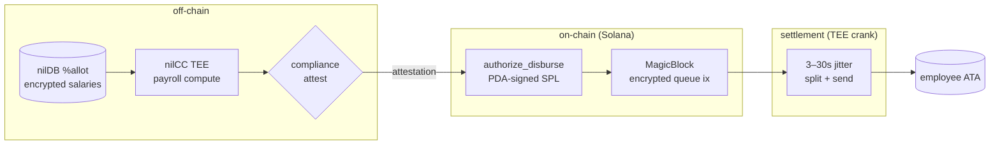
**Caption:**
```
The full Civitas pipeline in one image.

Off-chain: encrypted storage, TEE compute, compliance attest.
On-chain: a single atomic Solana tx — policy gate + private queue ix.
Settlement: TEE crank, 3–30s, employee just gets paid.

No claim flow. Ever.

meetcivitas.xyz
```

## Day 2 — Tue May 20
**Topic:** authorize_disburse policy gate — what runs before USDC moves
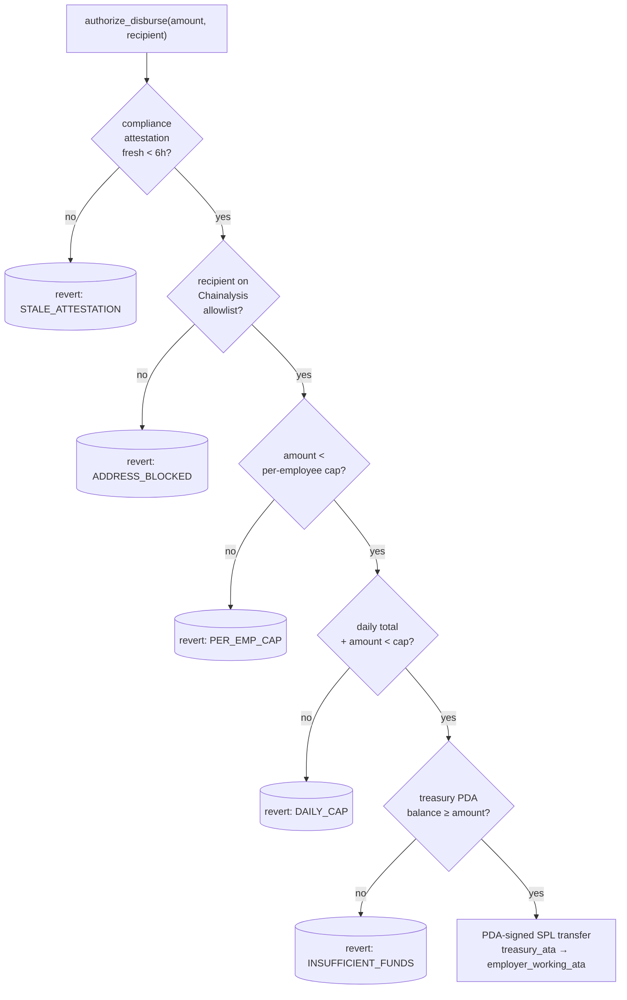
**Caption:**
```
The policy gate inside `authorize_disburse`.

5 checks. All in-program. PDA holds custody.

If any fails, the tx reverts before a single lamport moves.

Employer's key can't bypass policy even if it's owned.

github.com/MeetCivitas/Civitas-SOL
```

## Day 3 — Wed May 21
**Topic:** MagicBlock encrypted queue lifecycle (the privacy primitive)
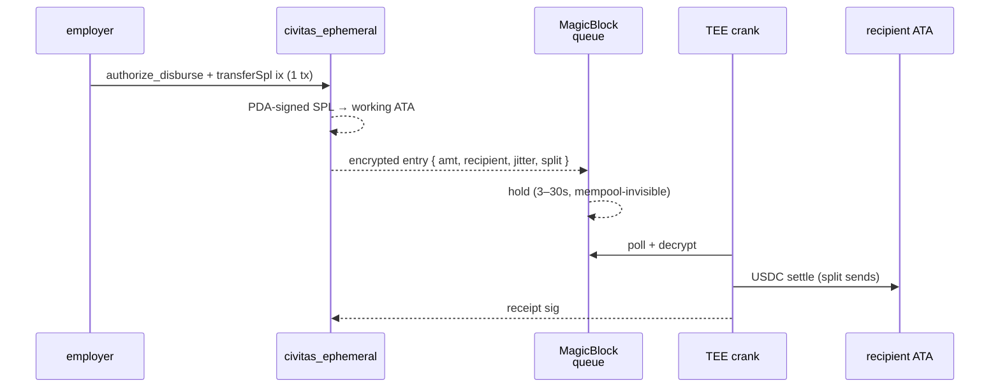
**Caption:**
```
The MagicBlock encrypted-queue lifecycle.

Encrypt at submit. Hold off-mempool. Decrypt only inside the TEE. Split + jitter on settle.

That's how the amount, the recipient, and the timing stay private — on a public chain.

3–30 seconds.
```

## Day 4 — Thu May 22
**Topic:** Treasury PDA seed derivation + ATA ownership
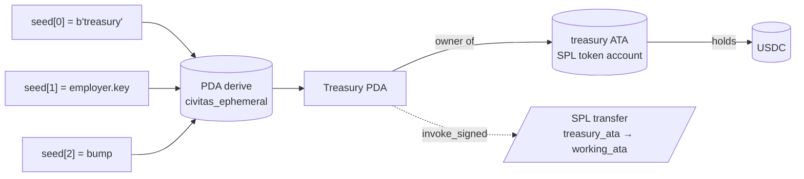
**Caption:**
```
Where the USDC actually lives in Civitas.

A program-derived address owns the treasury ATA. The PDA signs releases via `invoke_signed`. The employer never holds the SPL account itself.

Compromised employer key ≠ stolen payroll.
```

## Day 5 — Fri May 23
**Topic:** Compliance attestation — what gets signed
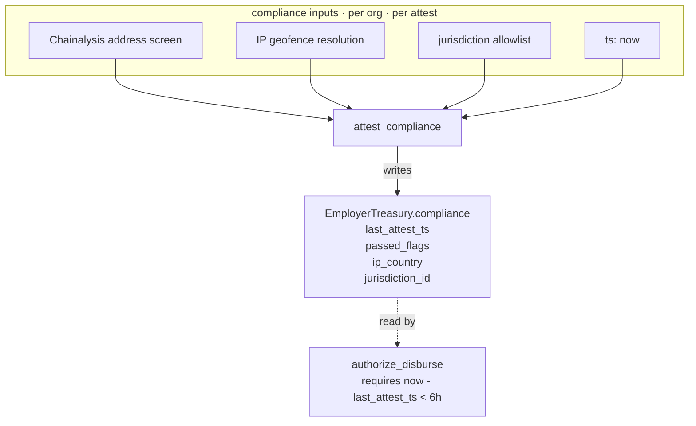
**Caption:**
```
What `attest_compliance` actually writes on-chain.

Not just a boolean. A struct: which checks passed, last timestamp, country, jurisdiction id.

`authorize_disburse` requires this struct to be fresher than 6h. Stale → revert.

Compliance is a deadline, not a checkbox.
```

## Day 6 — Sat May 24
**Topic:** nilDB %allot field-level secret sharing
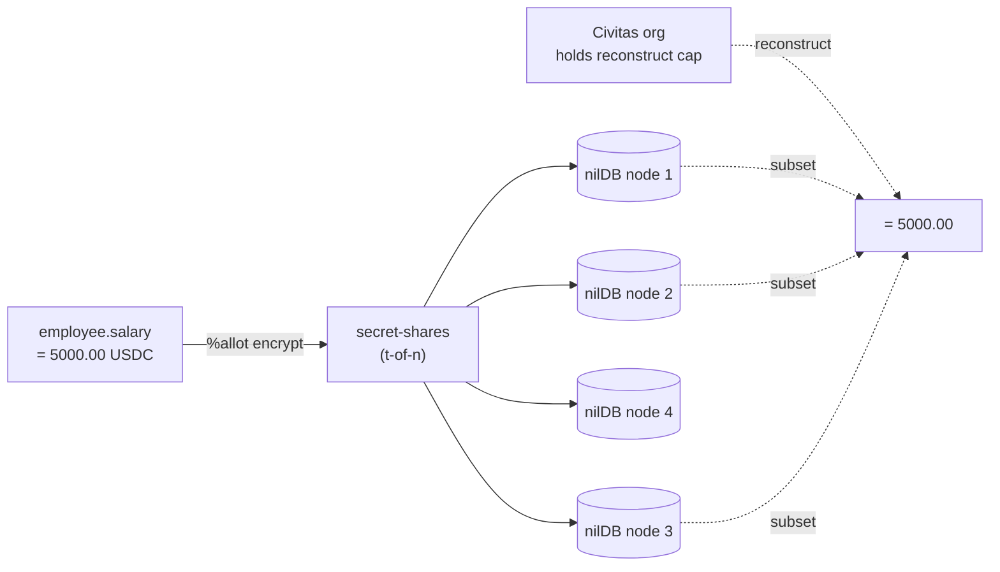
**Caption:**
```
%allot field encryption in nilDB:

The salary number gets split into secret shares across N nodes. Any t-of-n reconstruct returns it. The org holds the reconstruct capability — we don't.

A subpoena to Civitas the company returns ciphertext shares. Not salaries.
```

## Day 7 — Sun May 25
**Topic:** nilCC TEE attestation chain (warm workload)
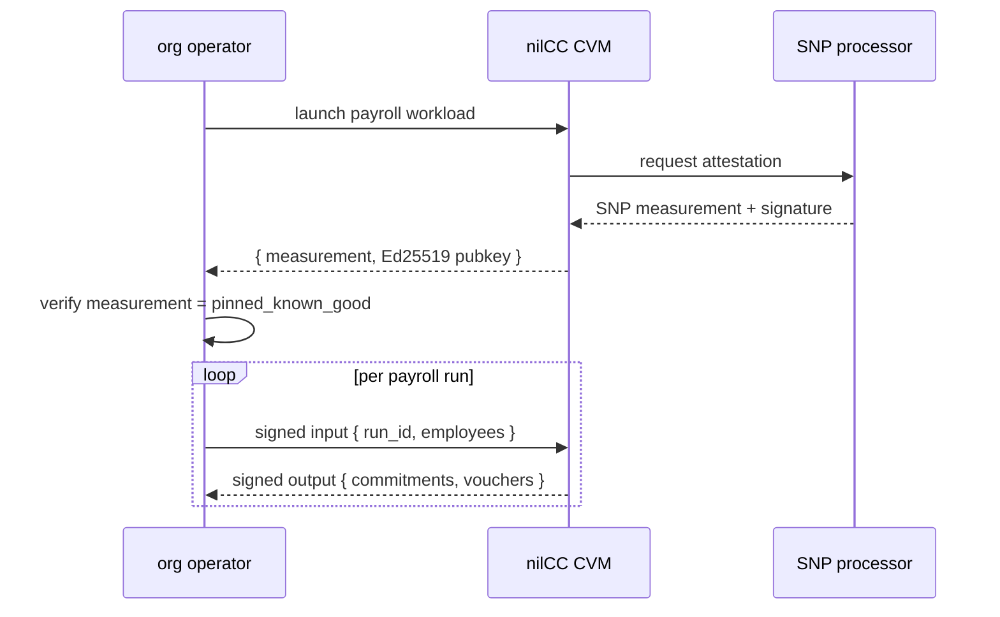
**Caption:**
```
The nilCC warm-workload attestation chain.

Boot once → verify SNP measurement against a pinned hash → run many payrolls inside.

Each input + output is Ed25519-signed by the enclave. Verify outside.

~200× faster than spinning a fresh CVM per run.
```

## Day 8 — Mon May 26
**Topic:** Civitas data model (org → users → vouchers)
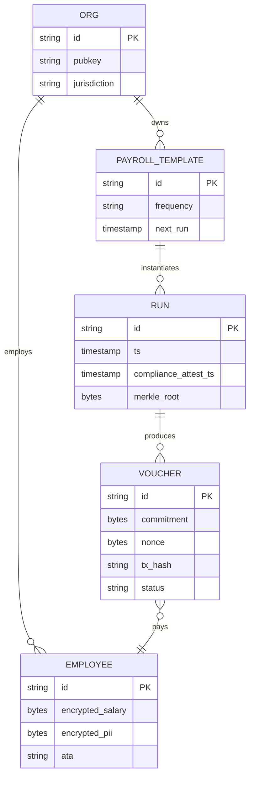
**Caption:**
```
The Civitas data model — 5 entities.

Org owns employees + payroll templates. Templates instantiate runs. Runs produce vouchers. Vouchers pay employees.

PII + salary are encrypted at the row. Audits read commitments + tx hashes. Both can be true.
```

## Day 9 — Tue May 27
**Topic:** One disbursement, instruction-level breakdown
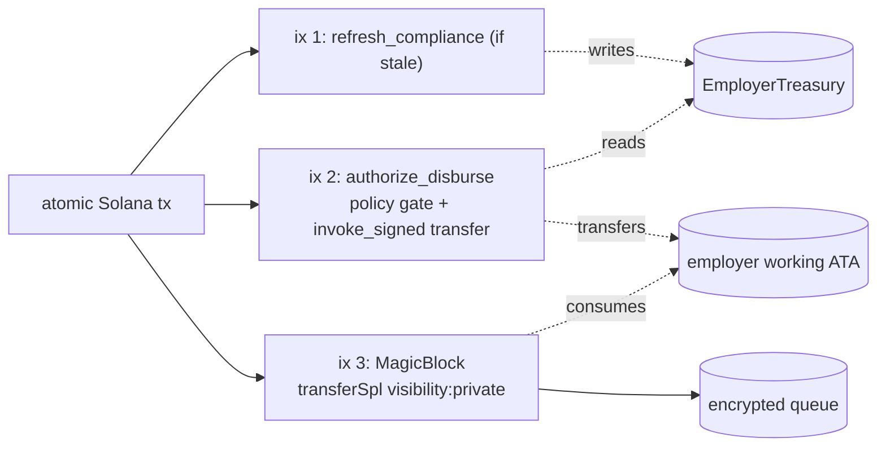
**Caption:**
```
One disbursement in 3 instructions, one atomic tx:

1. refresh_compliance — if needed
2. authorize_disburse — policy gate + PDA-signed SPL move
3. MagicBlock transferSpl({ visibility:'private' }) — encrypted-queue entry

If anything fails, none of it happens.
```

## Day 10 — Wed May 28
**Topic:** Voucher lifecycle (pending → settled)
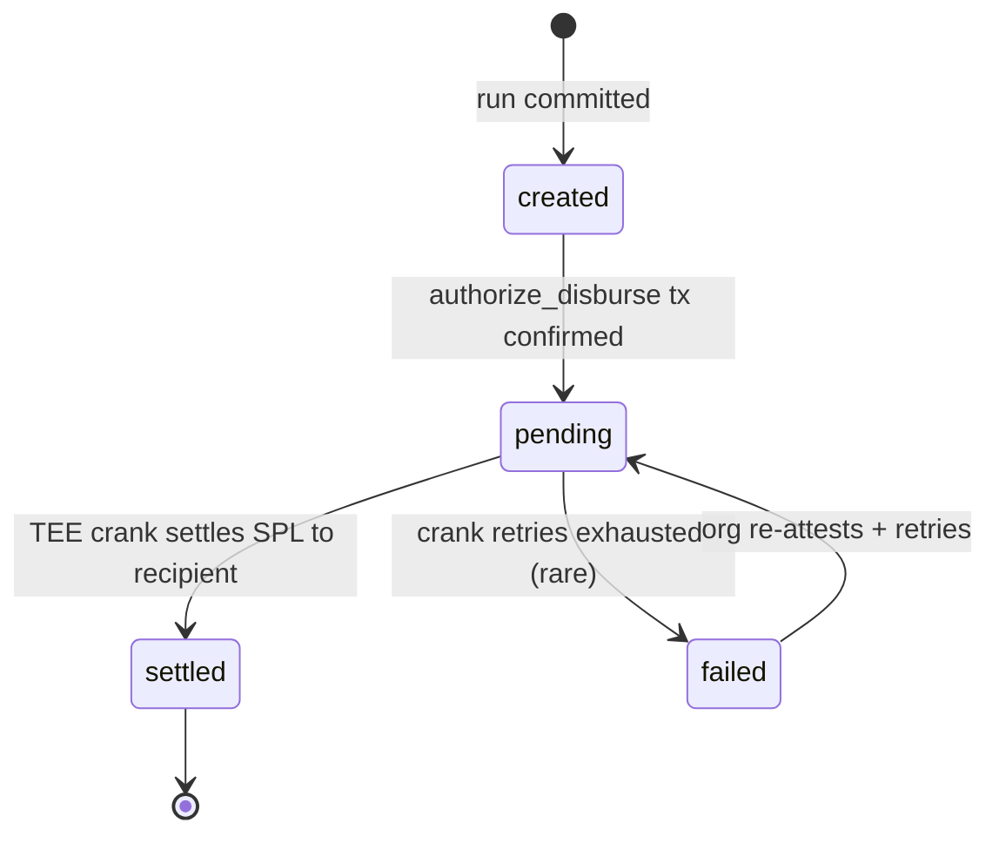
**Caption:**
```
The voucher lifecycle.

`created` → `pending` once on-chain auth confirms. `pending` → `settled` once the TEE crank lands the SPL. `failed` is rare and recoverable.

Status lives in encrypted nilDB. Auditor sees it. Chain sees only the SPL transfer.
```

## Day 11 — Thu May 29
**Topic:** Settlement latency Gantt
```mermaid
gantt
  title One disbursement: T+0 → T+settled
  dateFormat  X
  axisFormat  %Ss
  section off-chain
  compliance batch       :a1, 0, 8s
  TEE payroll compute    :a2, after a1, 12s
  section on-chain
  authorize_disburse     :b1, after a2, 0.4s
  MagicBlock queue ix    :b2, after b1, 0.3s
  section settlement
  encrypted-queue hold   :c1, after b2, 3s
  TEE crank decrypt      :c2, after c1, 0.5s
  SPL settle             :c3, after c2, 0.4s
```
**Caption:**
```
End-to-end latency for one disbursement.

Off-chain: ~20s (compliance + TEE compute, dominates).
On-chain: <1s (two ix in one tx).
Settlement: 3–30s queue jitter + sub-second SPL transfer.

The "feels like Stripe" claim is measurable.
```

## Day 12 — Fri May 30
**Topic:** Failure modes / replay protection
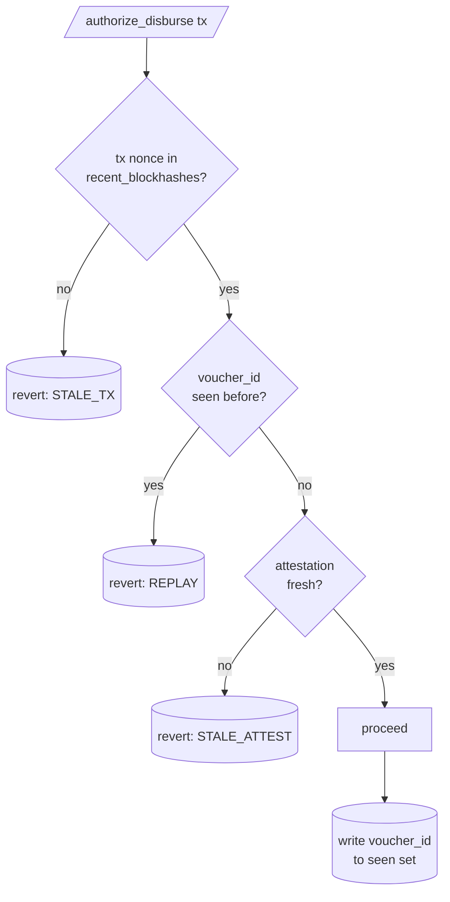
**Caption:**
```
Replay protection in `authorize_disburse`.

Voucher ids are tracked in a bounded recent-set inside the program. Re-submitting the same voucher reverts at REPLAY before any check or transfer runs.

Same voucher can't be paid twice — even if the signer is the legitimate employer.
```

## Day 13 — Sat May 31
**Topic:** Daily-cap reset logic (per-employee + org-wide)
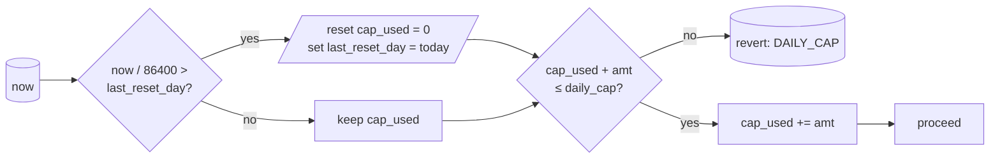
**Caption:**
```
Daily-cap accounting in `authorize_disburse`.

Auto-reset on day boundary (UTC). Increment on success. Compared against `daily_cap` on the org account.

No cron, no off-chain scheduler. The chain is the calendar.
```

## Day 14 — Sun Jun 1
**Topic:** Threat model — what each layer protects against
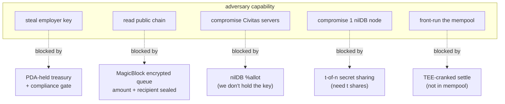
**Caption:**
```
Civitas threat model — one image.

5 attacker capabilities. 5 layers that each one specifically defeats. Together: amount, recipient, timing, identity all stay confidential, and custody stays gated even if the employer key is owned.

This is the box.
```

## Day 15 — Mon Jun 2
**Topic:** Privy embedded-wallet flow (employee onboarding)
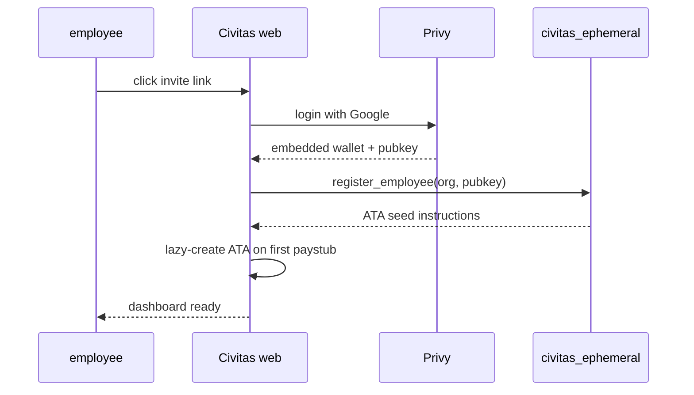
**Caption:**
```
Employee onboarding without the word "wallet."

Google OAuth via Privy → embedded wallet provisioned → pubkey registered on org → ATA lazy-created on first paystub.

Total time: <90 seconds. No seed phrases. They never know it's Solana.
```

## Day 16 — Tue Jun 3
**Topic:** SNS name resolution at recipient stage
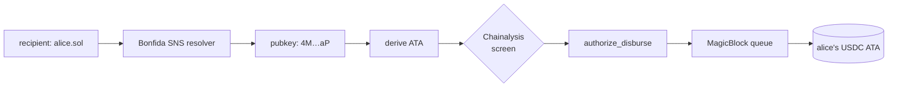
**Caption:**
```
Paying someone by `.sol` name in Civitas.

Bonfida resolves → ATA derived → compliance screen → policy gate → encrypted queue → USDC arrives.

A name in. Funds out. The recipient never copy-pastes anything.

meetcivitas.xyz
```

## Day 17 — Wed Jun 4
**Topic:** Receipt PDF generation pipeline
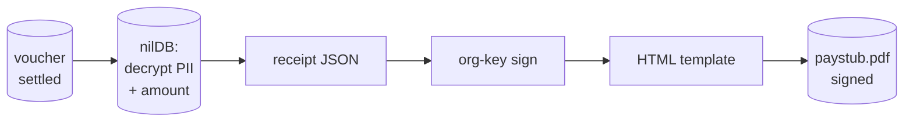
**Caption:**
```
How a Civitas paystub PDF gets made.

Pull voucher → decrypt PII inside the org-scoped context → sign the receipt JSON → render → emit a signed PDF.

The chain never sees the salary in cleartext. The PDF cryptographically commits to what it shows.
```

## Day 18 — Thu Jun 5
**Topic:** CPI graph — which program calls what
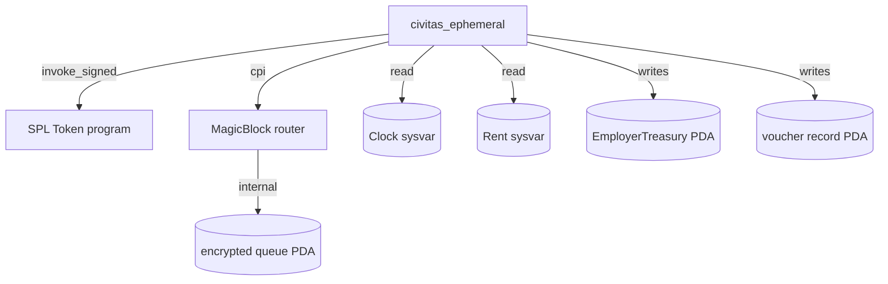
**Caption:**
```
The CPI graph of `civitas_ephemeral` v2.

One outbound CPI to SPL Token (transfers via PDA signer), one to the MagicBlock router. Reads Clock + Rent. Writes EmployerTreasury + voucher records.

Small surface. Audit-friendly.
```

## Day 19 — Fri Jun 6
**Topic:** Compute-unit budget per ix
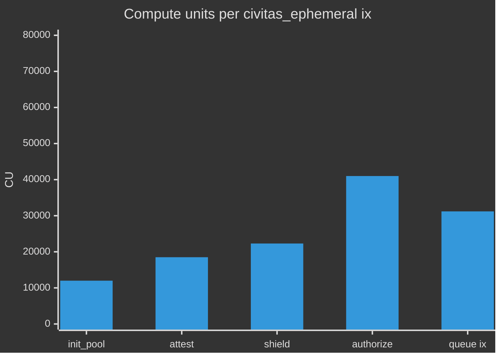
**Caption:**
```
Compute-unit cost per Civitas instruction (devnet measured).

`authorize_disburse` is the heaviest at ~41k CU — it runs the full policy gate inside the program. Everything else is cheap.

Under 200k CU for the whole atomic-tx pipeline.
```

## Day 20 — Sat Jun 7
**Topic:** Cross-mint disbursement flow (future)
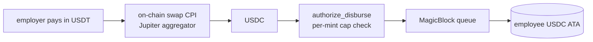
**Caption:**
```
Cross-mint disbursement, sketched.

Employer holds USDT, employee gets USDC. A Jupiter CPI inside the same atomic tx, then the standard pipeline.

Per-mint caps + freshness still hold. The employee never sees the swap.

Roadmap. Not yet shipped.
```

## Day 21 — Sun Jun 8
**Topic:** Auditor read-key derivation
```mermaid
flowchart LR
  ORG[org master key] --> KDF["HKDF(domain='audit'<br/>+ run_id<br/>+ scope)"]
  KDF --> AK[auditor scoped key]
  AK --> RD[read-only<br/>nilDB capability]
  RD --> V[(decrypt vouchers<br/>in scope window)]
  AK -.expires.-> EX[after T+30d]
```
**Caption:**
```
How an auditor gets a scoped view.

HKDF from org master key + run_id + scope → time-bounded read-only capability. The chain stays in cleartext for the auditor's window.

Public chain still sees just settled SPL transfers. Audit happens off-chain, by design.
```

## Day 22 — Mon Jun 9
**Topic:** Helius observability hooks
```mermaid
flowchart LR
  TX[/Civitas tx confirmed/] --> H[Helius RPC]
  H --> WH[webhook<br/>parse]
  WH --> KS{kind?}
  KS -- authorize_disburse --> UP1[update voucher → pending]
  KS -- spl transfer<br/>from queue --> UP2[update voucher → settled]
  UP1 & UP2 --> DB[(nilDB voucher status)]
  DB --> NTF[employee push notif]
```
**Caption:**
```
Helius is the eyes-and-ears of Civitas.

Confirmed tx → webhook → instruction-parsed → voucher status updated → employee push.

Without it, you'd be polling RPC and chewing rate limits. With it, the dashboard feels real-time.

Tooling at the rail layer matters.
```

## Day 23 — Tue Jun 10
**Topic:** Mainnet hardening checklist (visualized)
```mermaid
flowchart TB
  AUDIT[external audit booked] --> RL[rate limits on<br/>/payroll/disburse]
  RL --> IDM[idempotency keys<br/>per voucher]
  IDM --> DR[disaster recovery drill<br/>treasury PDA freeze]
  DR --> CON[constant-time<br/>policy gate]
  CON --> CD[circuit breakers<br/>on daily_cap]
  CD --> RC1[mainnet RC1]
```
**Caption:**
```
Civitas mainnet hardening, in order:

1. External audit
2. API rate limits
3. Idempotency keys
4. Treasury-freeze DR drill
5. Constant-time policy gate
6. Circuit breakers on caps
→ RC1 cut

Audit report public the same week.
```

## Day 24 — Wed Jun 11
**Topic:** Front-running protections at settlement
```mermaid
flowchart LR
  AUTH[authorize_disburse confirms] -. visible .-> PUB[public mempool]
  AUTH --> QUE[encrypted queue ix]
  QUE -. not visible .-> PUB
  QUE --> TEE[TEE crank<br/>3–30s jitter<br/>split sends]
  TEE --> R1[recipient ATA<br/>send 1]
  TEE --> R2[recipient ATA<br/>send 2]
```
**Caption:**
```
What X-ray vision into a Civitas settlement actually shows.

The authorize tx is public — amounts are policy-checked, not payload. The queue ix carries the encrypted payload. Settlement is TEE-cranked, jittered, optionally split.

Amount hidden. Timing hidden. Graph hidden.
```

## Day 25 — Thu Jun 12
**Topic:** Disbursement decision tree (engineer's eye view)
```mermaid
flowchart TD
  ST[/start: pay X to alice/] --> O{org compliant<br/>and fresh?}
  O -- no --> RA[re-attest first]
  O -- yes --> S{salary in nilDB<br/>matches X?}
  S -- no --> RJ[(reject: salary mismatch)]
  S -- yes --> CB[build atomic tx:<br/>authorize_disburse + queue ix]
  CB --> SU[submit]
  SU --> CF[confirmed]
  CF --> WB[webhook: voucher → pending]
  WB --> SET[TEE settle]
  SET --> WB2[webhook: voucher → settled]
```
**Caption:**
```
What actually happens when you click "Pay" in Civitas.

Org compliance check → salary commitment match → build atomic tx → submit → confirmed → webhook updates → settle → webhook updates.

10 named states. Zero magic. The whole thing fits in your head.
```

## Day 26 — Fri Jun 13
**Topic:** Stress-test perf curve (10k employees)
```mermaid
%%{init: {"theme":"dark","themeVariables":{"primaryColor":"#7CF9C7"}}}%%
xychart-beta
  title "10k-employee payroll run: wall-clock per stage (s)"
  x-axis ["off-chain compute","compliance batch","on-chain dispatch","settle tail"]
  y-axis "seconds" 0 --> 35
  bar [12, 8, 14, 30]
```
**Caption:**
```
Civitas at 10,000 employees, one payroll run.

Off-chain compute (nilCC): 12s.
Compliance batch: 8s.
On-chain dispatch (parallel ix): 14s.
Settlement tail: 30s.

Total: ~64s wall-clock. Devnet numbers. Not promises.

github.com/MeetCivitas/Civitas-SOL
```

## Day 27 — Sat Jun 14
**Topic:** Token-2022 CT vs. MagicBlock queue (the pivot)
```mermaid
flowchart LR
  subgraph CT["Token-2022 CT (disabled)"]
    A1[private balance on mint]
    A2[ZK proof on every transfer]
    A3[on-chain compute heavy]
  end
  subgraph MB["MagicBlock encrypted queue (live)"]
    B1[base SPL transfer]
    B2[encrypted off-mempool payload]
    B3[TEE-cranked settle]
  end
  CT --x DIS[disabled by Solana audit 2026-04]
  MB --o GO[in production, devnet today]
```
**Caption:**
```
Why Civitas runs on MagicBlock encrypted queue, not Token-2022 CT.

CT is disabled. MagicBlock is shipping. We picked the production-ready private SPL primitive instead of waiting on a roadmap.

Engineering > waiting.
```

## Day 28 — Sun Jun 15
**Topic:** SDK call graph (what an integrator touches)
```mermaid
flowchart LR
  APP[your HR app] -- "civitas.disburse({...})" --> SDK[Civitas SDK]
  SDK --> A1["/api/compliance/attest"]
  SDK --> A2["/api/payroll/disburse"]
  A1 --> CIV[civitas_ephemeral]
  A2 --> CIV
  CIV --> ON[on-chain pipeline]
  ON --> WH[webhooks → SDK]
  WH --> APP
```
**Caption:**
```
Civitas SDK from an integrator's seat.

One method to call. Two API endpoints behind it. One on-chain program. Webhooks come back to your app for status updates.

Designed so Rippling/Deel/Justworks can plug in without rebuilding payroll.
```

## Day 29 — Mon Jun 16
**Topic:** Failure recovery state machine
```mermaid
stateDiagram-v2
  [*] --> healthy
  healthy --> attest_stale : 6h passed
  attest_stale --> healthy : refresh ok
  healthy --> rpc_degraded : Helius timeouts
  rpc_degraded --> healthy : fallback RPC
  healthy --> queue_backlog : TEE crank slow
  queue_backlog --> healthy : crank catches up
  healthy --> frozen : circuit breaker tripped
  frozen --> healthy : ops manual unfreeze
```
**Caption:**
```
Civitas operational state machine.

4 failure modes, each with a known recovery path. `frozen` is the only one that needs human hands — it's the circuit breaker for caps + solvency, and that's by design.

Operability is a design output, not an afterthought.
```

## Day 30 — Tue Jun 17
**Topic:** Civitas system invariants (the contract)
```mermaid
flowchart TD
  I1["I1: USDC never leaves treasury<br/>without a compliance attest<br/>fresh < 6h"]
  I2["I2: same voucher_id can be paid at most once"]
  I3["I3: per-employee daily cap is not exceeded"]
  I4["I4: amount sealed in queue<br/>= amount transferred to working_ata"]
  I5["I5: salary cleartext never lives<br/>outside org-scoped TEE / nilDB share quorum"]
  I1 --- I2 --- I3 --- I4 --- I5
```
**Caption:**
```
The 5 invariants Civitas commits to.

Custody. Replay. Caps. Encrypted-payload integrity. Salary confidentiality.

These are the things the audit will check. These are the things that fail closed.

If we ever break one of these, we owe you a postmortem.

meetcivitas.xyz
```

---

## Image strategy

Each diagram renders to `images/dayNN-noon.png` (1600×900, Civitas dark-brand background, Mermaid SVG embedded, headline + footer chrome).

## Operating notes

- All times IST. Posts fire at 15:00 IST.
- Captions ≤ 280 chars (verified at render).
- Mermaid CDN via `unpkg.com/mermaid` (pinned version).
- Theme: dark; primary teal `#7CF9C7`; accent `#5B8DEF`; bg `#05070d → #0b1322`.
- X free tier caps queue at ~50. New posts only schedule when the AM/PM queue drains.
